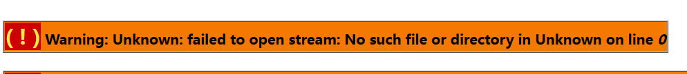
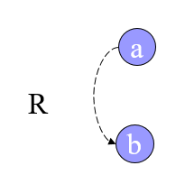
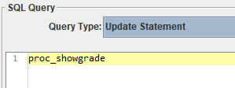

- [第二十五课时作业](javascript:void(0))

## 一.单选题*（共11题,78.1分）*

*1*

因果图中，这个符号表示

- A、

  恒等

- B、

  非

- C、

  或

- D、

  与

我的答案：C得分： 7.1分

*2*

在jmeter中配置“FTP请求"采样器元件匿名访问ftp服务器。用户名如何配置？

- A、

  不用填写

- B、

  填写anonymous

- C、

  填写user

- D、

  填写users

我的答案：B得分： 7.1分

*3*

运行Junit测试后，以下部分结果的截图

下面描述正确的是？

- A、

  testSubstract方法：程序异常

  testDivide方法：结果和期望值不一致

  testMultiply方法：此方法被忽略，测试时并未执行

- B、

  testSubstract方法：结果和期望值不一致

  testDivide方法：程序异常

  testMultiply方法：此方法被忽略，测试时并未执行

  

- C、

  testSubstract方法：结果和期望值不一致

  testDivide方法：此方法被忽略，测试时并未执行

  testMultiply方法：程序异常

  

- D、

  testSubstract方法：程序异常

  testDivide方法：此方法被忽略，测试时并未执行

  testMultiply方法：结果和期望值不一致

  

我的答案：B得分： 7.1分

*4*

Junit具体是通过哪个函数判断期望值和测试值是否一致的？

- A、

  assert

- B、

  equals

- C、

  setUp

- D、

  assertEquals

我的答案：D得分： 7.1分

*5*

在jemter3.1中，要添加一个http请求，具体的操作过程是？

- A、

  1、选择线程组，右击

  2、在弹出菜单选择“添加”

  3、选择“配置元件”

  4、选择"http请求"

- B、

  1、选择线程组，右击

  2、在弹出菜单选择“添加”

  3、选择“sampler”

  4、选择"http请求"

  

- C、

  1、选择线程组，右击

  2、在弹出菜单选择“添加”

  3、选择“逻辑控制器”

  4、选择"http请求"

  

我的答案：B得分： 7.1分

*6*

下面是一个正则表达式

<td>.*<\/td>

要匹配的对象字符串是

<table><tr><td>成绩</td><td>科目</td></tr></table>

那么，第1个匹配到的结果是

- A、

  <td>成绩</td>

- B、

  <td>成绩</td><td>科目</td>

- C、

  <table><tr><td>成绩</td><td>科目</td></tr></table>

我的答案：B得分： 7.1分

*7*

使用postman来测试本次课使用laravel编写的Restful标准的接口，接口的动作为post。那么，填写请求的body时，需选择

- A、

  none

- B、

  form-data

- C、

  x-www-form-urlencode

- D、

  raw

我的答案：D得分： 7.1分

*8*

语句覆盖，判定覆盖和条件覆盖的标准分别是什么？

- A、

  语句覆盖：使得程序中每个判定至少为TRUE或FALSE各一次

  判定覆盖：使得程序中每个语句至少都能被执行一次

  条件覆盖：得每个判定中的每个条件获得各种可能的结果

- B、

  语句覆盖：使得程序中每个语句至少都能被执行一次

  判定覆盖：使得程序中每个判定至少为TRUE或FALSE各一次

  条件覆盖：得每个判定中的每个条件获得各种可能的结果

  

- C、

  语句覆盖：得每个判定中的每个条件获得各种可能的结果

  判定覆盖：使得程序中每个判定至少为TRUE或FALSE各一次

  条件覆盖：使得程序中每个语句至少都能被执行一次

  

- D、

  语句覆盖：得每个判定中的每个条件获得各种可能的结果

  判定覆盖：使得程序中每个语句至少都能被执行一次

  条件覆盖：使得程序中每个判定至少为TRUE或FALSE各一次

  

我的答案：B得分： 7.1分

*9*

语句覆盖、判定覆盖、条件组合覆盖、路径覆盖这及格覆盖标准从弱到强的排序是？

- A、

  语句覆盖、判定覆盖、条件组合覆盖、路径覆盖

- B、

  路径覆盖、判定覆盖、条件组合覆盖、语句覆盖

- C、

  路径覆盖、条件组合覆盖、判定覆盖、语句覆盖

我的答案：A得分： 7.1分

*10*

FileZillaServer设置目录的权限如下图

- A、

  此目录下的文件可读可写

  此目录能获取目录列表。能创建和删除子目录。

- B、

  此目录下的文件可读可写

  此目录能获取目录列表。

  

- C、

  此目录下的文件只读

  此目录能获取目录列表。

  

- D、

  此目录下的文件只读

  此目录能获取目录列表。能删除子目录

  

我的答案：C得分： 7.1分

*11*

下图的判定表中，哪两列规划是可以合并成一列规则的？

- A、

  1，2

- B、

  3，4

- C、

  2，3

- D、

  1，3

我的答案：D得分： 7.1分

## 二.多选题*（共3题,21.9分）*

*1*

jmeter如需要测试数据库，必需先安装相应jar包。安装方法可以是

- A、

  点击测试计划，测试计划最下方的add directory or jar to classpath，添加下载的jar

- B、

  将下载的jar文件放置于jmeter安装目录的 \lib\ext目录内

- C、

  将下载的jar文件放置于jmeter安装目录的 \lib目录内

我的答案：ABC得分： 7.1分

*2*

等价类分为

- A、

  有效等价类

- B、

  无效等价类

- C、

  一般等价类

- D、

  特殊等价类

我的答案：AB得分： 7.1分

*3*

规定日期由6位数字字符组成，前4位表示年，后2位表示月。如从输入日期值的类型和长度来看（不考虑输入值的年和月是否合理），下面一定是属于无效等价类的是

- A、

  6位数字字符

- B、

  有非数字字符

  

  

- C、

  少于6位数字字符

  

  

- D、

  多于6位数字字符

我的答案：BCD

- [第二十四课时作业](javascript:void(0))

## 一.单选题*（共3题,30.0分）*

*1*

数据的接收方想使用RSA方式进行数据加密。一般情况下，数据接收方是把什么密钥发给数据发送方，然后数据发送方用此密钥进行数据加密，然后把数据发回给数据接收方？

- A、

  公钥

- B、

  私钥

正确答案： A 我的答案：A得分： 10.0分

*2*

如果我们调用支付宝的接口，接收支付宝返回并加密过的数据，我们是使用什么密钥进行解密的？

- A、

  支付宝公钥

- B、

  应用公钥

- C、

  应用私钥

- D、

  支付宝私钥

正确答案： C 我的答案：C得分： 10.0分

*3*

如果我们调用支付宝的接口，一般需要配置三把密钥，自己生成的公钥和私钥（应用公钥，应用私钥），从支付宝获取到的支付宝公钥。如果我们需传数据给支付宝，应该使用那把密钥对数据进行加密？

- A、

  应用公钥

- B、

  应用私钥

- C、

  支付宝公钥

正确答案： C 我的答案：C得分： 10.0分

## 二.多选题*（共1题,10.0分）*

*1*

下面属于不可逆的加密算法有

- A、

  md5

- B、

  des

- C、

  rsa

- D、

  crypt

- E、

  sha1

正确答案： ADE 我的答案：ADE得分： 10.0分

## 三.判断题*（共6题,60.0分）*

*1*

crypt("加密字符串","盐值"):第二个参数盐值可选，如不填盐值，会使用随机值代替，那么每次生成的密文都一样

我的答案：*×* 得分： 10.0分正确答案：*×*

*2*

Rsa每次加密得到的密文是不一样的

我的答案：*√* 得分： 10.0分正确答案：*√*

*3*

crypt是单向的不可逆的加密算法

我的答案：*√* 得分： 10.0分正确答案：*√*

*4*

下载'实验24.doc'文档,自行相应的实验，此题选正确

我的答案：*√* 得分： 10.0分正确答案：*√*

*5*

RSA加密和解密的密钥是不一样的。DES加密和解密的密钥是一样的

我的答案：*√* 得分： 10.0分正确答案：*√*

*6*

由于RSA是非对称加密，因此加密和解密的密钥是不一样的

我的答案：*√* 得分： 10.0分正确答案：*√*

- [第二十三课时作业](javascript:void(0))

## 一.多选题*（共1题,12.5分）*

*1*

下面说法正确的是

- *A、*[DES是双向的可逆的加密解密算法](javascript:void(0))

- B、

  MD5是不可逆的算法

- C、

  SHA1是可逆的算法

- D、

  RSA是对称的双向可逆的加密解密算法

正确答案： AB 我的答案：AB得分： 12.5分

## 二.填空题*（共4题,50.0分）*

*1*

使用MD5加密得到的密文的长度都是固定(加密后为_________________位（bit），按照16进制（4位一个16进制数）编码后，就成了____________个字符

[正确答案：](javascript:void(0))

*第一空：* 128*第二空：* 32

我的答案：得分： 12.5分

*第一空：* 

128

*第二空：* 

32

批语

*2*

md5('abc')的值是_______________________________

[正确答案：](javascript:void(0))

*第一空：* 900150983cd24fb0d6963f7d28e17f72; 900150983cd24fb0d6963f7d28e17f72;  900150983cd24fb0d6963f7d28e17f72 ;900150983cd24fb0d6963f7d28e17f72

我的答案：得分： 12.5分

*第一空：* 

900150983cd24fb0d6963f7d28e17f72

批语

*3*

使用本次课目录下的CryptDes.php类，加密字符串abc,加密后的密文是________________

[正确答案：](javascript:void(0))

*第一空：* lFjeaEyHabE=; lFjeaEyHabE=; lFjeaEyHabE= ;lFjeaEyHabE=；IFjeaEyHabE=

我的答案：得分： 12.5分

*第一空：* 

lFjeaEyHabE=

批语

*4*

使用函数sha1，加密字符串abc，结果是___________________

[正确答案：](javascript:void(0))

*第一空：* a9993e364706816aba3e25717850c26c9cd0d89d

我的答案：得分： 12.5分

*第一空：* 

a9993e364706816aba3e25717850c26c9cd0d89d

批语

## 三.判断题*（共3题,37.5分）*

*1*

MD5摘要比SHA摘要长，因此，MD5的安全性更好一点，但加密速度会慢一点

我的答案：*×* 得分： 12.5分正确答案：*×*

*2*

下载"实验23.doc"并自行完成。本题选正确。

我的答案：*√* 得分： 12.5分正确答案：*√*

*3*

DES是单向的不逆的算法

我的答案：*×* 得分： 12.5分正确答案：*×*

- [第二十二课时作业](javascript:void(0))

## 一.单选题*（共3题,49.8分）*

*1*

xampp安装目录是c:\xampp，那么，httpd.conf配置文件所在的默认目录是？

- A、

  c:\xampp\

- B、

  c:\xampp\apache\bin

- C、

  c:\xampp\apache\conf\

  

- D、

  c:\xampp\htdocs

正确答案： C 我的答案：C得分： 16.6分

*2*

$test = "<script>'ok'";

$r = htmlentities($test);

$r的值最终为？

- A、

  <script>'ok'

- B、

  &lt;script&gt;'ok'

- C、

  &lt;script&gt;&#039;ok&#039

正确答案： B 我的答案：C得分： 0.0分

*3*

$test = "<script>'ok'";

$r = htmlentities($test, ENT_QUOTES);

$r的值最终为？

- A、

  <script>'ok'

- B、

  &lt;script&gt;'ok'

- C、

  &lt;script&gt;&#039;ok&#039

正确答案： C 我的答案：C得分： 16.6分

## 二.多选题*（共1题,16.6分）*

*1*

在appache里面配置https，并要强制http跳转到https一般需要修改那几个配置文件

- A、

  httpd.conf

- B、

  httpd-info.conf

- C、

  httpd-ssl.conf

- D、

  httpd-vhosts.conf

正确答案： ACD 我的答案：ACD得分： 16.6分

## 三.填空题*（共2题,33.6分）*

*1*

 $test = "<script>'ok'";

$r = strip_tags($test);

$r的值是________________

[正确答案：](javascript:void(0))

*第一空：* 'ok'

我的答案：得分： 16.6分

*第一空：* 

'ok'

批语

*2*

直接运行wamp，在配置过程中，如果配置出错，通常在apache的错误日志也无法查看错误的原因和出错的地方。所以，非常有必要使用命令行的启动apache服务，如出错，能看到相应的错误信息

方法是打开命令行提示窗口，然后转到apache的bin所在目录，运行_________________命令

[正确答案：](javascript:void(0))

*第一空：* httpd -t

我的答案：得分： 17.0分

*第一空：* 

httpd -t

批语

- [第二十一课时作业](javascript:void(0))

## 一.单选题*（共4题,50.0分）*

*1*

使用fiddler更改post数据，通过设置自动断点规则来实现。

应该选择哪一项？

- A、

  Before Requests

- B、

  After Responses

- C、

  Disabled

- D、

  Ignore Images

正确答案： A 我的答案：A得分： 12.5分

*2*

使用fiddler更改post数据，用户再提交数据前，fiddler通过断点规则，实现了暂停，这时候，我们修改post的数据，本课程中，是通过选择哪个选项卡修改post数据的？

- A、

  Headers

- B、

  TextView

- C、

  Raw

- D、

  XML

正确答案： B 我的答案：B得分： 12.5分

*3*

对字符串 admin 进行16进制转码，结果是？

- A、

  0x31323334

- B、

  0x70617373

- C、

  0x7573657273

- D、

  0x61646d696e

正确答案： D 我的答案：D得分： 12.5分

*4*

0X68656c6c6f十六进制转换为字符串是？

- A、

  hello

- B、

  admin

- C、

  users

- D、

  password

正确答案： A 我的答案：A得分： 12.5分

## 二.多选题*（共2题,25.0分）*

*1*

使用jmeter发送post数据包，post数据的表单名为xh,cj和submit，分别表示学号，成绩，和提交表单按钮，值为01，90，sub

在Body Data选项卡里面，应该输入 

- A、

  xh=01,cj=90,submit=submit

- B、

  xh=01&cj=90&submit=submit

- C、

  01&90&ubmit

- D、

  01,90,submit

正确答案： B 我的答案：B得分： 12.5分

*2*

使用jmeter发送post数据包，post数据的表单名为xh,cj和submit，分别表示学号，成绩，和提交表单按钮，可以选择哪个选项卡输入？

- A、

  Parameters

- B、

  Body Data

- C、

  Files Upload

正确答案： AB 我的答案：AB得分： 12.5分

## 三.判断题*（共2题,25.0分）*

*1*

使用jmeter发送post数据包，如果要发送到的网址需要验证登录状态。我们已经通过浏览器获取到cookie的信息，那么，为了使jmeter能顺利的把post数据包发出，可以通添加 HTTP信息头管理器 管理器，并无需对其进行配置

我的答案：*√* 得分： 0.0分正确答案：*×*

*2*

下载“实验21.doc",并自行完成。此题选正确

我的答案：*√* 得分： 12.5分正确答案：*√*

- [第二十课时作业](javascript:void(0))

## 一.单选题*（共5题,55.5分）*

*1*

要查询当前数据库的名称，sql语句是？

- A、

  SELECT DATABASE

- B、

  database()

- C、

  SELECT DATABASE()

- D、

  select db()

正确答案： C 我的答案：C得分： 11.1分

*2*

tb_grade表共有三个字段，下面哪一个选项的sql语句能正确运行？

- A、

  SELECT * FROM tb_grade UNION SELECT 3

- B、

  SELECT * FROM tb_grade UNION SELECT 1,2,3,4

- C、

  SELECT * FROM tb_grade UNION SELECT 'a','b','c'

- D、

  SELECT * FROM tb_grade UNION SELECT a,b,c

正确答案： C 我的答案：C得分： 11.1分

*3*

成绩表的所有记录如下

SELECT GROUP_CONCAT(xh),GROUP_CONCAT(cj) FROM tb_grade的结果是？

- A、

  

- B、

  

- C、

  

正确答案： A 我的答案：A得分： 11.1分

*4*

成绩表的所有记录如下

SELECT * FROM tb_grade WHERE km='语文' # and cj>=90的查询结果为

- A、

  

- B、

  

- C、

  

正确答案： B 我的答案：B得分： 11.1分

*5*

下面是手工注入的操作步骤，

1.获取数据库中的表

2.猜解SQL查询语句中的字段数

3.下载数据

4.获取当前数据库

5.判断是否存在注入，注入是字符型还是数字型

6.确定显示的字段顺序

7.获取表中的字段名

如果按先后次序排列，正确的是？

- A、

  1234567

- B、

  5264173

- C、

  5264713

- D、

  6542713

正确答案： B 我的答案：B得分： 11.1分

## 二.多选题*（共1题,11.1分）*

*1*

已知成绩表tb_grade有三个字段，xh,km,cj分别表示学号，科目，成绩。查询成绩表所有内容，并且按成绩从大到小排序。下面，sql语句正确的是？

- A、

  SELECT * FROM tb_grade ORDER BY cj DESC

- B、

  SELECT * FROM tb_grade ORDER BY cj ASC

- C、

  SELECT * FROM tb_grade ORDER BY 3 DESC

- D、

  SELECT * FROM tb_grade ORDER BY 2 DESC

正确答案： AC 我的答案：AC得分： 11.1分

## 三.填空题*（共2题,22.2分）*

*1*

要查询数据库demo17里的tb_grade表的所有字段的名称，相应的查询语句是

SELECT  ___________  FROM information_schema.columns WHERE table_name='tb_grade' AND

___________ ='demo17'

[正确答案：](javascript:void(0))

*第一空：* column_name;GROUP_CONCAT(COLUMN_NAME)*第二空：* table_schema

我的答案：得分： 11.1分

*第一空：* 

column_name

*第二空：* 

table_schema

批语

*2*

要查询数据库dvwa所有表的名称，相应的查询语句

SELECT ___________ FROM information_schema.tables WHERE ____________='dvwa'

[正确答案：](javascript:void(0))

*第一空：* table_name;GROUP_CONCAT(table_name)*第二空：* table_schema

我的答案：得分： 11.1分

*第一空：* 

table_name

*第二空：* 

table_schema

批语

## 四.判断题*（共1题,11.2分）*

*1*

下载“实验20.doc"并完成。完成后，此题选正确即可

我的答案：*√* 得分： 11.2分正确答案：*√*

- [第十九课时作业](javascript:void(0))

## 一.单选题*（共6题,75.0分）*

*1*

使用sqlmap显示表tb_stuinf表的内容。要求只显示xh,xm两个字段的内容，下面命令正确的是？

- A、

  sqlmap.py -u"http://127.0.0.1/demo17/showgrade.php?xh=07120101" --cookie="PHPSESSID=3aie0lhgjmdeocj3j2p7t799j3" -D demo17 -T tb_stuinf -C xh,xm,class_name --dump

  

- B、

  sqlmap.py -u"http://127.0.0.1/demo17/showgrade.php?xh=07120101" --cookie="PHPSESSID=3aie0lhgjmdeocj3j2p7t799j3" -D demo17 -T tb_stuinf --dump

- C、

  sqlmap.py -u"http://127.0.0.1/demo17/showgrade.php?xh=07120101" --cookie="PHPSESSID=3aie0lhgjmdeocj3j2p7t799j3" -D demo17 -T tb_stuinf -C xh,xm --dump

- D、

  sqlmap.py -u"http://127.0.0.1/demo17/showgrade.php?xh=07120101" --cookie="PHPSESSID=3aie0lhgjmdeocj3j2p7t799j3" -D demo17 -T tb_stuinf xh,xm --dump

正确答案： C 我的答案：C得分： 12.5分

*2*

使用sqlmap进行post方式的自动搜索表单进行注入的操作，下面命令正确的是

- A、

  sqlmap.py -u"http://127.0.0.1/demo17/login.php" --forms

  

- B、

  sqlmap.py -u"http://127.0.0.1/demo17/login.php" --froms

- C、

  sqlmap.py -u"http://127.0.0.1/demo17/login.php" --auto

- D、

  sqlmap.py -u"http://127.0.0.1/demo17/login.php" 

正确答案： A 我的答案：A得分： 12.5分

*3*

使用sqlmap查询表tb_stuinf有什么字段，下面命令正确的是？

- A、

  sqlmap.py -u"http://127.0.0.1/demo17/showgrade.php?xh=07120101" --cookie="PHPSESSID=3aie0lhgjmdeocj3j2p7t799j3" -D demo17 -T tb_stuinf --col

  

- B、

  sqlmap.py -u"http://127.0.0.1/demo17/showgrade.php?xh=07120101" --cookie="PHPSESSID=3aie0lhgjmdeocj3j2p7t799j3" -D demo17 -T tb_stuinf --columns

- C、

  sqlmap.py -u"http://127.0.0.1/demo17/showgrade.php?xh=07120101" --cookie="PHPSESSID=3aie0lhgjmdeocj3j2p7t799j3" -D demo17 tb_stuinf --columns

- D、

  sqlmap.py -u"http://127.0.0.1/demo17/showgrade.php?xh=07120101" --cookie="PHPSESSID=3aie0lhgjmdeocj3j2p7t799j3" -D demo17  --columns

正确答案： B 我的答案：B得分： 12.5分

*4*

使用sqlmap显示数据库demo17中所有表的名称，下面命令正确的是？

- A、

  sqlmap.py -u"http://127.0.0.1/demo17/showgrade.php?xh=07120101" --cookie="PHPSESSID=3aie0lhgjmdeocj3j2p7t799j3" demo17 --tables

  

- B、

  sqlmap.py -u"http://127.0.0.1/demo17/showgrade.php?xh=07120101" --cookie="PHPSESSID=3aie0lhgjmdeocj3j2p7t799j3" -D demo17 -tables

  

- C、

  sqlmap.py -u"http://127.0.0.1/demo17/showgrade.php?xh=07120101" --cookie="PHPSESSID=3aie0lhgjmdeocj3j2p7t799j3" -T --tables

- D、

  sqlmap.py -u"http://127.0.0.1/demo17/showgrade.php?xh=07120101" --cookie="PHPSESSID=3aie0lhgjmdeocj3j2p7t799j3" -D demo17 --tables

正确答案： D 我的答案：D得分： 12.5分

*5*

使用sqlmap进行漏洞检测的时候，如果希望程序使用默认值自动应答，可以加

- A、

  --auto

- *B、*[--batch](javascript:void(0))

- C、

  --default

- D、

  --auto-default

正确答案： B 我的答案：B得分： 12.5分

*6*

使用fiddler来获取某次http连接的post请求头部信息，应该选择下面哪个选项卡

- A、

  TextView

- B、

  SyntaxView

- C、

  WebForms

- D、

  Raw

正确答案： D 我的答案：D得分： 12.5分

## 二.多选题*（共1题,12.5分）*

*1*

sqlmap检测过的站都会生成一个文件夹存放记录文件，要清除检测的结果，可以

- A、

  删除记录文件所在的目录

- B、

  使用命令 --clear

- C、

  使用命令 --clear--output

- D、

  使用命令--purge

正确答案： AD 我的答案：AD得分： 12.5分

## 三.判断题*（共1题,12.5分）*

*1*

下载"实验19.doc"并完成，完成后，此题选正确。

我的答案：*√* 得分： 12.5分正确答案：*√*

- [第十七课时作业](javascript:void(0))

## 一.单选题*（共3题,30.0分）*

*1*

某成绩管理系统有一个根据学号查询成绩的功能，其查询语句如下

$Sql = 'select * from tb_grade where xh='.$_GET['xh'];

系统对表单的输入内容并无任何过滤处理。

如服务器的地址是localhost，显示成绩所在的页面是showgrade.php。如想显示所有学生的成绩，那么只需在浏览器输入

- A、

  http://localhost/showgrade.php

- B、

  http://localhost/showgrade.php?id=1

- C、

  http://localhost/showgrade.php?xh=1 or 1=1

- D、

  http://localhost/showgrade.php?xh=1' or '1'='1

正确答案： C 我的答案：C得分： 10.0分

*2*

LoadRunner可以通过一台机器，向多台安装有Loade Generators的机器分配压力测试任务，向测试对象发起压力测试。接收任务的机器要确保

- A、

  Analysis已经启动

- B、

  Virtual User Generator已经启动

- C、

  LoadRunner Agent Processer代理进程已经启动

- D、

  Controller已经启动

正确答案： C 我的答案：C得分： 10.0分

*3*

某成绩管理系统有一个根据学号查询此学生信息的功能，其查询语句如下

$sql = "select * from tb_stuinf where xh = '$xh'";

系统对表单的输入内容并无任何过滤处理。

如服务器的地址是localhost，显示成绩所在的页面是showstu.php。如想显示所有学生的成绩，那么只需在浏览器输入

- A、

  http://localhost/showstu.php

- B、

  http://localhost/showstu.php?id=1

- C、

  http://localhost/showstu.php?xh=1 or 1=1

- D、

  http://localhost/showstu.php?xh=1' or '1'='1

正确答案： D 我的答案：D得分： 10.0分

## 二.多选题*（共3题,30.0分）*

*1*

某成绩管理系统有一个根据学号查询成绩的功能，其查询语句如下

$Sql = 'select * from tb_grade where xh='.$_GET['xh'];

系统对表单的输入内容并无任何过滤处理。

如服务器的地址是localhost，显示成绩所在的页面是showgrade.php。如想显示所有学生的成绩，那么只需在浏览器输入

- A、

  http://localhost/showgrade.php?xh=1 or 1=1

- B、

  http://localhost/showgrade.php?xh=1 or '1'='1'

- C、

  

  http://localhost/showgrade.php?xh=1' or '1'='1

- D、

  http://localhost/showgrade.php?xh=1 or 'a'='a'

正确答案： ABD 我的答案：ABD得分： 10.0分

*2*

某成绩管理系统登录功能中，判断用户名和密码是否正确是通过以下sql语句

select * from tb_stuinf where xh = '$name' and pwd = '$password'

的查询结果。系统对表单的输入内容并无任何过滤处理。登录的界面如下

假设已经知道用户名07120101是有效的，密码不知道。那么，在用户名和密码框输入什么内容，能成功登录进入到系统

- A、

  用户名输入：07120101'#

  密码输入：abc

- B、

  用户名输入：07120101'#

  密码框随便输入一些内容或者不输入任何内容

  

- C、

  用户名输入：07120101

  密码输入：a' or '1'='1

- D、

  用户名输入：07120101

  密码输入：1 or 1=1

  

正确答案： ABC 我的答案：ABC得分： 10.0分

*3*

某成绩管理系统有一个根据学号查询成绩的功能，通过以下语句来获取成绩

$xh = $_GET['xh'];	

$xh = addslashes($xh);

$sql = "select * from tb_grade where xh = $xh";	

如服务器的地址是localhost，显示成绩所在的页面是showgrade.php。如想显示所有学生的成绩，那么只需在浏览器输入

- A、

  http://localhost/showgrade.php?xh=1 or 1=1

- B、

  http://localhost/showgrade.php?xh=1 or '1'='1'

- C、

  http://localhost/showgrade.php?xh=1' or '1'='1

- D、

  http://localhost/showgrade.php?xh=1 or 2=2

正确答案： AD 我的答案：AD得分： 10.0分

## 三.判断题*（共4题,40.0分）*

*1*

下载“实验17.doc"并完成，完成后，此题选正确即可

我的答案：*√* 得分： 10.0分正确答案：*√*

答案解析：

第二大题第1小题

[showgrade.php](https://mooc1-1.chaoxing.com/ueditorupload/read?objectId=56db7c7858ff0a6be34da06a641fef4a&fileOriName=showgrade.php)

第二大题第2小题

[showstu.php](https://mooc1-1.chaoxing.com/ueditorupload/read?objectId=636eb7ce01d51140fec1910b14d6f9f7&fileOriName=showstu.php)

第二大题第3小题

[logindo.php](https://mooc1-1.chaoxing.com/ueditorupload/read?objectId=b15d1e907a53255f6b80c17751bc7775&fileOriName=logindo.php)

*2*

某成绩管理系统登录功能中，判断用户名和密码是否正确是通过以下语句

$name = $_POST['name'];		

$password = $_POST['password'];		

$name = addslashes($name);

$password = addslashes($password);

select * from tb_stuinf where xh = '$name' and pwd = '$password'

登录的界面如下

假设已经知道用户名07120101是有效的，密码不知道。那么，在用户名输入：07120101，密码输入：1' or '1'='1 就能成功登录。

我的答案：*×* 得分： 10.0分正确答案：*×*

*3*

某成绩管理系统有一个根据学号查询成绩的功能，通过以下语句来获取成绩

$xh = $_GET['xh'];				

$pat = '/\d{8}/';

if(!preg_match($pat,$xh)) return;

$sql = "select * from tb_grade where xh = $xh";	

如服务器的地址是localhost，显示成绩所在的页面是showgrade.php。如想显示所有学生的成绩，那么只需在浏览器输入http://localhost/showgrade.php?xh=1 or 1=1

我的答案：*×* 得分： 10.0分正确答案：*×*

*4*

某成绩管理系统登录功能中，判断用户名和密码是否正确是通过以下语句

$name = $_POST['name'];

$password = $_POST['password'];

$name = addslashes($name);

$password = addslashes($password);

select * from tb_stuinf where xh = '$name' and pwd = '$password'

登录的界面如下

假设已经知道用户名07120101是有效的，密码不知道。那么，在用户名输入：07120101'#，密码不输入任何内容，就能成功登录

我的答案：*×* 得分： 10.0分正确答案：*×*

- [第十六课时作业](javascript:void(0))

## 一.单选题*（共9题,90.0分）*

*1*

在下面的LR中关联函数中，哪个是使用正则表达式来关联的？

- A、

  web_reg_save_param_regexp

- B、

  web_reg_save_param

- C、

  web_reg_save_param_ex

- D、

  web_reg_save_param_json_JS

正确答案： A 我的答案：A得分： 10.0分

*2*

使用LR录制了一段脚本，功能是使用用户名jojo，密码bean登录webtours。但回放的时候，发现并没有登录成功，在快照看到如下图的错误

原因是

- A、

  脚本没有动态捕获系统动态生成并保存在session的验证字符串，并在登录的时候提交此字符串的值

- B、

  用户名错误

- C、

  密码错误

正确答案： A 我的答案：A得分： 10.0分

*3*

使用LR进行性能测试，需要配置模拟10个用户向测试服务器发送请求，具体是使用LR里面的哪个工具？

- A、

  Virtual User Generator

- B、

  Controller

- C、

  Analysis

正确答案： B 我的答案：B得分： 10.0分

*4*

检查点函数的作用是

- A、

  检查是否能成功连接服务器

- B、

  检查服务器是否返回了数据

- C、

  检查用户名和密码是否正确

- D、

  判定是否返回了和期望一致的值，如返回值和期望值一致，表示测试通过

正确答案： D 我的答案：D得分： 10.0分

*5*

在LR中，使用关联函数获取动态值，这个值的左边的字符串是"hello"，右边的字符串是ok,那么应该如何填写相应的参数

- A、

  

- B、

  web_reg_save_param("myvalue",

   "LB=\"hello\"",

   "RB=ok",

   LAST);

- C、

  web_reg_save_param("myvalue",

   "LB=hello",

   "RB=ok",

   LAST);

  

- D、

  web_reg_save_param("myvalue",

   "LB="hello"",

   "RB=ok",

   LAST);

  

正确答案： B 我的答案：B得分： 10.0分

*6*

使用LR进行性能测试，需要在Controller把当前的测试结果发到Analysis工具，进行测试结果数据分析，首先要选择菜单的哪一项？

- A、

  Tools

  

- B、

  Results

  

- C、

  Scenario 

- D、

  Diagnostics

正确答案： B 我的答案：B得分： 10.0分

*7*

使用LR进行性能测试，如需修改脚本，具体是使用LR里面的哪个工具？

- A、

  Analysis

- B、

  Controller

- C、

  Virtual User Generator

正确答案： C 我的答案：C得分： 10.0分

*8*

在LR中，要获取关联值，需要把关联函数放在提交http请求的函数的

- A、

  前面

- B、

  后面

- C、

  前后都无所谓

正确答案： A 我的答案：A得分： 10.0分

*9*

下面哪个是检查点函数

- A、

  web_submint_data

- B、

  web_reg_find

- C、

  lr_start_transaction

- D、

  web_reg_save_param

正确答案： B 我的答案：B得分： 10.0分

## 二.多选题*（共1题,10.0分）*

*1*

关于LR中的事务，下面说法的正确的是

- A、

  事务函数必须成对出现

- B、

  事务开始函数的和事务结束函数的第一个参数是用来表示事务的名称。

- C、

  lr_end_transcaction是事务结束函数

- D、

  lr_start是事务开始函数

正确答案： ABC 我的答案：ABC

- [第十五课时作业](javascript:void(0))

## 一.单选题*（共10题,100.0分）*

*1*

hp的测试网站WebTours的用户信息，订单等数据是存放在？

- A、

  sqlite数据库

- B、

  access数据库

- C、

  mysql数据库

- *D、*[webTours安装目录下的cgi-bin\users目录下的可以用记事本打开的文本格式的文件](javascript:void(0))

正确答案： D 我的答案：D得分： 10.0分

*2*

webtours安装完成后，默认的端口是

- A、

  80

- B、

  8080

- C、

  1080

- D、

  443

正确答案： C 我的答案：C得分： 10.0分

*3*

在LR中，需设置脚本的迭代次数，应该

- A、

  打开Replay-->Runtime Settings..进行设置

- B、

  打开Record-->Runtime Settings..进行设置

- C、

  打开Record-->Record Options..进行设置

- D、

  打开Desig->Parameters..进行设置

正确答案： A 我的答案：A得分： 10.0分

*4*

在LR中，如希望每次迭代都重新取值，下面的参数应该选

- A、

  Once

- B、

  Each iteration

- C、

  Eache occurence

正确答案： B 我的答案：B得分： 10.0分

*5*

在LR里面，用来编写脚本的工具是？

- A、

  Virtual User Generator

- B、

  Controller

- C、

  Analysis

- D、

  Agent Process

正确答案： A 我的答案：A得分： 10.0分

*6*

在LR中，需参数化值，选择此值，右击鼠标，出现如下弹出菜单

接下来应该选项哪一项？

- A、

  Insert

- B、

  Correlate Selection

- C、

  Replace with Parameter

正确答案： C 我的答案：C得分： 10.0分

*7*

如希望观看回放的快照snap shots，出现以下提示，

需要打开 Tools->Options->Scripting->SnanpShots并进行设置，才能看到快照，具体如何设置？

- A、

  

- B、

  

- C、

  

正确答案： C 我的答案：C得分： 10.0分

*8*

在LR中，如希望取值的方式是按顺序取，下面应该选择

- A、

  Random

- B、

  Sequential

- C、

  Unique

正确答案： B 我的答案：B得分： 10.0分

*9*

使用postman来测试本次课使用laravel编写的Restful标准的接口，接口的动作为post。那么，填写请求的body时，需选择

- A、

  none

- B、

  form-data

- C、

  x-www-form-urlencode

- D、

  raw

正确答案： D 我的答案：D得分： 10.0分

*10*

使用jmeter来测试本次课使用laravel编写的Restful标准的接口，接口的动作为post。那么，http请求采用器填写post的数据，最好选择

- A、

  

- B、

  

- C、

  

正确答案： B 我的答案：B

- [第十四课时作业](javascript:void(0))

## 一.单选题*（共6题,60.0分）*

*1*

在php中使用curl通过http-post的方式来访问接口，获取数据，下面的说法正确是

（10.0分）

- A、

  使用默认配置即可

- B、

  需添加以下代码

   curl_setopt($curl, CURLOPT_POST, 1);

正确答案： B 我的答案：B得分： 10.0分

*2*

在谷歌或火狐浏览器输入[http://wthrcdn.etouch.cn/weather_mini?city=北京](http://wthrcdn.etouch.cn/weather_mini?city=北京，)

出现以下乱码

的情况，可以把使用火狐浏览器把编码格式改为什么格式就能正常显示天气预报的内容？

（10.0分）

- A、

  简体中文

  

- B、

  西文

- C、

  Unicode

- D、

  繁体中文

正确答案： C 我的答案：C得分： 10.0分

*3*

在php中使用curl通过http-get的方式来访问接口，获取数据，下面的说法正确是

（10.0分）

- A、

  使用默认配置即可

  

- B、

  需添加以下代码

   curl_setopt($curl, CURLOPT_POST, 1);

正确答案： A 我的答案：A得分： 10.0分

*4*

默认情况下IIS Express的配置文件所在的目录是？

（10.0分）

- A、

  C:\Program Files (x86)\IIS Express\Config

- B、

  C:\Program Files\IIS Express\Config

- C、

  我的文档目录下的

  文档\IIS Express\Config

正确答案： C 我的答案：C得分： 10.0分

*5*

默认情况下IIS Express的可执行程序安装目录是

（10.0分）

- A、

  C:\Program Files (x86)\IIS Express

- B、

  C:\Program Files \Microsoft\IIS Express

- C、

  我的文档目录下的

  文档\IIS Express\Config

  

- D、

  C:\IIS Express

正确答案： A 我的答案：A得分： 10.0分

*6*

在PHP中使用curl出现乱码和解决方法

用curl获取一个经过gzip压缩后的网页时返回乱码。如

http://wthrcdn.etouch.cn/weather_mini?city=北京

需要如何解决

（10.0分）

- A、

  添加代码

   curl_setopt($curl, CURLOPT_HEADER, 0);

- B、

  添加代码

  curl_setopt($curl,CURLOPT_ENCODING ,'gzip')

  

- C、

  添加代码

  curl_setopt($curl,CURLOPT_ENCODING ,'utf-8')

  

- D、

  添加代码

  curl_setopt($curl,CURLOPT_GZIP)

正确答案： B 我的答案：B得分： 10.0分

## 二.判断题*（共3题,40.0分）*

*1*

IISExpress的配置文件applicationhost.config在安装完成后就自动生成

（15.0分）

我的答案：*×* 得分： 15.0分正确答案：*×*

*2*

下载”实验14.doc“文档，并自行完成，完成后，此题选择正确。

（10.0分）

我的答案：*√* 得分： 10.0分正确答案：*√*

答案解析：

[getctiy.php](https://mooc1-1.chaoxing.com/ueditorupload/read?objectId=276f5e25385722f90eda6470ed65faa9&fileOriName=getctiy.php)

[translate.php](https://mooc1-1.chaoxing.com/ueditorupload/read?objectId=f7958caf400cacc39683bf7a7d6bcdc5&fileOriName=translate.php)

[weather.php](https://mooc1-1.chaoxing.com/ueditorupload/read?objectId=1f546125cf2f1e04989b8eea9e5d9228&fileOriName=weather.php)

*3*

IISExpress的配置文件applicationhost.config是在第一次运行IISExpress后才会生成。

（15.0分）

我的答案：*√* 得分： 15.0分正确答案：*√*

- [第十三课时作业](javascript:void(0))

## 一.判断题*（共1题,100.0分）*

*1*

下载“实验13.doc”并完成。完成后，此题选正确。

我的答案：*√* 得分： 100.0分正确答案：*√*

答案解析：

[showcity.php](https://mooc1-1.chaoxing.com/ueditorupload/read?objectId=16e4d6c959bc061251e87b01eacf93c8&fileOriName=showcity.php)

[weatherinf.php](https://mooc1-1.chaoxing.com/ueditorupload/read?objectId=95c9515ebfd91a848776b9e9ea00125f&fileOriName=weatherinf.php)

- [第十二课时作业](javascript:void(0))

## 一.单选题*（共6题,75.0分）*

*1*

在jmeter中配置“FTP请求"采样器元件匿名访问ftp服务器。用户名如何配置？

（15.0分）

- A、

  不用填写

- B、

  填写anonymous

- C、

  填写user

- D、

  填写users

正确答案： B 我的答案：B得分： 15.0分

*2*

FileZillaServer设置目录的权限如下图

（10.0分）

- A、

  此目录下的文件可读可写

  此目录能获取目录列表。能创建和删除子目录。

- B、

  此目录下的文件可读可写

  此目录能获取目录列表。

  

- C、

  此目录下的文件只读

  此目录能获取目录列表。

  

- D、

  此目录下的文件只读

  此目录能获取目录列表。能删除子目录

  

正确答案： C 我的答案：C得分： 10.0分

*3*

在jmeter中配置“FTP请求"采样器元件上传文件，

应该选

（15.0分）

- A、

  get(RETR)

- B、

  put(STOR)

正确答案： B 我的答案：B得分： 15.0分

*4*

ftp的匿名用户的用户名是

（10.0分）

- A、

  anonymous

- B、

  user

- C、

  admin

- D、

  users

正确答案： A 我的答案：A得分： 10.0分

*5*

上图是FileZillaServer用户的目录设置，哪个是根目录？

（10.0分）

- A、

  E:\javacode

- B、

  D:\php

正确答案： B 我的答案：B得分： 10.0分

*6*

如希望把目录E:\javacode（下图所示）显示在根目录下，并且目录名为java

那应该在别名设置的地方，把此目录的别名设置为

（15.0分）

- A、

  java

- B、

  /java

- C、

  D:/php/java

- D、

  H/java

正确答案： B 我的答案：D得分： 0.0分

## 二.多选题*（共1题,20.0分）*

*1*

使用windows资源管理器访问ftp服务器。

服务器地址是192.168.199.153

ftp用户名是:test

密码是：123456

下面操作正确的是

（20.0分）

- A、

  在地址栏输入

  

- B、

  

  [在地址栏输入](javascript:void(0))[ftp://192.168.199.153](http://ftp//192.168.199.153)

  然后右击，选择“登录”，输入用户名和密码

- C、

  

  [在地址栏输入](javascript:void(0))[ftp://192.168.199.153?user=test&password=123456](http://ftp//192.168.199.153)

  

正确答案： AB 我的答案：AB得分： 20.0分

## 三.判断题*（共1题,5.0分）*

*1*

下载“实验12.doc”。自行完成。结果不用上传，完成后，此题选正确。

（5.0分）

我的答案：*√* 得分： 5.0分正确答案：*√*

- [第十一课时作业](javascript:void(0))

## 一.判断题*（共1题,100.0分）*

*1*

下载"实验11.doc"和相关文件，完成实验，完成后结果不用上传，此题目选正确即可。作业提交后，可以查看答案解析。下载jmx参考代码

我的答案：*√* 得分： 100.0分正确答案：*√*

答案解析：

[11测试sqlserver.jmx](https://mooc1-1.chaoxing.com/ueditorupload/read?objectId=d992049a9589235f822bb98e8fdc091a&fileOriName=11测试sqlserver.jmx)

- [第十课时作业](javascript:void(0))

## 一.判断题*（共1题,100.0分）*

*1*

下载"实验10.doc"和相关文件，完成实验，完成后结果不用上传，此题目选正确即可。作业提交后，可以查看答案解析。

我的答案：*√* 得分： 100.0分正确答案：*√*

答案解析：

此题目需要先执行删除成绩的操作。但是，默认情况下，线程组执行的顺序是并发的。所以，有可能成绩表还未删除完成，下面插入成绩的操作就已经开始执行了。并且，刚刚插入的成绩记录在数据库表里面是已经存在的，那么，就可能会出现有若干条记录插入失败，并提示主键冲突。如下图

所以，最好是让线程组从上到下的顺序执行。

方法是选择测试计划，在右边的属性勾选上“独立运行每个线程组..."

[10-数据库测试.jmx](https://mooc1-1.chaoxing.com/ueditorupload/read?objectId=d71f926df3c36f2f14f84dc2004e8f53&fileOriName=10-数据库测试.jmx)

- [第九课时作业](javascript:void(0))

## 一.单选题*（共7题,80.0分）*

*1*

正则表达式为：a.*?b

字符串为：abcdefgab

第一次匹配的结果为

（15.0分）

- A、

  abcdefgab

- B、

  ab

正确答案： B 我的答案：B得分： 15.0分

*2*

下面是经过url编码后的字符

%e4%bd%a0%e7%8c%9c%e4%b8%8d%e5%88%b0

那么，对其进行解码后，对应的内容应该是？

（10.0分）

- A、

  hello

- B、

  提交

- C、

  你好

- D、

  你猜不到

正确答案： D 我的答案：D得分： 10.0分

*3*

使用jmeter中的配置元件来读取本次课的grade(utf-8).csv文件里面的学号，科目和成绩。配置如下图

如果在其他元件中要获取学号的值，代码应该怎么写

（10.0分）

- A、

  $p1

- B、

  p1

- C、

  ${p1}

- D、

  {p1}

正确答案： C 我的答案：C得分： 10.0分

*4*

使用jmeter测试本次课的例子web应用demo9。出现了如下图所示的结果。原因是

（10.0分）

- A、

  用户名和密码错误

- B、

  没有添加http cookie 管理器元件

- C、

  登录超时了

正确答案： B 我的答案：B得分： 10.0分

*5*

下图的匹配数字（0代表随机）：中的值1表示意思

（10.0分）

- A、

  随机取匹配到的值

- B、

  取第1次匹配到的值

- C、

  取表达式第1个括号的规则的值

正确答案： B 我的答案：B得分： 10.0分

*6*

使用jmeter进行测试时候，如果想知道采用器发送了什么数据给测试对象，应该怎么操作？

（10.0分）

- A、

  运行测试后，选择察看结果树，选择相应的结果项，点击“取样器结果”选项卡

- B、

  运行测试后，选择察看结果树，选择相应的结果项，点击“请求”选项卡

- C、

  运行测试后，选择察看结果树，选择相应的结果项，点击“响应数据”选项卡

正确答案： B 我的答案：B得分： 10.0分

*7*

正则表达式为：a.*b

字符串为：abcdefgab

第一次匹配的结果为

（15.0分）

- A、

  ab

- B、

  abcdefgab

正确答案： B 我的答案：B得分： 15.0分

## 二.多选题*（共2题,19.0分）*

*1*

下面哪些工具可以查看文档是否带有BOM签名

（10.0分）

- A、

  word

- B、

  UltraEdit

- C、

  Dreamweaver

- D、

  谷歌浏览器

正确答案： BC 我的答案：BC得分： 10.0分

*2*

要读取csv，可以

（9.0分）

- A、

  

- B、

  

- C、

  

- D、

  

正确答案： BC 我的答案：BC得分： 9.0分

## 三.判断题*（共1题,1.0分）*

*1*

下载“实验9.doc”并完成。完成后此题选择正确。

（1.0分）

我的答案：*√* 得分： 1.0分正确答案：*√*

答案解析：

[9-第二题第1小题-成绩录入测试.jmx](https://mooc1-1.chaoxing.com/ueditorupload/read?objectId=120cb725947bdc15ae2776eecd5fd33f)

[9-第二题第2小题-成绩录入测试(utf-8).jmx](https://mooc1-1.chaoxing.com/ueditorupload/read?objectId=854af04432d69720ca128a47c2e4cc4b)

[9-第三题第3小题-显示班级信息.jmx](https://mooc1-1.chaoxing.com/ueditorupload/read?objectId=2d7728b729ff35f83fd0f892ca0a5362)

[9-第三题第4小题-显示成绩&班级&专业信息.jmx](https://mooc1-1.chaoxing.com/ueditorupload/read?objectId=a7e526aa1051803a063d187b8a32820b)

- [第八课时作业](javascript:void(0))

## 一.单选题*（共10题,100.0分）*

*1*

如果“demo8”部署后，成绩查询接口的地址是http://localhost/phptest/STest/demo8/getgrade.php

如果直接在浏览器上测试“demo8”的成绩查询接口，应该在浏览器输入

（10.0分）

- A、

  http://localhost/phptest/STest/demo8/getgrade.php

- B、

  http://localhost/phptest/STest/demo8/getgrade.php?xh=07120101

- C、

  http://localhost/phptest/STest/demo8/getgrade.php?xh=07120101$km=php

- D、

  http://localhost/phptest/STest/demo8/getgrade.php?xh=07120101&km=php

正确答案： D 我的答案：D得分： 10.0分

*2*

如果“demo8”部署后，成绩查询接口的地址是http://localhost/phptest/STest/demo8/getgrade.php如果直接在浏览器上输入http://localhost/phptest/STest/demo8/getgrade.php,结果会是

（10.0分）

- A、

  缺少学号入参

- B、

  缺少科目入参

- C、

  显示所有成绩

- D、

  缺少学号和科目入参

正确答案： A 我的答案：A得分： 10.0分

*3*

获取城市的城市代号的接口地址是http://toy1.weather.com.cn/search?cityname=参数，

现在要测试的城市是广州，那么再jemter相应的http请求元件的路径（如下图红色箭头处）要输入的内容是？

（10.0分）

- A、

  

  [http://toy1.weather.com.cn/search?cityname=广州](http://toy1.weather.com.cn/search?cityname=参数，)

- B、

  

  [http://toy1.weather.com.cn](http://toy1.weather.com.cn/search?cityname=参数，)

- C、

  

  [toy1.weather.com.cn](http://toy1.weather.com.cn/search?cityname=参数，)

- D、

  

  [/search?cityname=广州](http://toy1.weather.com.cn/search?cityname=参数，)

正确答案： D 我的答案：D得分： 10.0分

*4*

如果只希望查看“登录”http请求元件的结果，那么察看结果树应该如何放置？

（10.0分）

- A、

  

- B、

  

- C、

  

- D、

  

正确答案： A 我的答案：C得分： 0.0分

*5*

在jemter3.1中，要清除察看结果树的所有结果应该点击哪个按钮？

（10.0分）

- A、

  

- B、

  

正确答案： A 我的答案：A得分： 10.0分

*6*

下图的察看结果树能查看的内容是

（10.0分）

- A、

  “登录”元件的结果

- B、

  “主页”元件的结果

- C、

  “登录”和“主页”元件的结果都可以看到

- D、

  “登录”和“主页”元件的结果都不可以看到

正确答案： C 我的答案：C得分： 10.0分

*7*

要测试本次课的web项目“demo8"里面的登录功能,下面参数配置正确的是？

（10.0分）

- A、

  

- B、

  

正确答案： A 我的答案：A得分： 10.0分

*8*

要测试本次课的web项目“demo8"里面的登录功能，应把用户名，密码等参数发到哪个php文件？

（10.0分）

- A、

  login.php

- B、

  logindo.php

- C、

  index.php

正确答案： B 我的答案：B得分： 10.0分

*9*

在jemter3.1中，要给线程组添加一个察看结果树，具体的操作过程是？

（10.0分）

- A、

  1、选择线程组，右击

  2、在弹出菜单选择“添加”

  3、选择“配置元件”

  4、选择"察看结果树"

  

- B、

  1、选择线程组，右击

  2、在弹出菜单选择“添加”

  3、选择“sampler”

  4、选择"察看结果树"

- C、

  1、选择线程组，右击

  2、在弹出菜单选择“添加”

  3、选择“监听器”

  4、选择"察看结果树"

正确答案： C 我的答案：B得分： 0.0分

*10*

在jemter3.1中，要添加一个http请求，具体的操作过程是？

（10.0分）

- A、

  1、选择线程组，右击

  2、在弹出菜单选择“添加”

  3、选择“配置元件”

  4、选择"http请求"

- B、

  1、选择线程组，右击

  2、在弹出菜单选择“添加”

  3、选择“sampler”

  4、选择"http请求"

  

- C、

  1、选择线程组，右击

  2、在弹出菜单选择“添加”

  3、选择“逻辑控制器”

  4、选择"http请求"

  

正确答案： B 我的答案：B

- [第七课时作业](javascript:void(0))

## 一.简答题*（共1题,100.0分）*

*1*

打开本次课资料目录下的"实验7.doc" 并完成。请把第五题“五、完成教材81页第6)题”的作答结果截图放入到答题框，如结果不止一页，按顺序截多张图。

（100.0分）

[正确答案：](javascript:void(0);)

略

我的答案：

- [第六课时作业](javascript:void(0))

## 一.单选题*（共6题,90.0分）*

*1*

如下因果图

如想结果e1成立，那么C1,C2,C3的取值应该是

（15.0分）

- A、

  C1=1

  C2=1

  C3=1

- B、

  C1=0

  C2=0

  C3=0

  

- C、

  C1=1

  C2=0

  C3=1

  

- D、

  C1=1

  C2=1

  C3=0

  

正确答案： A 我的答案：A得分： 15.0分

*2*

使用因果图表示输入条件的约束。下图是E约束(异)

请问，使用1表示条件成立，0表示条件不成立，下面的哪个选项是不符合上图约束

（15.0分）

- A、

  a=0,b=0

- B、

  a=1,b=1

- C、

  a=1,b=0

- D、

  a=0,b=1

正确答案： B 我的答案：B得分： 15.0分

*3*

下图的判定表中，哪两列规划是可以合并成一列规则的？

（15.0分）

- A、

  1，2

- B、

  3，4

- C、

  2，3

- D、

  1，3

正确答案： D 我的答案：D得分： 15.0分

*4*

使用因果图表示输入条件的约束。下图是O约束(唯一)

请问，使用1表示条件成立，0表示条件不成立，下面的哪个选项是符合上图约束

（15.0分）

- A、

  a=1，b=1

- B、

  a=0,b=0

- C、

  a=1,b=0

正确答案： C 我的答案：C得分： 15.0分

*5*

因果图中，这个符号表示

（15.0分）

- A、

  恒等

- B、

  与

- C、

  或

- D、

  非

正确答案： B 我的答案：B得分： 15.0分

*6*

因果图中，这个符号表示

（15.0分）

- A、

  恒等

- B、

  非

- C、

  或

- D、

  与

正确答案： C 我的答案：C得分： 15.0分

## 二.多选题*（共1题,9.0分）*

*1*

如下因果图

如希望结果e1成立，那么C1,C2,C3的取值应该是

（9.0分）

- A、

  C1=0

  C2=0

  C3=1

- B、

  C1=0

  C2=1

  C3=1

- C、

  C1=1

  C2=1

  C3=1

- D、

  C1=0

  C2=0

  C3=0

正确答案： ABC 我的答案：ABC得分： 9.0分

## 三.判断题*（共1题,1.0分）*

*1*

下载“实验6.doc”，自行完成实验6。完成后，此题目选择正确即可。作业截止后，可以在本题的答案解析下载参考答案文件。

（1.0分）

我的答案：*√* 得分： 1.0分正确答案：*√*

答案解析：

[实验6-answer.doc](https://mooc1-1.chaoxing.com/ueditorupload/read?objectId=5b150825ebf207428a794730e85e9a76)

- [第五课时作业](javascript:void(0))

## 一.单选题*（共5题,40.0分）*

*1*

本次课计算保险的点数的例子中，如测试用例中，婚姻输入：离异，这是

（10.0分）

- A、

  有效等价类

- B、

  无效等价类

正确答案： B 我的答案：B得分： 10.0分

*2*

本次课计算保险的点数的例子中，如测试用例中，年龄输入100，这个是

（10.0分）

- A、

  有效等价类

- B、

  无效等价类

正确答案： B 我的答案：B得分： 10.0分

*3*

本次课的“相关代码”目录下，有我们课堂练习和实验5用到的java类代码，下面哪个类是用来计算保险费率的依据--点数

（5.0分）

- A、

  CheckDate.java

- B、

  Insurance_Rate.java

- C、

  Insurance_Rate_Cal.java

正确答案： C 我的答案：C得分： 5.0分

*4*

把本次课的“相关代码”目录下的Insurance_Rate.java和Insurance_Rate_Cal.java导入到你创建后的java项目，并运行。年龄输入 100，抚养人数输入 a。按下计算按钮，系统的反馈是

（5.0分）

- A、

  

- B、

  

- C、

  

- D、

  

正确答案： C 我的答案：C得分： 5.0分

*5*

本次课计算保险的点数的例子中，如测试用例中，性别输入：女，这是

（10.0分）

- A、

  有效等价类

- B、

  无效等价类

正确答案： B 我的答案：B得分： 10.0分

## 二.多选题*（共5题,55.0分）*

*1*

规定日期由6位数字字符组成，前4位表示年，后2位表示月。如从输入日期值的类型和长度来看（不考虑输入值的年和月是否合理），下面一定是属于无效等价类的是

（15.0分）

- A、

  6位数字字符

- B、

  有非数字字符

  

  

- C、

  少于6位数字字符

  

  

- D、

  多于6位数字字符

正确答案： BCD 我的答案：BCD得分： 15.0分

*2*

下面说法正确的是

（15.0分）

- A、

  一个测试用例，应尽可能覆盖多个无效等价类

- B、

  一个测试用例，应尽可能覆盖多个有效等价类

- C、

  一个测试用例，应该只覆盖一个有效等价类

- D、

  一个测试用例，应该只覆盖一个无效等价类

正确答案： BD 我的答案：BD得分： 15.0分

*3*

把本次课的“相关代码”目录下的Insurance_Rate.java和Insurance_Rate_Cal.java导入到你创建后的java项目，并运行。用户可以输入或选择录入的内容

（5.0分）

- A、

  年龄

- B、

  性别

- C、

  保险费率

- D、

  婚姻

正确答案： ABD 我的答案：ABD得分： 5.0分

*4*

系统需求：每一个学生要选修1到3门的课程，下面属于无效等价类的是

（5.0分）

- A、

  选了1门课程

- B、

  选了3门课程

- C、

  没有选修课程

- D、

  选修了4门课程

正确答案： CD 我的答案：CD得分： 5.0分

*5*

需求是：成绩输入的范围是0到100之间的整数

根据边界值分析法，测试用例应该选

（15.0分）

- A、

  -10000

- B、

  0

- C、

  -1

- D、

  100

- E、

  99

正确答案： BCDE 我的答案：BCDE得分： 15.0分

## 三.判断题*（共1题,5.0分）*

*1*

1.自行完成本次课的课堂练习

本次课PPT的第15页“课堂练习：使用Junit辅助完成测试”

2.下载"实验5.doc"，自行完成实验5

3.课堂练习和实验5完成后，结果不用交。本题选正确即可，作业截止后。可以在答案解析那边下载参考答案。

（5.0分）

我的答案：*√* 得分： 5.0分正确答案：*√*

答案解析：

1.课堂练习的junit测试类

[Insurance_Rate_CalTest.java](https://mooc1-1.chaoxing.com/ueditorupload/read?objectId=4947332e78e455119ba355807eec23ee)

2.实验5

[实验5.doc](https://mooc1-1.chaoxing.com/ueditorupload/read?objectId=f4bc2f831dd00eafd135e72355f1e415)

- [第四课时作业](javascript:void(0))

## 一.单选题*（共5题,95.0分）*

*1*

查看本次课的“课堂练习4.doc"，题目的代码有几个判定？

（10.0分）

- A、

  1

- B、

  2

- C、

  3

- D、

  4

正确答案： A 我的答案：A得分： 10.0分

*2*

查看本次课的“课堂练习4.doc"，题目的代码共有几个条件？

（10.0分）

- A、

  1

- B、

  2

- C、

  3

- D、

  4

正确答案： B 我的答案：B得分： 10.0分

*3*

查看本次课的“课堂练习4.doc"，下面哪个选项的测试用例符合条件覆盖标准？

（20.0分）

- A、

  a=100,b=100

  a=140,b=200

  a=90,b=300

- B、

  a=160,b=200

  a=180,b=100

- C、

  a=149,b=199

  a=150,b=200

- D、

  a=149,b=199

  a=140,b=200

正确答案： C 我的答案：C得分： 20.0分

*4*

查看本次课的“课堂练习4.doc"，下面哪个选项的测试用例符合判定覆盖标准？

（25.0分）

- A、

  a=150,b=200

- B、

  a=150,b=200

  a=149,b=200

- C、

  a=100,b=200

  a=150,b=199

- D、

  a=200,b=100

  a=150,b=199

  

正确答案： B 我的答案：B得分： 25.0分

*5*

查看本次课的“课堂练习4.doc"，下面哪个选项的测试用例符合判定-条件覆盖标准？

（30.0分）

- A、

  a=100,b=199

  a=150,b=200

- B、

  a=100,b=199

  a=100,b=200

  

- C、

  a=200,b=200

  a=150,b=200

  

正确答案： A 我的答案：A得分： 30.0分

## 二.判断题*（共1题,5.0分）*

*1*

请自行完成本次课的实验4和课堂练习，结果无需上传。完成后，本题选正确即可。

（5.0分）

我的答案：*√* 得分： 5.0分正确答案：*√*

答案解析：

[课堂练习4.doc](https://mooc1-1.chaoxing.com/ueditorupload/read?objectId=ce080c8a145251895ac5cc52335532a7)

[课堂练习4讲解.ppt](https://mooc1-1.chaoxing.com/ueditorupload/read?objectId=24a3401ddba2d5ffb09d0597fc3c43f9)

[实验4.doc](https://mooc1-1.chaoxing.com/ueditorupload/read?objectId=038c567a02604af716eea86daca7641a)

- [第三课时作业](javascript:void(0))

## 一.单选题*（共4题,60.0分）*

*1*

要测试web系统的退出功能是否正常，下面那一项的测试步骤是正确的？

（15.0分）

- A、

  点击退出，系统能显示退出成功，并且跳转到登录页面，那么退出功能正常。

- B、

  点击退出，系统显示提出成功。然后再尝试直接从浏览器的地址栏输入登录成功后的任意一个功能的地址，如能正常进入，那么，退出功能正常。

- C、

  点击退出，系统显示提出成功。然后再尝试直接从浏览器的地址栏输入登录成功后的任意一个功能的地址，如能正常进入，那么，退出功能不正常。有bug。

- D、

  点击退出，系统显示提出成功。那么退出功能正常。

正确答案： C 我的答案：C得分： 15.0分

*2*

下面的gif动画是测试员工总数录入文本框。动画测试了哪几项内容？

（15.0分）

- A、

  是否可以为空、是否可以输入非整数、是否能通过复制的方法输入非整数。是否能通过sql注入

- B、

  是否可以为空、是否可以输入非整数、是否能通过复制的方法输入非整数

- C、

  是否可以为空、是否可以输入中文、是否能通过复制的方法输入非整数

- D、

  是否可以输入非整数、是否能通过复制的方法输入非整数

正确答案： B 我的答案：A得分： 0.0分

答案解析：

注意，C选项和B很接近，区别是,B选项.内容是“...是否可以输入非整数...." C选项内容是“...是否可以输入中文...." 。非整数包括 中文，小数，字母，特殊符合等等

*3*

运行windows程序，出现了如下的错误提示，是因为

（15.0分）

- A、

  windows系统缺少Framework3.5

- B、

  windows系统缺少Framework4.0

- C、

  windows系统缺少Framework2.0

- D、

  windows系统缺少Framework1.0

正确答案： B 我的答案：B得分： 15.0分

*4*

语句覆盖，判定覆盖和条件覆盖的标准分别是什么？

（15.0分）

- A、

  语句覆盖：使得程序中每个判定至少为TRUE或FALSE各一次

  判定覆盖：使得程序中每个语句至少都能被执行一次

  条件覆盖：得每个判定中的每个条件获得各种可能的结果

- B、

  语句覆盖：使得程序中每个语句至少都能被执行一次

  判定覆盖：使得程序中每个判定至少为TRUE或FALSE各一次

  条件覆盖：得每个判定中的每个条件获得各种可能的结果

  

- C、

  语句覆盖：得每个判定中的每个条件获得各种可能的结果

  判定覆盖：使得程序中每个判定至少为TRUE或FALSE各一次

  条件覆盖：使得程序中每个语句至少都能被执行一次

  

- D、

  语句覆盖：得每个判定中的每个条件获得各种可能的结果

  判定覆盖：使得程序中每个语句至少都能被执行一次

  条件覆盖：使得程序中每个判定至少为TRUE或FALSE各一次

  

正确答案： B 我的答案：B得分： 15.0分

## 二.多选题*（共1题,25.0分）*

*1*

下面，属于白盒测试的覆盖标准的是？

（25.0分）

- A、

  语句覆盖

- B、

  判定覆盖

- C、

  逻辑覆盖

- D、

  条件覆盖

- E、

  选择覆盖

- F、

  判定条件覆盖

- G、

  条件组合覆盖

正确答案： ABDFG 我的答案：ABDFG得分： 25.0分

## 三.简答题*（共1题,15.0分）*

*1*

在本次课程对应的资料目录下下载"实验3.doc"文档和相关文件，完成实验3。把第一题“编写个人所得税计算类”完成后的CalTax.java文件代码复制到下面（注意：是把代码的文本复制到答题框，不是上传代码文件，否则，不给分）。第二题不用复制，自行完成。

（15.0分）

[正确答案：](javascript:void(0);)

//计算个人所得税
public class CalTax {
   public double cal(double sq,double sb){
     double r = 0;
     double c = sq -sb-5000;
     double sl = 0; //税率
     double sx = 0;//速算扣除数
     if(c<=0){
       r = 0;
     }else{
       if(c<=36000){
         sl = 0.03;
         sx = 0;
       }else if(c<=144000){
         sl = 0.1;
         sx = 2520;
         

       }
       else if(c<=300000){
         sl = 0.2;
         sx = 16920;
         
       }
       else if(c<=420000){
         sl = 0.25;
         sx = 31920;
         
       }
       else if(c<=660000){
         sl = 30;
         sx = 52920;
         
       }
       else if(c<=960000){
         sl = 0.35;
         sx = 85920;
         
       }
       else {
         sl = 0.45;
         sx = 181920;
         
       }
       r = c*sl-sx;
       
     }
     return r;

   }

}

我的答案：

import java.util.ArrayList;
/** * @author moreant * @date 2020/03/22 15:51 * 在线版: https://paste.ubuntu.com/p/yCvjhNmT7f/ */public class CalTax {  /**   * 计算缴税款   * @param bTax 税前工资   * @param tsb 各项社会保险费及扣除   * @return 应缴税款   */  private Double cal(Double bTax, Double tsb) {    if (bTax > 5000) {      bTax -= 5000-tsb;      int i = 0;      for (Double tmp = bTax; tmp > 36000; i++) {        tmp -= obj.get(i + 1).getWithholding();      }      // 应纳个人所得税税额= 应纳税所得额× 适用税率- 速算扣除数      System.out.println(bTax * obj.get(i).getWithholdingRate() - obj.get(i).getQuickDeductions());    }    return 0.0;  }
  ArrayList<Tex> obj = new ArrayList<Tex>() {    {      add(new Tex(5000, 0.03, 0));      add(new Tex(36000, 0.1, 2520));      add(new Tex(144000, 0.20, 16920));      add(new Tex(300000, 0.25, 31920));      add(new Tex(420000, 0.30, 52920));      add(new Tex(660000, 0.35, 85920));      add(new Tex(960000, 0.45, 181920));    }  };
  static class Tex {    // 预扣额    private final Integer withholding;    // 预扣率    private final Double withholdingRate;    // 速算扣除数    private final Integer quickDeductions;
    public Tex(Integer withholding, Double withholdingRate, Integer quickDeductions) {      this.withholding = withholding;      this.withholdingRate = withholdingRate;      this.quickDeductions = quickDeductions;    }
    public Integer getWithholding() {      return withholding;    }
    public Double getWithholdingRate() {      return withholdingRate;    }
    public Integer getQuickDeductions() {      return quickDeductions;    }  }}

批语

回答错误

- [第二课时作业](javascript:void(0))

## 一.单选题*（共3题,70.0分）*

*1*

Junit具体是通过哪个函数判断期望值和测试值是否一致的？

（20.0分）

- A、

  assert

- B、

  equals

- C、

  setUp

- D、

  assertEquals

正确答案： D 我的答案：D得分： 20.0分

*2*

CalArea类的CircularArea方法是计算圆的面积。入参是圆的半径。

public class CalArea {  
   public double CircularArea(double r){
     r = 3.14*r*r;
     return r;
   }

  ........ 
}

在测试类里面测试这个方法,假设圆的半径为2，请正确补全下面的代码

public class CalAreaTest {
   private CalArea calArea = new CalArea();
   @Test
   public void testCircularArea() {  
        //此处填写测试代码
   }

 .......

}

（30.0分）

- A、

  assertEquals(12.56,calArea.CircularArea(2));

- B、

  assertEquals(2,calArea.CircularArea(12.56));

- C、

  assertEquals(12.56,calArea.CircularArea(2),0.01);

正确答案： C 我的答案：C得分： 30.0分

*3*

运行Junit测试后，以下部分结果的截图

下面描述正确的是？

（20.0分）

- A、

  testSubstract方法：程序异常

  testDivide方法：结果和期望值不一致

  testMultiply方法：此方法被忽略，测试时并未执行

- B、

  testSubstract方法：结果和期望值不一致

  testDivide方法：程序异常

  testMultiply方法：此方法被忽略，测试时并未执行

  

- C、

  testSubstract方法：结果和期望值不一致

  testDivide方法：此方法被忽略，测试时并未执行

  testMultiply方法：程序异常

  

- D、

  testSubstract方法：程序异常

  testDivide方法：此方法被忽略，测试时并未执行

  testMultiply方法：结果和期望值不一致

  

正确答案： B 我的答案：B得分： 20.0分

## 二.多选题*（共1题,20.0分）*

*1*

想给项目添加Junit Libraries 接下来可以选择的菜单项有

（20.0分）

- A、

  New

- B、

  Build Path

- C、

  Import

- D、

  Properties

正确答案： BD 我的答案：BD得分： 20.0分

## 三.判断题*（共2题,10.0分）*

*1*

使用Junit测试时候，如果在测试方法前加@Ignore，表示执行测试时候，此方法将被忽略。

（9.0分）

我的答案：*√* 得分： 9.0分正确答案：*√*

*2*

请自觉完成本次课的“实验2”。结果不用上传，完成后本题目选择“正确”。

（1.0分）

我的答案：*√* 得分： 1.0分正确答案：*√*

答案解析：

[CalArea.java](https://mooc1-1.chaoxing.com/ueditorupload/read?objectId=d4fa90af7a11cef50e1047cd008c8028)

[CalAreaTest.java](https://mooc1-1.chaoxing.com/ueditorupload/read?objectId=53784aba620b8b1c80630c28f46feaa0)

[Calculator.java](https://mooc1-1.chaoxing.com/ueditorupload/read?objectId=c3d8db3527e608534ed1aebccf67339e)

[CalculatorTest.java](https://mooc1-1.chaoxing.com/ueditorupload/read?objectId=2b2ed3c33be0c2a9234c57e3351c5d86)

[第一课时作业](javascript:void(0))

| 客观 成绩 | 单选题 （30.0分） |
| --------- | ----------------- |
| 30.0      |                   |

| 客观总分 |
| -------- |
| 30.0     |

| 主观 成绩 | 填空题 （20.0分） | 简答题 （45.0分） |
| --------- | ----------------- | ----------------- |
| 20.0      | 45.0              |                   |

| 主观总分 |
| -------- |
| 65.0     |

### 总得分

95.0

## 一.单选题*（共2题,30.0分）*

*1*

在部署本次课的“成绩管理系统-WEB”项目的时候（解压本次课对应的资料目录下的“要测试程序.rar“文件的"成绩管理系统-WEB.rar"文件即可得到项目代码文件）。如果直接用“成绩管理系统-WEB”作为目录名，放在apache可以解析的web目录下，然后启动项目，访问项目根目录下的index.php文件，将会

（15.0分）

- A、

  只要web环境部署正确，php版本符合要求，能正常运行

- B、

  会出现如“

  Warning: Unknown: failed to open stream: No such file or directory in Unknown on line 0“的错误，如下图：

  

  的错误，因为apache解析中文目录下的php文件会有错误

- C、

  会有PHP版本不符合要求的提示

正确答案： B 我的答案：B得分： 15.0分

*2*

在部署本次课的“成绩管理系统-WEB”项目的时候。如出现“

Fatal error: Uncaught Error: Call to undefined function mysql_connect() ...”错误，原因是

（15.0分）

- A、

  数据库mysql用户名或密码错误，或者mysql数据库程序没有启动成功

- B、

  web目录包含中文名

- C、

  php版本是7.0或以上，而mysql_connect()函数已经被废弃

正确答案： C 我的答案：C得分： 15.0分

## 二.填空题*（共1题,20.0分）*

*1*

解压本次课对应资料目录下的“要测试程序.rar“文件。在“桌面程序”目录下找到"SFTest（bug）.exe"文件，运行。请尝试输入用户名_________________和密码_________________成功注入

（20.0分）

[正确答案：](javascript:void(0))

*第一空：* 1' or '1'='1
*第二空：* 1' or '1'='1

我的答案：得分： 20.0分

*第一空：* 

任意

*第二空：* 

‘ or '1' = 1

批语

回答正确

## 三.简答题*（共2题,45.0分）*

*1*

在资料目录下找到本次课的资料目录，下载“实验1.doc”完成实验1。

把两道题目要求填写的表格填写完毕后，复制到下面

（20.0分）

[正确答案：](javascript:void(0);)

略

我的答案：

一、测试桌面应用程序的登录功能测试人员操作预期结果软件反应输入合法的用户名和密码成功进入成功进入输入合法的用户名和不合法密码不可以进入，并给出合理的提示不可以进入，并给出合理的提示输入不合法的用户名和正确密码不可以进入，并给出合理的提示不可以进入，并给出合理的提示输入不合法的用户名和不正确的密码不可以进入，并给出合理的提示不可以进入，并给出合理的提示输入 SQL 注入语句不可用进入，并给出合理提示成功进入
二、测试Web 应用程序测试人员操作预期结果软件反应输入合法的用户名和密码成功进入成功进入输入合法的用户名和不合法密码不可以进入，并给出合理的提示不可以进入，并给出合理的提示输入不合法的用户名和正确密码不可以进入，并给出合理的提示不可以进入，并给出合理的提示输入不合法的用户名和不正确的密码不可以进入，并给出合理的提示不可以进入，并给出合理的提示
输入 SQL 注入语句不可用进入，并给出合理提示成功进入

*2*

本次课对应资料目录下的“要测试程序.rar“文件。“桌面程序”进入系统后，显示的都是“已收费”的记录。现在想测试一下对未收费的记录进行收费。你有什么办法

1、请说出你的思路。

2、如果你能实现此功能，请截取运行软件时，出现的包含未收费记录的界面或者点击确认收费按钮，提示收费成功的界面。

（25.0分）

[正确答案：](javascript:void(0);)

安装access编辑工具，进入access修改相应表的记录

我的答案：

在数据库中添加一条未收费的假数据进行测试。"未收费" 是否能确认收费， "收费" 是否能确认收费，"已收费2" 是否能确认收费

随堂练习

03-11 11:47

\1. [多选题]

我们这门课程主要的学习内容有？

A.

软件测试

B.

代码安全

C.

java程序设计

D.

Laravel

正确答案：AB

\2. [多选题]

常见的软件架构有

A.

B/S

B.

C/S

C.

W/S

D.

Q/S

正确答案：AB

\3. [多选题]

下面属于数据库软件的是？

A.

vmware

B.

sqlite

C.

foxpro

D.

access

正确答案：BCD

\4. [单选题]

第一课时作业中，我们要测试两种类型的程序，其中，桌面端程序里面使用了什么数据库？

A.

access

B.

sqlite

C.

db

D.

sqlserver

正确答案：A

\5. [单选题]

第一课时作业中，我们要测试两种类型的程序，其中，web成绩管理程序需要PHP的版本是？

A.

PHP7.0或以上

B.

低于PHP7.0的版本

正确答案：B

第二课时测验

03-13 11:53

\1. [单选题]

Java用于测试的包的名称叫？

A.

junit

B.

jtest

C.

calculator

正确答案：A

\2. [单选题]

上课演示的Junit的版本是

A.

junit3

B.

junit4

C.

junit5

正确答案：B

\3. [单选题]

测试用例的设计的重要参考文档是？

A.

测试报告

B.

测试总结

C.

需求分析

D.

测试方案

正确答案：C

第四课时小测

03-20 12:07

\1. [多选题]

今天我们学习了白盒测试的那几种覆盖标准？

A.

语句覆盖

B.

判定覆盖

C.

条件覆盖

D.

判定条件覆盖

E.

条件组合覆盖

F.

路径覆盖

正确答案：DEF

\2. [单选题]

语句覆盖、判定覆盖、条件组合覆盖、路径覆盖这及格覆盖标准从弱到强的排序是？

A.

语句覆盖、判定覆盖、条件组合覆盖、路径覆盖

B.

路径覆盖、判定覆盖、条件组合覆盖、语句覆盖

C.

路径覆盖、条件组合覆盖、判定覆盖、语句覆盖

正确答案：A

\3. [单选题]

执行足够的测试用例，使得判定中每个条件取到各种可能的值，并使每个判定取到各种可能的结果。这个是白盒测试中的什么覆盖标准？

A.

判定覆盖

B.

条件覆盖

C.

条件组合覆盖

D.

判定-条件覆盖

正确答案：D

\4. [单选题]

执行足够的例子，覆盖程序中所有可能的路径。这是白盒测试中的什么覆盖标准？

A.

路径覆盖

B.

判定覆盖

C.

条件组合覆盖

正确答案：A

第四课时小测

03-25 12:00

\1. [多选题]

本次课讲解了那几种黑盒测试方法

A.

场景法

B.

等价类划分

C.

边界值分析

D.

错误推测

E.

判定覆盖

正确答案：BCD

\2. [多选题]

等价类分为

A.

有效等价类

B.

无效等价类

C.

一般等价类

D.

特殊等价类

正确答案：AB

\3. [多选题]

要求成绩的值的范围是0--100的整数，使用边界值分析法进行测试用例设计，下面应该选的值是

A.

0

B.

100

C.

99

D.

-1

E.

100000

F.

-19999

正确答案：ABCD

第六课时小测

03-27 12:01

\1. [单选题]

上面的图形表示因果图的

A.

恒等

B.

非

C.

或

D.

与

正确答案：C

\2. [单选题]

下面哪个图形是表示唯一约束

A.

B.

C.

D.

正确答案：B

\3. [单选题]

在绘制判定表的时候，如果条件有三个，那么条件的组合有几种？

A.

8

B.

3

C.

4

D.

6

正确答案：A

第七课时小测

04-01 11:56

\1. [多选题]

本次课讲述的场景法的例子中，属于基本流的是操作步骤的是

A.

插入卡

B.

账户无效

C.

取款成功

D.

密码错误

正确答案：AC

\2. [多选题]

本次课在测试demo7里面的成绩查询接口getgrade.php的时候，需要的入参包括

A.

xh

B.

km

C.

cj

D.

xm

正确答案：AB

\3. [单选题]

在jmeter中，要查看http请求元件的结果，需要添加

A.

HTTP信息头管理器

B.

HTTP Cookie 管理器

C.

察看结果树

D.

HTML链接解析器

正确答案：C

\4. [单选题]

本次课在使用jmeter测试demo7里面的成绩查询接口getgrade.php的时候。下图的红色箭头处，应该选

A.

get

B.

post

C.

put

正确答案：A

八课时小测

04-03 12:21

\1. [单选题]

下图是一个正则表达式提取器，如在其他地方引用提取器提出来的值，应该如何引用

A.

citycode

B.

$citycode

C.

${citycode}

D.

{citycode}

正确答案：C

\2. [单选题]

要把badboy录制的脚本导出为jmeter能读取的格式，应该如何操作

A.

选择菜单 File --->Export to Jmeter..

B.

选择菜单 File --->Save.

C.

选择菜单 File --->Save.as

正确答案：A

\3. [单选题]

下面是一个正则表达式

<td>.*<\/td>

要匹配的对象字符串是

<table><tr><td>成绩</td><td>科目</td></tr></table>

那么，第1个匹配到的结果是

A.

<td>成绩</td>

B.

<td>成绩</td><td>科目</td>

C.

<table><tr><td>成绩</td><td>科目</td></tr></table>

正确答案：B

\4. [单选题]

下面是一个正则表达式

<td>.*?<\/td>

要匹配的对象字符串是

<table><tr><td>成绩</td><td>科目</td></tr></table>

那么，第1个匹配到的结果是

A.

<td>成绩</td>

B.

<td>成绩</td><td>科目</td>

C.

<table><tr><td>成绩</td><td>科目</td></tr></table>

正确答案：A

第九课时小测

04-08 11:56

\1. [多选题]

如何查看文件是否包含BOM签名

A.

用UltraEdit打开文件，切换到十六进制编辑模式，察看文件头部是否有EF BB BF

B.

用Dreamweaver打开，察看页面属性，看“包括Unicode签名BOM”前面是否有个勾

正确答案：AB

\2. [多选题]

如何去除BOM签名？

A.

用Dreamweaver打开，点击文件—另存为，把“包括Unicode签名BOM”前面是的勾去掉

B.

sublime text打开文件，然后选择菜单File—>Save with Encoding -> UTF-8

C.

使用notepad++打开文件---点击编码---转为UTF-8编码---然后保存即可

正确答案：ABC

\3. [单选题]

对中文进行url编码,要编码的中文是: 你好

格式是gb2312,编码后的内容是

（可以使用在线工具，http://tool.chinaz.com/tools/urlencode.aspx）

A.

%c4%e3%ba%c3

B.

%e4%bd%a0%e5%a5%bd

正确答案：A

第十课时小测

04-10 11:55

\1. [判断题]

下图红色箭头的正则表式也可以这样写：<td>(.+?)<\/td>

1.对

2.错

正确答案：对

\2. [单选题]

在jmeter中，如果希望查看变量的值，需要添加

A.

计数器

B.

查看结果树

C.

Debug Sampler

正确答案：C

\3. [多选题]

jmeter如需要测试数据库，必需先安装相应jar包。安装方法可以是

A.

点击测试计划，测试计划最下方的add directory or jar to classpath，添加下载的jar

B.

将下载的jar文件放置于jmeter安装目录的 \lib\ext目录内

C.

将下载的jar文件放置于jmeter安装目录的 \lib目录内

正确答案：ABC

\4. [单选题]

如果使用jmeter连接数据库

服务器的地址为192.168.0.1

数据库名称为：demo9

端口为：3306

编码为:utf-8

那么，JDBC Connection Configuration 元件的DataBaseURL参数应该怎么填

A.

jdbc:mysql://192.168.0.1/3306/demo9

B.

jdbc:mysql://192.168.0.1/3306/demo9/characterEncoding=utf-8

C.

jdbc:mysql://192.168.0.1:3306/demo9?characterEncoding=utf-8

正确答案：C

\1. [单选题]

proc_showgrade是sqlserver里面的一个存储过程，没有入参，现在想在jmeter的jdbc请求元件中调用它，下面配置正确的是

A.

B.

C.

D.

正确答案：C

\2. [单选题]

要删除成绩表tb_grade的所有数据，下面配置正确的是

A.

B.

C.

正确答案：A

\3. [单选题]

如希望测试计划的线程组按顺序从上到下执行，如下图

执行顺序是线程组1，线程组2，线程组3。下面配置测试计划正确的是

A.

B.

C.

正确答案：B

\1. [单选题]

ftp的匿名用户的用户名是

A.

anonymous

B.

admin

C.

user

D.

users

正确答案：A

\2. [单选题]

上图是FileZillaServer用户的目录设置，哪个是根目录？

A.

E:\javacode

B.

D:\PHP

正确答案：B

\3. [单选题]

在jmeter中配置“FTP请求"采样器元件匿名访问ftp服务器。用户名如何配置？

A.

不用填写

B.

填写anonymous

C.

填写user

D.

填写admin

正确答案：B

