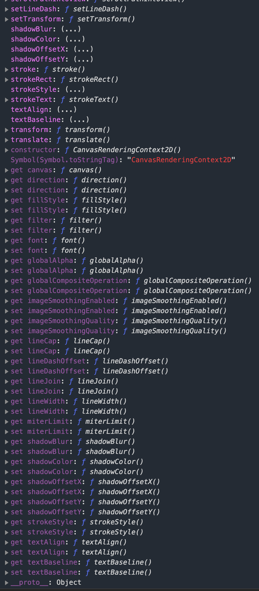
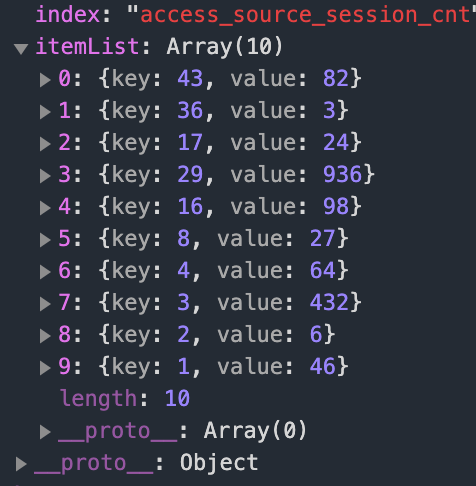

## 第一次课后作业 

### 一.单选题（共8题,100.0分）

*1*

下面哪个不是腾讯开放平台的组成部分

- A、

  应用开放平台

- B、

  微信开放平台

- C、

  AI开放平台

- D、

  创业服务平台

- E、

  内容开放平台

- F、

  QQ开放平台

- G、

  微博开放平台

我的答案：G得分： 12.5分

*2*

下面哪个不是微信开放平台的组成部分

- A、

  移动应用开发

- B、

  网站应用开发

- C、

  公众账号开发

- D、

  QQ小程序开发

- E、

  第三方平台开发

我的答案：D得分： 12.5分

*3*

下面哪个不是微信公众平台账号类型

- A、

  服务号

- B、

  订阅号

- C、

  视频号

- D、

  小程序

- E、

  企业微信

我的答案：C得分： 12.5分

*4*

下面哪个不是微信小程序的特点

- A、

  应用体积小

- B、

  可以完全控制手机功能

- C、

  无需安装

- D、

  无需卸载

我的答案：B得分： 12.5分

*5*

小程序名称一年内能修改几次

- A、

  设置后不能再改

- B、

  2次

- C、

  5次

- D、

  随便改，不限制。

我的答案：B得分： 12.5分

*6*

订阅号推文在后台哪个栏目创建

- A、

  功能

- B、

  管理

- C、

  设置

- D、

  开发

我的答案：B得分： 12.5分

*7*

订阅号能绑定多少个运营者

- A、

  5

- B、

  10

- C、

  25

- D、

  50

我的答案：C得分： 12.5分

*8*

小程序后台哪个栏目下可以找到appid

- A、

  管理

- B、

  统计

- C、

  开发

- D、

  推广

我的答案：C


## 第二次课后作业

###  一.单选题*（共4题,66.4分）*

*1*

微信开发者工具我们应该下载哪种版本

- A、

  Stable Build

- B、

  RC Build

- C、

  Nightly Build

- D、

  Jidian Build

我的答案：A得分： 16.6分

*2*

下面哪个不是微信开发者工具的快捷按钮

- A、

  模拟器

- B、

  编辑器

- C、

  解释器

- D、

  云开发

- E、

  编译

- F、

  预览

- G、

  真机调试

- H、

  切后台

- I、

  清缓存

- J、

  上传

- K、

  版本管理

- L、

  详情

我的答案：C得分： 16.6分

*3*

微信开发者工具无法编写哪种项目

- A、

  小程序

- B、

  小游戏

- C、

  代码片段

- D、

  公众号网页

- E、

  thinkphp

我的答案：E得分： 16.6分

*4*

微信开发者工具不能清除哪种缓存

- A、

  数据

- B、

  文件

- C、

  cookie

- D、

  授权

- E、

  网络

- F、

  登录状态

我的答案：C得分： 16.6分

### 二.多选题*（共1题,16.6分）*

*1*

新建小程序项目时后端服务有哪些可选？

- A、

  小程序·云开发

- B、

  腾讯云

- C、

  百度云

- D、

  阿里云

- E、

  华为云

- F、

  机电云

我的答案：AB得分： 16.6分

### 三.判断题*（共1题,17.0分）*

*1*

新建小程序项目时，appid可以吗为空吗？

我的答案：*×*


## 课后作业 3


### 一.单选题*（共2题,10.0分）*

*1*

下面哪个不是小程序项目成员的身份？

- A、

  运营者

- B、

  体验成员

- C、

  开发者

- D、

  数据分析者

我的答案：B得分： 5.0分

*2*

 一个小程序从开发完到上线的几个重要步骤正确的顺序是：1.发布，2.提交审核，3.预览，4.上传代码

- A、

    2->3->1->4

- B、

  3->4->2->1(

- C、

  1->2->3->4

- D、

   4->1->2->3

我的答案：B得分： 5.0分

### 二.多选题*（共6题,30.0分）*

*1*

运营者、开发者和数据分析者都可以有的权限是？

- A、

  体验者权限

- B、

  推广

- C、

  登录

- D、

  腾讯云管理

我的答案：AC得分： 5.0分

*2*

一个小程序页面由四个文件组成，分别是

- A、

    .js，必须的，负责页面逻辑

- B、

  .wxml，必须的，负责页面结构

- C、

  . json，不是必须的，负责页面配置

- D、

  . wxss，不是必须的，负责页面样式表

- E、

  .wxs，不是必须的，负责页面交互

我的答案：ABCD得分： 5.0分

*3*

微信小程序，只有后缀名在白名单内的文件可以被上传，不在白名单列表内文件在开发工具能被访问到，但无法被上传。下面哪些后缀在白名单中。

- A、

  .jpeg

- B、

  .wmv

- C、

  .mp4

- D、

  .png

我的答案：ACD得分： 5.0分

*4*

在项目目录中，哪些文件会编译，上传之后无法直接访问到。

- A、

  .js

- B、

  app.json

- C、

  .wxml(仅针对在 app.json 中配置了的页面)

- D、

  .wxss(仅针对在 app.json 中配置了的页面)

- E、

  .wxs

我的答案：ABCD得分： 5.0分

*5*

小程序的版本有几种状态？

- A、

  开发版本

- B、

  体验版本

- C、

   审核中版本

- D、

  线上版本

我的答案：ABCD得分： 5.0分

*6*

 一个小程序主体部分由哪三个文件组成，必须放在项目的根目录。

- A、

  app.js

- B、

  app.json

- C、

  app.wxss

- D、

  app.wxml

我的答案：ABC得分： 5.0分

### 三.判断题*（共12题,60.0分）*

*1*

后台页面收录设置，可对特定页面的索引进行关闭。sitemap配置可对整个小程序的索引进行关闭

我的答案：*×*得分： 5.0分

*2*

小程序根目录下的 app.json 文件用来对微信小程序进行全局配置，决定页面文件的路径、窗口表现、设置网络超时时间、设置多 tab 等。

我的答案：*√*得分： 5.0分

*3*

在小程序的平台里，开发者完成开发之后，把网页代码和资源上传到服务器上，即可同步更新系统。

我的答案：*×*得分： 5.0分

*4*

场景值用来描述用户进入小程序的路径，就是用户通过什么方式进入小程序的

我的答案：*√*得分： 5.0分

*5*

对于小游戏，可以在 wx.getLaunchOptionsSync 和 wx.onShow 中获取上述场景值

我的答案：*√*得分： 5.0分

*6*

部分场景值下还可以获取来源应用、公众号或小程序的appId。

我的答案：*√*得分： 5.0分

*7*

由于Android系统限制，目前还无法获取到按 Home 键退出到桌面，然后从桌面再次进小程序的场景值，对于这种情况，会保留上一次的场景值。

我的答案：*√*得分： 5.0分

*8*

对于小程序，可以在App的onLaunch和onShow，或wx.getLaunchOptionsSync中获取场景值。

我的答案：*√*得分： 5.0分

*9*

小程序没有sitemap.json则默认所有页面都不能被索引

我的答案：*×*得分： 5.0分

*10*

微信现已开放小程序内搜索，开发者可以通过 sitemap.json 配置，或者管理后台页面收录开关来配置其小程序页面是否允许微信索引。

我的答案：*√*得分： 5.0分

*11*

为了方便开发者减少配置项，微信小程序描述页面的四个文件可以有不同的路径与文件名

我的答案：*×*得分： 5.0分

*12*

每一个小程序页面也可以使用同名 .json 文件来对本页面的窗口表现进行配置，页面中配置项会覆盖 app.json 的 window 中相同的配置项。

我的答案：*√*


## 课后作业 4

### 一.单选题*（共6题,30.0分）*

*1*

下面关于微信小程序逻辑层描述错误的是？

- A、

  小程序开发框架的逻辑层使用 JavaScript 引擎为小程序提供开发者 JavaScript 代码的运行环境以及微信小程序的特有功能。

- B、

   小程序框架的逻辑层运行在浏览器中，因此JavaScript的DOM API都可使用，如访问window，document对象。

- C、

  逻辑层将数据进行处理后发送给视图层，同时接受视图层的事件反馈。

- D、

  开发者写的所有代码最终将会打包成一份 JavaScript 文件，并在小程序启动的时候运行，直到小程序销毁。这一行为类似 ServiceWorker，所以逻辑层也称之为 App Service。

我的答案：B得分： 5.0分

*2*

小程序Page实例有几个生命周期回调？

- A、

  4

- B、

  6

- C、

  8

- D、

  10

我的答案：B得分： 5.0分

*3*

分析小程序生命周期示意图，当视图线程(View Thread)第一次渲染完成后(First Render)，并发送通知给逻辑层线程(AppService Thread)，这时哪个生命周期回调函数将被调用？


- A、

  onLoad

- B、

  onShow

- C、

  onReady

- D、

  onHide

我的答案：C得分： 5.0分

*4*

哪一种路由方式会发生页面全部出栈，只留下新的页面的结果？

- A、

  初始化

- B、

  重加载

- C、

  页面返回

- D、

  Tab切换

我的答案：B得分： 5.0分

*5*

可以使用哪个函数获取当前页面栈？

- A、

  getApp()

- B、

  console.log()

- C、

  getCurrentPages()

- D、

   require()

我的答案：C得分： 5.0分

*6*

 以下关于路由操作的叙述错误的

- A、

  navigateTo, redirectTo只能打开非tabBar页面。

- B、

  路由后页面都会触发onShow生命周期函数

- C、

  switchTab只能打开tabBar页面。

- D、

  reLaunch可以打开任意页面。

- E、

  页面底部的tabBar由页面决定，即只要是定义为tabBar的页面，底部都有tabBar。

- F、

  调用页面路由带的参数可以在目标页面的onLoad中获取。

我的答案：B得分： 5.0分

### 二.多选题*（共3题,15.0分）*

*1*

腾讯在小程序逻辑层上增加了哪些功能，以方便程序的开发。

- A、

  增加App和Page方法，进行程序注册和页面注册。

- B、

  增加getApp和getCurrentPages方法，分别用来获取App实例和当前页面栈。

- C、

  提供丰富的API，如微信用户数据，扫一扫，支付等微信特有能力。

- D、

  提供模块化能力，每个页面有独立的作用域。

我的答案：ABCD得分： 5.0分

*2*

小程序注册页面的构造器有

- A、

  Page()

- B、

  Behaviors()

- C、

  Pages()

- D、

  Component()

- E、

  App()

我的答案：AD得分： 5.0分

*3*

哪些路由方式会发生新页面入栈的结果

- A、

  初始化

- B、

  打开新页面

- C、

  页面重定向

- D、

  重加载

我的答案：ABC得分： 5.0分

### 三.判断题*（共10题,50.0分）*

*1*

每个小程序都需要在app.js中调用App方法注册小程序实例，绑定生命周期回调函数、错误监听和页面不存在监听函数等。

我的答案：*√*得分： 5.0分

*2*

整个小程序只有一个App实例，是全部页面共享的。开发者可以通过getApp方法获取到全局唯一的App实例，获取App上的数据或调用开发者注册在App上的函数。

我的答案：*√*得分： 5.0分

*3*

对于小程序中的每个页面，都需要在页面对应的js文件中进行注册，指定页面的初始数据、生命周期回调、事件处理函数等。

我的答案：*√*得分： 5.0分

*4*

behaviors()可以用来让多个页面有相同的数据字段和方法。

我的答案：*√*得分： 5.0分

*5*

Page构造器适用于简单的页面。但对于复杂的页面，Page构造器可能并不好用。此时，可以使用Component构造器来构造页面。Component构造器的主要区别是：方法需要放在components:{ }里面。

我的答案：*×*得分： 5.0分

*6*

在小程序中所有页面的路由全部由框架进行管理，框架以队列的形式维护了当前的所有页面。

我的答案：*×*得分： 5.0分

*7*

微信小程序中可以将一些公共的代码抽离成为一个单独的js文件，作为一个模块。模块只有通过module.exports或者exports才能对外暴露接口。在需要使用这些模块的文件中，使用require将公共代码引入。[

我的答案：*√*得分： 5.0分

*8*

 微信小程序的文件作用域是指在JavaScript文件中声明的变量和函数只在该文件中有效；不同的文件中可以声明相同名字的变量和函数，不会互相影响。

我的答案：*√*得分： 5.0分

*9*

微信小程序的事件监听API，以on开头的API用来监听某个事件是否触发，如：wx.onSocketOpen，wx.onCompassChange 等。这类API接受一个回调函数作为参数，当事件触发时会调用这个回调函数，并将相关数据以参数形式传入。

我的答案：*√*得分： 5.0分

*10*

微信小程序大多数API都是异步API，执行结果需要通过Object类型的参数中传入的对应回调函数获取。微信小程序同步API的执行结果可以通过函数返回值直接获取，如果执行出错会抛出异常。有些异步API也有返回值。

我的答案：*√*得分： 5.0分

### 四.连线题*（共1题,5.0分）*

*1*

路由方式和触发时机连线

- 第一组数据

- 1、

  [初始化](javascript:void(0);)

- 2、

  [打开新页面](javascript:void(0);)

- 3、

  [页面重定向](javascript:void(0);)

- 4、

  [页面返回](javascript:void(0);)

- 5、

  [Tab切换](javascript:void(0);)

- 6、

  [重启动](javascript:void(0);)

- 第二组数据

- A、

  [调用API wx.navigateTo 或使用组件](javascript:void(0);)

- B、

  [小程序打开的第一个页面](javascript:void(0);)

- C、

  [调用 API wx.navigateBack 或使用组件 或用户按左上角返回按钮](javascript:void(0);)

- D、

  [调用 API wx.redirectTo 或使用组件 ](javascript:void(0);)

- E、

  [调用 API wx.reLaunch 或使用组件 ](javascript:void(0);)

- F、

  [调用 API wx.switchTab 或使用组件  或用户切换 Tab](javascript:void(0);)

我的答案

- 1.------------ 						    												B 																			
- 2.------------ 						    												A 																			
- 3.------------ 						    												D 																			
- 4.------------ 						    												C 																			
- 5.------------ 						    												F 																			
- 6.------------ 						    												E


## 课后作业 5

### 一.单选题（共11题,41.8分）
1
  小程序框架视图层

https://developers.weixin.qq.com/miniprogram/dev/framework/view/

答案请填A


A、
A

B、
B

正确答案： A 我的答案：A得分： 5.0分
2
下面哪个不是WXML的能力？

A、
数据绑定

B、
  模块化

C、
 列表渲染

D、
模板

E、
引用

F、
条件渲染

正确答案： B 我的答案：B得分： 3.8分
3
微信小程序的尺寸单位，rpx(responsive pixel): 可以根据屏幕宽度进行自适应。规定屏幕宽为750rpx。请计算2019年9月发布的最新版iphone的rpx与px的换算。

iPhone 11：Liquid 视网膜高清显示屏，6.1 英寸 (对角线) LCD 全面屏，1792 x 828 像素分辨率，326 ppi。

iPhone 11 Pro Max ：超视网膜 XDR 显示屏，6.5 英寸 (对角线) OLED 全面屏，2688 x 1242 像素分辨率，458 ppi

A、
 iPhone11 1rpx = 0.906px ；iPhone11 Pro Max 1rpx = 0.604px

B、
iPhone11 1rpx = 2.389px ；iPhone11 Pro Max 1rpx = 3.584px

C、
iPhone11 1rpx = 1.104px ；iPhone11 Pro Max 1rpx = 1.656px

D、
iPhone11 1rpx = 2.301px ；iPhone11 Pro Max 1rpx = 1.638px

正确答案： C 我的答案：C得分： 3.8分
4
下面对WXS叙述错误的是

A、
WXS函数不可以作为组件的事件回调。 

B、
WXS依赖于运行时的基础库版本，低版本需做兼容处理。

C、
WXS与JavaScript是不同的语言，有自己的语法，并不和JavaScript一致。

D、
WXS的运行环境和其他JavaScript代码是隔离的，WXS中不能调用其他JavaScript文件中定义的函数，也不能调用小程序提供的API。

正确答案： B 我的答案：B得分： 3.8分
5
下面对微信小程序事件叙述错误的是

A、
 事件可以将用户的行为反馈到逻辑层进行处理。

B、
事件可以绑定在组件上，当达到触发事件，就会执行逻辑层中对应的事件处理函数。

C、
事件是逻辑层到视图层的通讯方式。

D、
事件对象可以携带额外信息，如 id, dataset, touches。

正确答案： C 我的答案：C得分： 3.8分
6
下面关于使用WXS函数响应事件的叙述错误的是

A、
从基础库版本2.4.4开始，支持使用WXS函数绑定事件

B、
绑定的WXS函数必须用()括起来

C、
WXS函数接受2个参数，第一个是event，在原有的event的基础上加了event.instance对象，第二个参数是ownerInstance，和event.instance一样是一个ComponentDescriptor对象。

D、
ownerInstance包含了一些方法，可以设置组件的样式和class

正确答案： B 我的答案：B得分： 3.8分
答案解析：

绑定的WXS函数必须用{{}}括起来

7
下面哪个事件不是冒泡事件

A、
touchstart

B、
tap

C、
input

D、
 transitionend

E、
animationstart

F、
touchforcechange

正确答案： C 我的答案：C得分： 3.8分
8
下面哪个不是bind事件的合法绑定方式？

A、
 bindtap

B、
:tap

C、
 bind:tap

D、
catchtap

E、
catch:tap

F、
mut-bind:tap

G、
capture-bind:tap

正确答案： B 我的答案：B得分： 3.8分
9
下面哪个不是BaseEvent基础事件对象属性

A、
type

B、
 target

C、
bind

D、
currentTarget

E、
mark

正确答案： C 我的答案：C得分： 3.8分
10
下面关于mark描述错误的是

A、
在基础库版本2.7.1以上，可以使用mark来识别具体触发事件的target节点。此外，mark还可以用于承载一些自定义数据(类似于dataset)

B、
如果存在同名的mark，子节点的mark会被父节点覆盖。

C、
当事件触发时，事件冒泡路径上所有的mark会被合并，并返回给事件回调函数。(即使事件不是冒泡事件，也会mark)

D、
在自定义组件中接收事件时， mark不包含自定义组件外的节点的mark。

E、
 不同于dataset，节点的mark不会做连字符和大小写转换。

正确答案： B 我的答案：B得分： 3.8分
11
事件对象的触控属性中，距离页面可显示区域(屏幕除去导航条)左上角距离，横向点数的是？

A、
 clientX

B、
clientY

C、
pageX

D、
pageY

E、
x

F、
y

正确答案： A 我的答案：A得分： 3.8分
### 二.多选题（共1题,3.8分）
1
事件对象的哪些属性有dataset属性？

A、
target

B、
 currentTarget

C、
type

D、
mark

正确答案： AB 我的答案：AB得分： 3.8分
### 三.判断题（共14题,54.4分）
1
WXML(WeiShui Markup Language)是框架设计的一套标签语言，结合基础组件、事件系统，可以构建出页面的结构.[

我的答案：× 得分： 3.8分正确答案：×
2
组件上支持使用 style、class 属性来控制组件的样式。

我的答案：√ 得分： 3.8分正确答案：√
3
class用于指定样式规则，其属性值是样式规则中类选择器名(样式类名)的集合，样式类名不需要带上.，样式类名之间用分号分隔。

我的答案：× 得分： 3.8分正确答案：×
答案解析：

样式类名之间用空格分隔。

4
定义在app.wxss中的样式为全局样式，作用于每一个页面。在page的wxss文件中定义的样式为局部样式，只作用在对应的页面，并会覆盖app.wxss中相同的选择器。

我的答案：√ 得分： 3.8分正确答案：√
5
WXSS使用import语句可以导入外联样式表，import后跟需要导入的外联样式表的相对路径，用;表示语句结束。

我的答案：× 得分： 3.8分正确答案：×
答案解析：

@import

6
 WXS(WeiXin Script)是小程序的一套脚本语言，结合 WXML，可以构建出页面的结构。

我的答案：√ 得分： 3.8分正确答案：√
7
微信小程序的事件要在组件中绑定一个事件处理函数，并在相应的Page定义中写上相应的事件处理函数，参数是event。

我的答案：√ 得分： 3.8分正确答案：√
8
 微信小程序视图层的事件分为冒泡事件和非冒泡事件

我的答案：√ 得分： 3.8分正确答案：√
9
 如无特殊说明，当组件触发事件时，逻辑层绑定该事件的处理函数会收到一个事件对象。

我的答案：√ 得分： 3.8分正确答案：√
10
 canvas中的触摸事件不可冒泡，所以没有currentTarget。

我的答案：√ 得分： 3.8分正确答案：√
11
在组件节点中可以附加一些自定义数据。这样，在事件中可以获取这些自定义的节点数据，用于事件的逻辑处理。在WXML中，这些自定义数据以data-开头，多个单词由连字符-连接。这种写法中，连字符写法会转换成驼峰写法，而大写字符会自动转成小写字符。

我的答案：√ 得分： 3.8分正确答案：√
12
touches是一个数组，每个元素为一个Touch对象(canvas触摸事件中携带的touches是CanvasTouch数组)。表示当前停留在屏幕上的触摸点。

我的答案：√ 得分： 3.8分正确答案：√
13
detail是自定义事件所携带的数据，如表单组件的提交事件会携带用户的输入，媒体的错误事件会携带错误信息。

我的答案：√ 得分： 3.8分正确答案：√
14
事件对象的timeStamp属性是页面打开到触发事件所经过的秒数。

我的答案：× 得分： 3.8分正确答案：×
答案解析：

毫秒


## 课后作业6

### 一.单选题*（共6题,28.2分）*

*1*

小程序运行时：
https://developers.weixin.qq.com/miniprogram/dev/framework/runtime/env.html

小程序基础能力 网络
https://developers.weixin.qq.com/miniprogram/dev/framework/ability/network.html


小程序基础能力 存储[
https://developers.weixin.qq.com/miniprogram/dev/framework/ability/storage.html](https://developers.weixin.qq.com/miniprogram/dev/framework/ability/storage.html)

- A、

  A

- B、

  B

正确答案： A 我的答案：A得分： 4.7分

*2*

基于Mobile Chrome内核的XWeb引擎是微信小程序在哪个平台上的视图层运行环境？

- A、

  android

- B、

  iOS

- C、

  微信开发者工具

- D、

  微信windows客户端

- E、

  微信Mac客户端

正确答案： A 我的答案：A得分： 4.7分

*3*

JavaScriptCore是微信小程序在哪个平台上的javascript代码的运行引擎？

- A、

  android

- B、

  iOS

- C、

  微信开发者工具

- D、

  微信windows客户端

正确答案： B 我的答案：B得分： 4.7分

*4*

小程序服务域名设置共有几类，每类最多设置几个域名？

- A、

  4，10

- B、

  5，20

- C、

  6，30

- D、

  7，40

正确答案： B 我的答案：B得分： 4.7分

*5*

在小程序后台-开发-开发设置-服务器域名中的request合法域名加入了一条记录，内容是：https://myserver.com:8080，下面那些URL可以使用wx.request这个API成功发送请求。

- A、

  http://myserver.com/myapi

- B、

  http://myserver.com:8080/myapi

- C、

  https://myserver.com/myapi

- D、

  https://myserver.com:8080/myapi

- E、

   https://myserver.com:8090/myapi

正确答案： D 我的答案：D得分： 4.7分

*6*

在小程序后台-开发-开发设置-服务器域名中的request合法域名加入了一条记录，内容是：https://myserver.com，下面那些URL可以使用wx.request这个API成功发送请求。

- A、

  http://myserver.com/myapi

- B、

  http://myserver.com:443/myapi

- C、

  https://myserver.com/myapi

- D、

  https://myserver.com:443/myapi

- E、

  https://myserver.com:8443/myapi

正确答案： C 我的答案：C得分： 4.7分

答案解析：

https不能写端口号

### 二.多选题*（共3题,14.1分）*

*1*

微信小程序已经支持了绝大部分的ES6API，但以下几项API支持的不完整，部分平台上不支持。

- A、

  String.prototype.normalize()

- B、

  Array.prototype.values()

- C、

  Array.prototype.includes()

- D、

  Proxy

- E、

  Object.is()

正确答案： ABCD 我的答案：ABCD得分： 4.7分

*2*

以下关于微信小程序退出状态保存的叙述正确的是。

- A、

  如果超过expireTimeStamp，保存的数据将被丢弃，且冷启动时不遵循restartStrategy的配置，而是直接从首页冷启动。

- B、

  expireTimeStamp有可能被自动提前，如微信客户端需要清理数据的时候。

- C、

  在小程序存活期间，onSaveExitState可能会被多次调用，此时以最后一次的调用结果作为最终结果。

- D、

  在某些特殊情况下(如微信客户端直接被系统杀死)，这个方法将不会被调用，下次冷启动也不遵循restartStrategy的配置，而是直接从首页冷启动。

正确答案： ABCD 我的答案：ABCD得分： 4.7分

*3*

每个微信小程序都可以有自己的本地缓存，可以通过哪些API对本地缓存进行读写和清理。

- A、

  wx.setStorage/wx.setStorageSync(

- B、

  wx.getStorage/wx.getStorageSync

- C、

  wx.clearStorage/wx.clearStorageSync

- D、

  wx.removeStorage/wx.removeStorageSync

正确答案： ABCD 我的答案：ABCD得分： 4.7分

### 三.判断题*（共12题,57.7分）*

*1*

 基于安全考虑，小程序中不支持动态执行JS代码，即：不支持使用eval执行JS代码；不支持使用new Function创建函数

我的答案：*√* 得分： 4.7分正确答案：*√*

*2*

如果用户已经打开过某小程序，然后在一定时间内再次打开该小程序，此时小程序并未被销毁，只是从后台状态进入前台状态，这个过程就是冷启动

我的答案：*×* 得分： 4.7分正确答案：*×*

答案解析：

热启动

*3*

当用户点击右上角胶囊按钮关闭小程序，或者按了设备Home键离开微信时，小程序完全终止运行，并不进入后台状态。

我的答案：*×* 得分： 4.7分正确答案：*×*

答案解析：

后台状态

*4*

当小程序进入后台，可以会维持一小段时间的运行状态，如果这段时间内都未进入前台，小程序会被销毁。当小程序占用系统资源过高，可能会被系统销毁或被微信客户端主动回收。

我的答案：*√* 得分： 4.7分正确答案：*√*

*5*

每当小程序可能被销毁之前，页面回调函数exitState会被调用。如果想保留页面中的状态，可以在这个回调函数中“保存”一些数据，下次启动时可以通过onSaveExitState获得这些已保存数据。

我的答案：*×* 得分： 4.7分正确答案：*×*

答案解析：

每当小程序可能被销毁之前，页面回调函数 `onSaveExitState` 会被调用。如果想保留页面中的状态，可以在这个回调函数中“保存”一些数据，下次启动时可以通过 `exitState` 获得这些已保存数据。

*6*

开发者在后台发布新版本之后，无法立刻影响到所有现网用户，但最差情况下，在小程序发布之后48小时之内下发新版本信息到用户。用户下次打开时会先更新最新版本再打开。小程序每次冷启动时，都会检查是否有更新版本，如果发现有新版本，将会异步下载新版本的代码包，并同时用客户端本地的包进行启动，即新版本的小程序需要等下一次冷启动才会应用上。

我的答案：*×* 得分： 4.7分正确答案：*×*

答案解析：

24小时

*7*

小程序服务器域域名不能使用IP地址(小程序的局域网IP除外)或 localhost，域名必须经过 ICP 备案，只支持https (wx.request、wx.uploadFile、wx.downloadFile) 和wss (wx.connectSocket) 协议。

我的答案：*√* 得分： 4.7分正确答案：*√*

*8*

小程序进入后台运行后，如果60s内网络请求没有结束，会回调错误信息 fail interrupted；在回到前台之前，网络请求接口调用都会无法调用。

我的答案：*×* 得分： 4.7分正确答案：*×*

答案解析：

5秒

*9*

只要成功接收到服务器返回，无论statusCode是多少，都会进入success回调

我的答案：*√* 得分： 4.7分正确答案：*√*

*10*

在微信开发者工具中，可以临时开启 开发环境不校验请求域名、TLS版本及HTTPS证书选项，跳过服务器域名的校验。此时，在微信开发者工具中及手机开启调试模式时，不会进行服务器域名的校验。

我的答案：*√* 得分： 4.7分正确答案：*√*

*11*

同一个微信用户，同一个小程序storage上限为100MB。storage以用户维度隔离，同一台设备上，A用户无法读取到B用户的数据；不同小程序之间也无法互相读写数据

我的答案：*×* 得分： 4.7分正确答案：*×*

答案解析：

10M

*12*

本地缓存的清理时机跟代码包一样，只有在代码包被清理的时候本地缓存才会被清理。

我的答案：*√* 得分： 6.0分正确答案：*√*


## 课后作业 7

### 一.单选题*（共5题,25.0分）*

*1*

仅在当前生命周期内有效，重启之后即不可用的文件类型是？

- A、

  程序包文件

- B、

  本地缓存文件

- C、

   本地用户文件

- D、

  本地临时文件

正确答案： D 我的答案：D得分： 5.0分

*2*

有完全自由的读写权限的文件类型是

- A、

  程序包文件

- B、

  本地临时文件

- C、

   本地缓存文件

- D、

  本地用户文件

正确答案： D 我的答案：D得分： 5.0分

*3*

canvas组件的哪个属性用于创建绘图上下文

- A、

  canvasid

- B、

  canvas-id

- C、

  id

- D、

  class

正确答案： B 我的答案：B得分： 5.0分

*4*

创建绘图上下文的API是？

- A、

  wx.canvasContext()

- B、

  wx.getCanvasContext()

- C、

  wx.createCanvasContext()(

- D、

  wx.createCanvasContextById()

正确答案： C 我的答案：C得分： 5.0分

*5*

单个分包/主包的大小限制，整个小程序所有分包的大小限制是？

- A、

    1M，4M

- B、

  2M，12M

- C、

  4M，16M

- D、

  8M，64M

正确答案： B 我的答案：B得分： 5.0分

答案解析：

### 二.多选题*（共4题,20.0分）*

*1*

微信小程序文件主要分为哪两大类?

- A、

  代码包文件：代码包文件指的是在项目目录中添加的文件。

- B、

  本地文件：通过调用接口本地产生，或通过网络下载下来，存储到本地的文件。

- C、

  共享文件：指的是用来和其它应用之间相互分享的文件

- D、

  下载文件：指的是从网络下载回来的文件

正确答案： AB 我的答案：AB得分： 5.0分

*2*

微信小程序的本地文件分为哪三大类 ？

- A、

  本地临时文件：临时产生，随时会被回收的文件。不限制存储大小。

- B、

  本地缓存文件：小程序通过接口把本地临时文件缓存后产生的文件，不能自定义目录和文件名。跟本地用户文件共计，普通小程序最多可存储 10MB，游戏类目的小程序最多可存储 50MB。

- C、

  本地用户文件：小程序通过接口把本地临时文件缓存后产生的文件，允许自定义目录和文件名。跟本地缓存文件共计，普通小程序最多可存储 10MB，游戏类目的小程序最多可存储 50MB。

- D、

  本地共享文件：用来和其它应用之间相互分享的文件。不限制存储大小。

正确答案： ABC 我的答案：ABC得分： 5.0分

*3*

app.json的分包设置subpackages属性中有哪几个设置项？

- A、

  root String 分包根目录

- B、

  name String 分包别名，分包预下载时可以使用

- C、

  pages StringArray 分包页面路径，相对与分包根目录

- D、

  independent Boolean 分包是否是独立分包

正确答案： ABCD 我的答案：ABCD得分： 5.0分

答案解析：

*4*

微信小程序打包原则描述正确的是

- A、

  声明subpackages后，将按subpackages配置路径进行打包，subpackages配置路径外的目录将被打包到app(主包)中

- B、

  app(主包)也可以有自己的pages(即最外层的pages字段)

- C、

  subpackage的根目录不能是另外一个subpackage内的子目录

- D、

  tabBar页面必须在app(主包)内

正确答案： ABCD 我的答案：ABCD得分： 5.0分

### 三.判断题*（共11题,55.0分）*

*1*

文件系统是小程序提供的一套以小程序和用户维度隔离的存储以及一套相应的管理接口。通过FileSystemManager可以获取到全局唯一的文件系统管理器，所有文件系统的管理操作通过wx.getFileSystemManager()来调用。

我的答案：*×* 得分： 5.0分正确答案：*×*

答案解析：

通过wx.getFileSystemManager()可以获取到全局唯一的文件系统管理器，所有文件系统的管理操作通过FileSystemManager来调用。

*2*

由于代码包文件大小限制，代码包文件适用于放置首次加载时需要的文件，对于内容较大或需要动态替换的文件，不推荐用添加到代码包中，推荐在小程序启动之后再用下载接口下载到本地。

我的答案：*√* 得分： 5.0分正确答案：*√*

*3*

代码包文件的访问方式是从项目根目录开始写文件路径，支持相对路径的写法。如：/a/b/c、a/b/c 和 ./a/b/c ../a/b/c 都是合法的。

我的答案：*×* 得分： 5.0分正确答案：*×*

答案解析：

不支持相对路径，只支持绝对路径。

*4*

代码包内的文件可以在运行后动态修改或删除

我的答案：*×* 得分： 5.0分正确答案：*×*

答案解析：

运行后不能动态修改。

*5*

微信小程序的本地文件以用户维度隔离。即同一台手机，每个微信用户不能访问到其他登录用户的文件，同一个用户不同appId之间的文件也不能互相访问。

我的答案：*√* 得分： 5.0分正确答案：*√*

*6*

本地临时文件、本地缓存文件和本地用户文件的清理时机跟代码包一样，只有在代码包被清理的时会被清理。

我的答案：*×* 得分： 5.0分正确答案：*×*

答案解析：

本地临时文件，小程序关闭后，可能会被清理。

*7*

所有在canvas中的画图必须用JavaScript完成

我的答案：*√* 得分： 5.0分正确答案：*√*

*8*

canvas的坐标系是在一个二维的网格当中，右上角的坐标为(0, 0)。

我的答案：*×* 得分： 5.0分正确答案：*×*

答案解析：

左上角

*9*

渐变能用于填充一个矩形，圆，线，文字等。填充色只能是固定的一种颜色。

我的答案：*×* 得分： 5.0分正确答案：*×*

答案解析：

两种颜色的渐变

*10*

每个使用分包小程序必定含有一个主包。所谓的主包，即放置默认启动页面/TabBar页面，以及一些所有分包都需用到公共资源/JS脚本；而分包则是根据开发者的配置进行划分。在小程序启动时，默认会下载主包并启动主包内页面，当用户进入分包内某个页面时，客户端会把对应分包下载下来，下载完成后再进行展示。

我的答案：*√* 得分： 5.0分正确答案：*√*

*11*

分包内的页面只能引用所在分包或主包内的js文件、template文件和资源文件。

我的答案：*√* 得分： 5.0分正确答案：*√*


## 课后作业 8

### 一.单选题*（共3题,15.0分）*

*1*

在主线程中用哪个API来初始化worker?

- A、

  wx.worker()

- B、

  wx.createWorker()

- C、

  wx.getWorker()

- D、

  wx.createWorkerById()

正确答案： B 我的答案：B得分： 5.0分

*2*

以下对worker的运行限制叙述错误的是？

- A、

  Worker最大并发数量限制为1个，创建下一个前请用Worker.terminate()结束当前 Worker

- B、

  Worker内代码只能require指定Worker路径内的文件，无法引用其它路径

- C、

  Workers之间可以发送消息

- D、

  Worker内不支持wx系列的 API

正确答案： C 我的答案：C得分： 5.0分

*3*

以下关于自定义tabbar叙述错误的是？

- A、

  为了保证低版本兼容以及区分哪些页面是tab页，tabBar的相关配置项需完整声明，但这些字段不会作用于自定义tabBar的渲染。

- B、

  此时需要开发者提供一个自定义组件来渲染tabBar，所有tabBar的样式都由该自定义组件渲染。推荐用fixed在底部的cover-view+cover-image组件渲染样式，以保证tabBar层级相对较高。

- C、

  与tabBar样式相关的接口，如wx.setTabBarItem不会失效。

- D、

  每个tab页下的自定义tabBar组件实例是不同的，可通过自定义组件下的getTabBar接口，获取当前页面的自定义tabBar组件实例。

  

正确答案： C 我的答案：C得分： 5.0分

### 二.多选题*（共2题,10.0分）*

*1*

接入微信小程序消息推送服务，哪些方式可以选择？

- A、

  开发者服务器接收消息推送

- B、

  云函数接收消息推送

- C、

  大数据接收消息推送

- D、

  云计算接收消息推送

正确答案： AB 我的答案：AB得分： 5.0分

*2*

开发者服务器接收消息推送需要哪些步骤？

- A、

  小程序后台填写服务器配置

- B、

  验证服务器地址的有效性

- C、

  跟据接口文档实现业务逻辑，接收消息和事件

- D、

  搭建websocket服务器

正确答案： ABC 我的答案：ABC得分： 5.0分

### 三.判断题*（共15题,75.0分）*

*1*

一些异步处理的任务，可以放置于Worker中运行，待运行结束后，再把结果返回到小程序主线程。Worker运行于一个单独的全局上下文与线程中，不能直接调用主线程的方法。Worker与主线程之间的数据传输，双方使用Worker.postMessage() 来发送数据，Worker.onMessage()来接收数据，传输的数据并不是直接共享，而是被复制的。

我的答案：*√* 得分： 5.0分正确答案：*√*

*2*

在app.json中可配置Worker代码放置的目录，目录下的代码将被打包成一个文件。

我的答案：*√* 得分： 5.0分正确答案：*√*

*3*

在Worker线程执行上下文会全局暴露一个worker对象，直接调用worker.onMeesage/postMessage即可[

我的答案：*√* 得分： 5.0分正确答案：*√*

*4*

access_token是小程序全局唯一后台接口调用凭据，调用绝大多数后台接口时都需使用。开发者可以通过 getAccessToken 接口获取并进行妥善保存。为了access_token的安全性，后端API不能直接在小程序内通过wx.request调用，即api.weixin.qq.com不能被配置为服务器域名。开发者应在后端服务器使用getAccessToken获取access_token，并调用相关API。

我的答案：*√* 得分： 5.0分正确答案：*√*

*5*

对于GET请求，请求参数应以QueryString的形式写在URL中。对于POST请求，部分参数需以QueryString的形式写在URL中(一般只有access_token，如有额外参数会在文档里的URL中体现)，其他参数如无特殊说明均以JSON字符串格式写在POST请求的body中。

我的答案：*√* 得分： 5.0分正确答案：*√*

*6*

开通了云开发的小程序可以使用云函数接收消息推送，目前仅支持客服消息推送。

我的答案：*√* 得分： 5.0分正确答案：*√*

*7*

自定义组件新增getTabBar接口，可获取当前页面下的自定义tabBar组件实例。如需实现tab选中态，要在当前页面下，通过getTabBar接口获取组件实例，并调用setData更新选中态.

我的答案：*√* 得分： 5.0分正确答案：*√*

*8*

周期性更新能够在用户未打开小程序的情况下，也能从服务器提前拉取数据，当用户打开小程序时可以更快地渲染页面，减少用户等待时间，增强在弱网条件下的可用性.微信客户端会在一定的网络条件下，每隔2小时(以上一次成功更新的时间为准)向配置的数据下载地址发起一个HTTP GET请求。

我的答案：*×* 得分： 5.0分正确答案：*×*

答案解析：

每隔12小时

*9*

预拉取能够在小程序冷启动的时候通过微信后台提前向第三方服务器拉取业务数据，当代码包加载完时可以更快地渲染页面，减少用户等待时间，从而提升小程序的打开速度。

我的答案：*√* 得分： 5.0分正确答案：*√*

*10*

周期性更新和数据预拉取都是向开发者服务器发起HTTP GET请求，开发者服务器接口返回的数据类型应为字符串，且大小应不超过256M，否则将无法缓存数据。

我的答案：*×* 得分： 5.0分正确答案：*×*

答案解析：

256KB

*11*

蓝牙适配器模块生效周期为调用wx.openBluetoothAdapter至调用wx.closeBluetoothAdapter或小程序被销毁为止。在小程序蓝牙适配器模块生效期间，开发者才能够正常调用蓝牙相关的小程序 API，并收到蓝牙模块相关的事件回调

我的答案：*√* 得分： 5.0分正确答案：*√*

*12*

由于系统限制，Android上获取到的deviceId为设备uuid，iOS上则为设备MAC地址。因此deviceId不能硬编码到代码中。

我的答案：*×* 得分： 5.0分正确答案：*×*

答案解析：

Android 上获取到的 `deviceId` 为设备 MAC 地址，iOS 上则为设备 uuid。

*13*

微信小程序对NFC暂仅支持HCE(基于主机的卡模拟)模式，即将安卓手机模拟成实体智能卡。适用机型：支持NFC功能，且系统版本为Android 5.0及以上的手机。适用卡范围：符合ISO 14443-4 标准的CPU卡。

我的答案：*√* 得分： 5.0分正确答案：*√*

*14*

在小程序中支持搜索周边的 Wi-Fi，同时可以针对指定 Wi-Fi，传入密码发起连接。

我的答案：*√* 得分： 5.0分正确答案：*√*

*15*

Android 6.0以上版本，在没有打开定位开关的时候会导致设备不能正常获取周边的Wi-Fi信息。

我的答案：*√* 得分： 5.0分正确答案：*√*


## 课后作业 9

### 一.单选题*（共13题,65.0分）*

*1*

扫描手机相册中选取的二维码的场景值是?    

- A、

  1024

- B、

  1025

- C、

  1013

- D、

  1049

正确答案： C 我的答案：C得分： 5.0分

*2*

哪个配置项声明了小程序使用的插件。

- A、

  preloadRules

- B、

  plugins

- C、

   functionalPages

- D、

  subpackages

正确答案： B 我的答案：B得分： 5.0分

*3*

搜一搜的结果页的场景值是

- A、

  1058

- B、

  1053

- C、

  1084

- D、

  1048

正确答案： B 我的答案：B得分： 5.0分

*4*

下面哪个不是tabBar的项目list的配置项？

- A、

  pagePath

- B、

  text

- C、

   color

- D、

  selectedIconPath

正确答案： C 我的答案：C得分： 5.0分

*5*

长按图片识别小程序码的场景值是?

- A、

  1024

- B、

  1048

- C、

  1084

- D、

  1012

正确答案： B 我的答案：B得分： 5.0分

*6*

下面哪个不是tabBar的配置项

- A、

  color

- B、

  selectedColor

- C、

  backgroundTextStyle

- D、

  backgroundColor

正确答案： C 我的答案：C得分： 5.0分

*7*

小程序的tabBar的按钮最少几个，最多几个？

- A、

  1，4

- B、

  2，5

- C、

  1，5

- D、

  2，6

正确答案： B 我的答案：B得分： 5.0分

*8*

哪个配置项设置跳转到其他小程序的appId列表？

- A、

  navigateToMiniProgramAppIdList

- B、

  resizable

- C、

  plugins

- D、

  preloadRules

正确答案： A 我的答案：A得分： 5.0分

*9*

浮窗打开小程序的场景值是?

- A、

  1184

- B、

  1131

- C、

  1077

- D、

  1240

正确答案： B 我的答案：B得分： 5.0分

*10*

哪个配置项指定需要引用的扩展库。

- A、

  useExtendedLib

- B、

  style

- C、

  entranceDeclare

- D、

  usingCompnents

正确答案： A 我的答案：A得分： 5.0分

*11*

下面哪个不是networkTimeout的配置项？

- A、

  request

- B、

  connectSocket

- C、

  response

- D、

  uploadFile

正确答案： C 我的答案：C得分： 5.0分

*12*

下面哪个不是window的配置项？

- A、

  navigationBarBackgroundColor

- B、

  navigationBarTextStyle

- C、

  permission

- D、

  navigationBarTitleText

正确答案： C 我的答案：C得分： 5.0分

答案解析：

*13*

哪个配置项设置聊天位置消息用打车类小程序打开？

- A、

  useExtendedLib

- B、

  style

- C、

  sitemapLocation

- D、

  entranceDeclare

正确答案： D 我的答案：D得分： 5.0分

### 二.多选题*（共3题,15.0分）*

*1*

页面配置与window配置项目都有的配置项有哪些？

- A、

  navigationBarBackgroundColor

- B、

  navigationBarTextStyle

- C、

  navigationBarTitleText

- D、

  navigationStyle

- E、

  backgroundColor

- F、

  backgroundColorTop

- G、

  backgroundColorBottom

正确答案： ABCDEFG 我的答案：ABCDEFG得分： 5.0分

*2*

requiredBackgroundModes申明需要后台运行的能力，类型为数组。目前支持哪些项目？

- A、

  audio: 后台音乐播放

- B、

  video：后台视频播放

- C、

  capture：后台视频录制

- D、

  location: 后台定位

- E、

  record：后台音频录制

正确答案： AD 我的答案：AD得分： 5.0分

*3*

下面哪些不是app.json的配置项？

- A、

  windows

- B、

  networkTimeout

- C、

  tarBars

- D、

  permission

正确答案： AC 我的答案：AC得分： 5.0分

答案解析：

### 三.判断题*（共4题,20.0分）*

*1*

在app.json的usingCompnents处声明的自定义组件视为全局自定义组件，在小程序内的页面或自定义组件中可以直接使用而无需再声明。

我的答案：*√* 得分： 5.0分正确答案：*√*

*2*

可以在开发者工具中开启debug模式，在开发者工具的控制台面板，调试信息以info的形式给出，其信息有Page的注册，页面路由，数据更新，事件触发等。可以帮助开发者快速定位一些常见的问题。

我的答案：*√* 得分： 5.0分正确答案：*√*

答案解析：

*3*

每一个小程序页面也可以使用.json文件来对本页面的窗口表现进行配置。页面中配置项在当前页面不会覆盖app.json的window中相同的配置项。

我的答案：*×* 得分： 5.0分正确答案：*×*

答案解析：

会覆盖

*4*

pages用于指定小程序由哪些页面组成，每一项都对应一个页面的路径(含文件名) 信息。文件名不需要写文件后缀，框架会自动去寻找对于位置的 .json, .js, .wxml, .wxss四个文件进行处理。数组的第一项代表小程序的初始页面(首页)。小程序中新增/减少页面，都需要对pages数组进行修改。

我的答案：*√* 得分： 5.0分正确答案：*√*


## 课后作业 10 

### 一.单选题*（共9题,45.0分）*

*1*

自定义转发内容的图片可以是哪些来源，支持哪些格式，长宽比是多少？

- A、

  本地文件、网络图片；jpg，gif、png；5：4

- B、

  本地文件、网络图片、云图片；jpg、png；5：4

- C、

  本地文件、网络图片、云图片；jpg、png；16：9

- D、

  本地文件、网络图片；jpg，gif、png；16：9

正确答案： B 我的答案：B得分： 5.0分

*2*

监听用户下拉刷新事件的回调函数是哪一个？

- A、

  onPullDownRefresh

- B、

  onReachBottom

- C、

  onUnload

- D、

  onShareAppMessage

正确答案： A 我的答案：A得分： 5.0分

*3*

点击tab时触发哪个事件

- A、

  onResize

- B、

  onShareAppMessage

- C、

  onTabItemTap

- D、

  onPullDownRefresh

正确答案： C 我的答案：C得分： 5.0分

*4*

下面哪个回调函数全局只触发一次

- A、

  onHide

- B、

  onPageNotFound

- C、

  onLaunch

- D、

  onHandledRejection

正确答案： C 我的答案：C得分： 5.0分

答案解析：

*5*

监听用户上拉触底事件的回调函数是哪一个？

- A、

  onUnload

- B、

  onReachBottom

- C、

  onPullDownRefresh

- D、

  onShareAppMessage

正确答案： B 我的答案：B得分： 5.0分

*6*

下面哪个不是App()参数对象的属性？

- A、

   onLaunch

- B、

  onShow

- C、

  onStart

- D、

  onHide

- E、

  onError

- F、

  onPageNotFound

- G、

  onHandledRejection

正确答案： C 我的答案：C得分： 5.0分

*7*

页面不存在监听函数是哪个?

- A、

  onHide

- B、

  onPageNotFound

- C、

  onError

- D、

  onHandledRejection

正确答案： B 我的答案：B得分： 5.0分

答案解析：

*8*

下面哪个不是Page()参数对象的属性？

- A、

   data

- B、

  onLoad

- C、

  onLaunch

- D、

  onShow

- E、

  onReady

- F、

  onPullDownRefresh

- G、

  onShareAppMessage

正确答案： C 我的答案：C得分： 5.0分

*9*

只有定义了哪个事件处理函数，右上角菜单才会显示“转发”按钮？

- A、

  onPullDownRefresh

- B、

  onReachBottom

- C、

  onShareAppMessage

- D、

  onUnload

正确答案： C 我的答案：C得分： 5.0分

### 二.多选题*（共4题,20.0分）*

*1*

下面哪些不是生命周期回调?

- A、

  onError

- B、

  onPageNotFound

- C、

  onHandledRejection

- D、

  onLaunch

- E、

  onShow

- F、

  onHide

正确答案： ABC 我的答案：ABC得分： 5.0分

答案解析：

*2*

onShareAppMessage转发回调函数需要return一个Object，用于自定义转发内容，都有哪些属性？

- A、

  title

- B、

  path

- C、

  imageUrl

- D、

  from

- E、

  target

- F、

  webViewUrl

正确答案： ABC 我的答案：ABC得分： 5.0分

*3*

一个页面只会调用一次的生命周期回调函数有哪些？

- A、

  onLoad

- B、

  onShow

- C、

  onReady

- D、

  onHide

- E、

  onUnload

正确答案： ACE 我的答案：ACE得分： 5.0分

*4*

setData数用于将数据从逻辑层发送到视图层(异步)，同时改变对应的this.data的值(同步)。下面对setData叙述正确的是？

- A、

  直接修改this.data而不调用 this.setData 是无法改变页面的状态的，还会造成数据不一致。

- B、

   setData仅支持设置可JSON化的数据。

- C、

  单次设置的数据不能超过1024kB，请尽量避免一次设置过多的数据。

- D、

   请不要把data中任何一项的value设为 undefined，否则这一项将不被设置并可能遗留一些潜在问题。

正确答案： ABCD 我的答案：ABCD得分： 5.0分

### 三.判断题*（共7题,35.0分）*

*1*

setData所设置的key，必须要在data中预先定义，否则会产生运行时错误。

我的答案：*×* 得分： 5.0分正确答案：*×*

答案解析：

不需要预先定义。

*2*

require(string path)函数用于引入模块，函数返回模块通过module.exports或exports暴露的接口。参数path，类型是String，是需要引入模块文件相对于当前文件的相对路径，或npm模块名，或npm模块路径。支持绝对路径。

我的答案：*×* 得分： 5.0分正确答案：*×*

答案解析：

不支持绝对路径

*3*

data 是页面第一次渲染使用的初始数据。页面加载时，data将会以JSON字符串的形式由逻辑层传至渲染层，因此data中的数据必须是可以转成JSON的类型：字符串，数字，布尔值，对象，数组。渲染层可以通过WXML对数据进行绑定。

我的答案：*√* 得分： 5.0分正确答案：*√*

*4*

module是当前模块对象，有一个属性exports数据类型是Object模块向外暴露的对象，使用require引用该模块时可以获取

我的答案：*√* 得分： 5.0分正确答案：*√*

*5*

可以在App.onLaunch生命周期回调函数中的时候调用getCurrentPages()，此时page已经生成。

我的答案：*×* 得分： 5.0分正确答案：*×*

答案解析：

onLaunch时page对象还没生成。

*6*

App()必须在app.json中由框架调用，必须调用且只能调用一次。不然会出现无法预期的后果。

我的答案：*×* 得分： 5.0分正确答案：*×*

答案解析：

app.js

*7*

Page中还可以定义组件事件处理函数。在渲染层的组件中加入事件绑定，当事件被触发时，就会执行Page中定义的事件处理函数。

我的答案：*√* 得分： 5.0分正确答案：*√*


## 课后作业 11

### 一.单选题*（共7题,32.9分）*

*1*

下面数据绑定运用错误的是？

- A、

  <view> {{ message }} </view>

- B、

  <checkbox checked="false"> </checkbox>

- C、

  <view id="item-{{id}}"> </view>

- D、

  <view wx:if= "{{condition}}" > </view>

正确答案： B 我的答案：B得分： 4.7分

答案解析：

*2*

微信小程序的数据绑定，可以在Mustache内直接进行组合，构成新的对象或数组。下面哪项不是组合

- A、

  <view wx:for= {{[zero, 1, 2, 3, 4]}} > {{item}} </view>

- B、

  <view>{{object.key}}</view>

- C、

  <template is= objectCombine data= {{for: a, bar: b}} ></template>

- D、

  <template is= objectCombine data= {{...obj1, ...obj2, e: 5}} ></template>

- E、

  <template is= objectCombine data= {{foo, bar}} ></template>

正确答案： B 我的答案：B得分： 4.7分

*3*

console是一个全局对象可以直接访问，用于打印日志，有几个打印日志的方法？

- A、

  1

- B、

  3

- C、

  5

- D、

  7

正确答案： C 我的答案：C得分： 4.7分

*4*

下面哪个方法是设定一个定时器。在定时到期以后执行注册的回调函数。

- A、

  clearTimeout

- B、

  setTimeout

- C、

  clearInterval

- D、

  setInterval

正确答案： B 我的答案：B得分： 4.7分

*5*

使用哪两个属性可以指定数组当前元素和当前下标的变量名

- A、

  or-item,for-index

- B、

  wx:for-item，wx:for-index

- C、

  wx:item,wx:index

- D、

   item,index

正确答案： B 我的答案：B得分： 4.7分

*6*

小程序框架接口 基础功能

https://developers.weixin.qq.com/miniprogram/dev/reference/api/wx.html

WXML语法参考 数据绑定

https://developers.weixin.qq.com/miniprogram/dev/reference/wxml/data.html

WXML语法参考 列表渲染

https://developers.weixin.qq.com/miniprogram/dev/reference/wxml/list.html

选a

- A、

  a

- B、

  b

正确答案： A 我的答案：A得分： 4.7分

*7*

下面数据绑定运算错误的是

- A、

  <view> {{a + b}} + {{c}} + {{d}} </view>

- B、

  <view hidden= {{flag ? true : false}} > Hidden </view>

- C、

  <view wx:if="length > 5"> </view>

- D、

   <view>{{"hello" + name}}</view>

- E、

  <view>{{object.key}} {{array[0]}}</view>

正确答案： C 我的答案：C得分： 4.7分

### 二.多选题*（共1题,4.7分）*

*1*

wx是小程序API全局对象，用于承载小程序能力相关API。wx的属性有哪些？

这题要写代码 console.log(wx)，在console窗口查看wx对象的所有属性，并展开内容。


- A、

  env

- B、

  error

- C、

  version

- D、

  cloud

- E、

  createWorker

正确答案： ABCD 我的答案：ABCD得分： 4.7分

### 三.判断题*（共13题,62.4分）*

*1*

如不提供wx:key，微信开发者工具会报一个warning，如果明确知道该列表是静态，或者不必关注其顺序，可以选择忽略。

我的答案：*√* 得分： 4.7分正确答案：*√*

*2*

一般来说，wx:if有更高的切换消耗而hidden有更高的初始渲染消耗。

我的答案：*√* 得分： 4.7分正确答案：*√*

*3*

setTimout和setInterval都可以传入3个以上的不定长参数，第3个及之后的参数是传给回调函数的。

我的答案：*√* 得分： 4.7分正确答案：*√*

答案解析：

*4*

默认数组的当前项的下标变量名默认为item，数组当前项的变量名默认为index

我的答案：*√* 得分： 4.7分正确答案：*×*

答案解析：

下标变量名默认为index，数组当前项的变量名默认为item

*5*

 WXML中的动态数据均来自对应Page的data。

我的答案：*√* 得分： 4.7分正确答案：*√*

*6*

import有作用域的概念，即只会import目标文件中定义的template，而不会import目标文件import的template。

我的答案：*√* 得分： 4.7分正确答案：*√*

*7*

在组件上使用 wx:for 控制属性绑定一个数组，即可使用数组中各项的数据重复渲染该组件。

我的答案：*√* 得分： 4.7分正确答案：*√*

*8*

类似block wx:if，也可以将wx:for用在<block/>标签上，以渲染一个包含多节点的结构块。

我的答案：*√* 得分： 4.7分正确答案：*√*

*9*

当 wx:for 的值为字符串时，会将字符串解析成字符串数组

我的答案：*√* 得分： 4.7分正确答案：*√*

*10*

数据绑定使用Mustache语法(双大括号{{}})将变量包起来

我的答案：*√* 得分： 4.7分正确答案：*√*

*11*

在框架中，使用wx:if=""来判断是否需要渲染该代码块，也可以用wx:elif和wx:else来添加一个else块。

我的答案：*√* 得分： 4.7分正确答案：*√*

*12*

setTimeout和setInterval函数都会返回一个数字，是定时器的编号，可以用来取消定时器。

我的答案：*√* 得分： 4.7分正确答案：*√*

*13*

模板拥有自己的作用域，只能使用data传入的数据以及模板定义文件中定义的<wxs />模块

我的答案：*√* 得分： 6.0分正确答案：*√*


## 课后作业 12


### 一.单选题*（共15题,70.5分）*

*1*

下面哪个不是WXS的数据类型

- A、

  number 数值

- B、

  geo 地理位置

- C、

   array 数组

- D、

  date 日期

- E、

   object 对象

- F、

  function 函数

- G、

  regexp 正则

正确答案： B 我的答案：B得分： 4.7分

*2*

下面哪个不是WXS的Math库属性

- A、

  Q

- B、

  E

- C、

  LN2

- D、

  PI

正确答案： A 我的答案：A得分： 4.7分

*3*

WXS有几种注释方法？

- A、

  1

- B、

  2

- C、

  3

- D、

  4

正确答案： C 我的答案：C得分： 4.7分

答案解析：

单行

多行

结尾注释

*4*

下面关于wxs模块叙述错误的是

- A、

  WXS代码可以编写在wxs文件中的<wxs>标签内，或以.wxs为后缀名的文件内。

- B、

  每一个.wxs文件和<wxs>标签都是一个单独的模块。

- C、

  每个模块都有自己独立的作用域。即在一个模块里面定义的变量与函数，默认为私有的，对其他模块不可见。

- D、

  一个模块要想对外暴露其内部的私有变量与函数，只能通过module.exports实现。

- E、

  每个wxs模块均有一个内置的module对象。

正确答案： A 我的答案：A得分： 4.7分

答案解析：

wxml文件的wxs标签内

*5*

下面关于require函数叙述错误的是

- A、

  在.wxs模块中引用其他wxs文件模块，可以使用require函数。

- B、

  require只能引用.wxs文件模块，可以使用绝对路径。

- C、

  wxs模块均为单例，wxs模块在第一次被引用时，会自动初始化为单例对象。多个页面，多个地方，多次引用，使用的都是同一个wxs模块对象。

- D、

  如果一个wxs模块在定义之后，一直没有被引用，则该模块不会被解析与运行。

正确答案： B 我的答案：B得分： 4.7分

答案解析：

相对路径

*6*

以下关于module叙述错误的是

- A、

  module属性是当前<wxs>标签的模块名。

- B、

  module属性值的命名与javascript的命名规则相同

- C、

  在单个wxml文件内，建议module值唯一。有重复模块名则按照先后顺序覆盖(后者覆盖前者)。

- D、

  不同文件之间的wxs模块名不会相互覆盖。

正确答案： B 我的答案：B得分： 4.7分

答案解析：

javascript的首字母还有 $

*7*

下面哪个不是WXS的Math库方法

- A、

  pow

- B、

  sqrt

- C、

  max

- D、

  push

正确答案： D 我的答案：D得分： 4.7分

*8*

下面关于src属性叙述错误的是

- A、

  src只能引用.wxs文件模块，且必须使用相对路径。

- B、

  wxs模块均为单例，wxs模块在第一次被引用时，会自动初始化为单例对象。多个页面，多个地方，多次引用，使用的都是同一个wxs模块对象。

- C、

  src属性可以用来外联引用其他的wxml文件模块。

- D、

  如果一个wxs模块在定义之后，一直没有被引用，则该模块不会被解析与运行。

正确答案： C 我的答案：C得分： 4.7分

答案解析：

引用其他wxs

*9*

scroll-view是可滚动视图区域。使用竖向滚动时，需要给scroll-view一个固定高度，通过WXSS设置height。组件属性的长度单位默认为px，2.4.0起支持传入单位(rpx/px)。下面哪个不是它的属性

- A、

  scroll-y

- B、

  lower-threshold

- C、

  autoplay

- D、

  enable-back-to-top

正确答案： C 我的答案：C得分： 4.7分

*10*

movable-area和movable-view，是微信小程序可移动视图。下面哪一项不是movable-view的属性

- A、

  inertia

- B、

  scale-auto

- C、

  damping

- D、

  friction

正确答案： B 我的答案：B得分： 4.7分

*11*

view设置手指松开后点击状态保留5秒的属性和参数是？

- A、

  hover-class=5

- B、

  hover-stop-propagation=5000

- C、

   hover-stay-time="5000"

- D、

  hover-start-time="5"

正确答案： C 我的答案：C得分： 4.7分

*12*

下面哪个不是WXS的Date库方法

- A、

  parse()

- B、

  UTC()

- C、

  toJSON()(

- D、

  now()

正确答案： C 我的答案：C得分： 4.7分

*13*

以下关于WXS变量叙述错误的是

- A、

  没有声明的变量直接赋值使用，会被定义为全局变量。

- B、

  WXS中的变量均为地址引用。

- C、

  如果只声明变量而不赋值，则默认值为undefined。

- D、

  var表现与javascript一致，会有变量提升。

正确答案： B 我的答案：B得分： 4.7分

答案解析：

值引用

*14*

swiper-item和swiper是微信小程序的轮播图，下面哪个不是swiper组件的属性。

- A、

  easing-function

- B、

  horizontal

- C、

   indicator-active-color

- D、

  circular

正确答案： B 我的答案：B得分： 4.7分

*15*

WXS语法参考

https://developers.weixin.qq.com/miniprogram/dev/reference/wxs/01wxs-module.html

WXS语法参考 变量 运算符

https://developers.weixin.qq.com/miniprogram/dev/reference/wxs/02variate.html

WXS语法参考 基础类库

https://developers.weixin.qq.com/miniprogram/dev/reference/wxs/07basiclibrary.html

组件 视图容器

https://developers.weixin.qq.com/miniprogram/dev/component/cover-image.html

选a


- A、

  a

- B、

  b

正确答案： A 我的答案：A得分： 4.7分

### 二.多选题*（共4题,18.8分）*

*1*

cover-view和cover-image可覆盖的原生组件有哪些？

- A、

  map

- B、

  video

- C、

  canvas

- D、

  camera

- E、

  live-player

- F、

  live-pusher

- G、

  textarea

正确答案： ABCDEF 我的答案：ABCDEF得分： 4.7分

答案解析：

*2*

下面哪些不是WXS保留字？

- A、

  import

- B、

  export

- C、

  delete

- D、

  NaN

- E、

  require

- F、

  default

正确答案： AB 我的答案：AB得分： 4.7分

答案解析：

exports

*3*

以下哪些不是WXS的运算符

- A、

  ** 指数运算

- B、

  ^ 按位异或

- C、

  ?: 三元运算

- D、

   === 完全相等

- E、

  % 取模运算

正确答案： AC 我的答案：AC得分： 4.7分

*4*

下面哪些是WXS的全局方法

- A、

  parseFloat()

- B、

  isNaN()

- C、

  encodeURI()

- D、

  encodeURIComponent()

正确答案： ABCD 我的答案：ABCD得分： 4.7分

### 三.判断题*（共2题,10.7分）*

*1*

JSON库的parse()函数将object对象转换为JSON字符串，并返回该字符串。

我的答案：*×* 得分： 4.7分正确答案：*×*

答案解析：

stringify方法转字符串

*2*

 <wxs>模块只能在定义模块的WXML文件中被访问到。使用<include>或 <import>时，<wxs>模块不会被引入到对应的WXML文件中。<template>标签中，只能使用定义该 <template> 的WXML文件中定义的<wxs>模块。

我的答案：*√* 得分： 6.0分正确答案：*√*


## 课后作业 13

### 一.单选题（共15题,57.0分）
1
下面哪个不是progress组件属性

A、
percent

B、
type

C、
border-radius

D、
stroke-width

E、
active

我的答案：B得分： 3.8分
2
下面哪个不是input的confirm-type属性合法值

A、
send

B、
search

C、
fly

D、
next

E、
go

F、
done

我的答案：C得分： 3.8分
3
下面哪个不是button组件的type属性合法值

A、
primary

B、
default

C、
error

D、
warn

我的答案：C得分： 3.8分
4
下面哪个属性在picker组件中是根据mode值生效的

A、
disable

B、
value

C、
range

D、
bindchange

我的答案：C得分： 3.8分
5
slider滑块如图所示，颜色参数配置是哪一项？


A、
activeColor="#ff0000" backgroundColor="#0000ff" block-color="#00ff00"

B、
color="#ff0000" backgroundColor="#0000ff" block-color="#00ff00"

C、
color="#ff0000" backgroundColor="#0000ff" blockColor="#00ff00"

D、
 activeColor="#ff0000" backgroundColor="#0000ff" blockColor="#00ff00"

我的答案：A得分： 3.8分
6
下面哪个不是input的type属性合法值

A、
text

B、
phone

C、
number

D、
idcard

E、
digit

我的答案：B得分： 3.8分

7
下面关于rich-text的叙述错误的

A、
nodes不推荐使用String类型，性能会有所下降。

B、
attrs属性既支持id，也支持class 。

C、
 rich-text组件内屏蔽所有节点的事件。

D、
name属性大小写不敏感。

E、
如果使用了不受信任的HTML节点，该节点及其所有子节点将会被移除。

F、
 img标签仅支持网络图片。

G、
如果在自定义组件中使用rich-text组件，那么仅自定义组件的wxss样式对rich-text中的class生效。

我的答案：B得分： 3.8分
8
组件基础内容

https://developers.weixin.qq.com/miniprogram/dev/component/icon.html

表单组件

https://developers.weixin.qq.com/miniprogram/dev/component/button.html

选a


A、
a

B、
b

我的答案：A得分： 3.8分
9
下面哪个组件label不能绑定

A、
button

B、
checkbox

C、
input

D、
radio

E、
switch

我的答案：C得分： 3.8分
10
下面哪个不是picker组件mode属性的合法值

A、
selector

B、
multiSelector

C、
year

D、
time

E、
date

F、
region

我的答案：C得分： 3.8分
11
以下关于text组件叙述错误的是

A、
text组件内只支持text嵌套。

B、
除了文本节点以外的其他节点都无法长按选中。

C、
各个操作系统的空格标准一致。

D、
基础库版本低于2.1.0时， text组件内嵌的text style设置可能不会生效。

我的答案：C得分： 3.8分
12
下面哪项不是switch组件的属性

A、
checked

B、
value

C、
disabled

D、
type

E、
color

我的答案：B得分： 3.8分
13
下面哪个不是textarea的有效属性

A、
 auto-focus

B、
type

C、
cursor

D、
 hold-keyboard

我的答案：B得分： 3.8分
14
下面哪个不是button组件open-type属性合法

A、
contact

B、
launchapp

C、
getPhoneNumber

D、
openSetting

我的答案：B得分： 3.8分
15
如图所示，icon的type类型的正确顺序是


A、
success_no_circle, warn, info, cancel, waiting, download

B、
success, success_no_circle, warn, info, cancel, download

C、
success,waiting, download, search, clear,warn

D、
success_no_circle, warn, download, search, waiting, info

我的答案：A得分： 3.8分
### 二.多选题（共6题,22.8分）
1
form组件能提交哪些组件的内容

这个需要写代码验证。

A、
switch

B、
input

C、
checkbox

D、
slider

E、
radio

F、
picker

G、
textarea

我的答案：ABCDEFG得分： 3.8分
2
rich-text支持的html标签有哪些？

A、
img

B、
li

C、
table

D、
span

E、
canvas

F、
video

G、
form

我的答案：ABCD得分： 3.8分
3
 text的decode属性设置为true后，可以解析的html特殊字符有哪些？
参考html特殊字符  http://tool.ycyuan.cn/net/htmlentity

需要自己编码尝试

A、
& n b s p ; 空格

B、
& l t ; 小于<

C、
& g t ; 大于>

D、
& a m p ;连字符&

E、
& a p o s ;单引号'

F、
& e n s p ;空格

G、
 & q u o t ;双引号"

我的答案：ABCDEFG得分： 3.8分
4
下面哪些不是button组件的form-type属性合法值

A、
delete

B、
update

C、
submit

D、
reset

我的答案：AB得分： 3.8分
5
下面哪些button属性，当button的open-type="contact"时有效

A、
size

B、
session-from

C、
 send-message-title(

D、
send-message-path

E、
send-message-img

F、
show-message-card

G、
bindcontact

我的答案：BCDEFG得分： 3.8分
6
rich-text组件space属性的合法值有哪些？

这个不能只看文档，写代码尝试一下才行。

参考https://www.jb51.net/onlineread/htmlchar.htm  html特殊字符

A、
ensp

B、
emsp

C、
nbsp

D、
thinsp

E、
zwnj

F、
zwj

我的答案：ABCD得分： 3.8分
### 三.判断题（共5题,20.2分）
1
picker-view是嵌入页面的滚动选择器。其中只可放置picker-view-column组件，其它节点不会显示。

我的答案：√得分： 3.8分
2
label组件用来改进表单组件的可用性。使用for属性找到对应的id，或者将控件放在该标签下，当点击label时，就会触发对应的控件。效果是点击label标签包含的区域相当于，点击绑定的控件。

我的答案：√得分： 3.8分
3
radio组件的color属性设置的是单选框被选中的颜色

我的答案：√得分： 3.8分
4
input是原生组件

我的答案：√得分： 3.8分
5
textarea是原生组件

我的答案：√


## 课后作业14

### 一.单选题*（共13题,58.5分）*

*1*

下面哪些是camera的device-position属性合法值

- A、

  front

- B、

  inner

- C、

  rear

- D、

  whole

我的答案：A得分： 4.5分

*2*

video组件在非全屏模式下，是否开启亮度与音量调节手势的属性是哪个？

- A、

  vslide-gesture-in-fullscreen

- B、

  enable-progress-gesture

- C、

  vslide-gesture

- D、

  enable-play-gesture

我的答案：C得分： 4.5分

*3*

组件 导航

https://developers.weixin.qq.com/miniprogram/dev/component/functional-page-navigator.html

组件 媒体

https://developers.weixin.qq.com/miniprogram/dev/component/audio.html

组件 地图

https://developers.weixin.qq.com/miniprogram/dev/component/map.html

组件 画布

https://developers.weixin.qq.com/miniprogram/dev/component/canvas.html

组件 开放能力

https://developers.weixin.qq.com/miniprogram/dev/component/ad.html

选a

- A、

  a

- B、

  b

我的答案：A得分： 4.5分

*4*

 image组件的默认宽度和高度。

- A、

  240px，300px

- B、

  300px，240px

- C、

  300px，200px

- D、

  200px，300px

我的答案：B得分： 4.5分

*5*

map组件的marker属性的callout是自定义标记点上方的气泡窗口，当设置callout后，哪个属性将被忽略？

- A、

  title

- B、

  name

- C、

  id

- D、

  zindex

我的答案：A得分： 4.5分

*6*

下面哪个不是camera的flash属性合法值

- A、

  auto

- B、

  on

- C、

  off

- D、

  close

- E、

  torch

我的答案：D得分： 4.5分

*7*

广告自动刷新的时间间隔必须大于

- A、

  10秒

- B、

  30秒

- C、

  1分钟

- D、

  3分钟

我的答案：B得分： 4.5分

*8*

流量主的开通条件，累计独立访客(UV)不低于

- A、

  100

- B、

  1000

- C、

  5000

- D、

  10000

我的答案：B得分： 4.5分

*9*

map组件的marker标注点有多个显示标记点文字提示的属性，哪个属性可以不用点击标注点就能显示标注点文字信息？

- A、

  zindex

- B、

  title

- C、

  callout

- D、

  id

我的答案：C得分： 4.5分

*10*

video组件是否显示视频底部控制栏的播放按钮的属性是哪个？

- A、

   show-progress

- B、

  show-play-btn

- C、

  show-fullscreen-btn

- D、

   show-center-play-btn

我的答案：B得分： 4.5分

*11*

第一张图片是原图，以下四张图片的缩放模式是

原图


- A、

  aspectFit，bottom，left，topRight

- B、

  aspectFill，top，left，bottomRight

- C、

  scaleToFit，top，center，bottomRight

- D、

  top，left，center，bottom

我的答案：C得分： 4.5分

*12*

扫码需要设置camera组件哪个属性？

- A、

  resolution

- B、

  flash

- C、

  mode

- D、

  device-position

我的答案：C得分： 4.5分

*13*

下面哪个属性不属于map组件

- A、

  setting

- B、

  show-scale

- C、

  location

- D、

  polygons

我的答案：C得分： 4.5分

### 二.多选题*（共5题,22.5分）*

*1*

canvas组件的type属性支持哪两种类型 

- A、

  2d

- B、

  webgl

- C、

  3d

- D、

  gpu

我的答案：AB得分： 4.5分

*2*

map组件必填的属性有哪些？

- A、

  longitude

- B、

  latitude

- C、

  scale

- D、

  rotate

- E、

  skew

我的答案：AB得分： 4.5分

*3*

下面的哪些navigator属性当target="miniProgram"时有效。

- A、

  url

- B、

  delta

- C、

  app-id

- D、

  path

- E、

  extra-data

我的答案：CDE得分： 4.5分

*4*

 image组件支持的文件格式有哪些？

- A、

  JPG

- B、

  PNG

- C、

  SVG

- D、

  WEBP

- E、

  GIF

我的答案：ABCDE得分： 4.5分

*5*

面哪些是navigator组件的open-type属性合法值

- A、

  quit

- B、

  navigate

- C、

  redirect

- D、

  switchTab

- E、

  reLaunch

- F、

  navigateBack

- G、

  exit

我的答案：BCDEFG得分： 4.5分

### 三.判断题*（共4题,19.0分）*

*1*

official-account是公众号关注组件。当用户扫小程序码打开小程序时，开发者可在小程序内配置公众号关注组件，方便用户快捷关注公众号，可嵌套在原生组件内。使用offical-account组件前，需前往小程序后台，在“设置”->“关注公众号”中设置要展示的公众号。设置的公众号需与小程序主体一致。

我的答案：*√*得分： 4.5分

*2*

若要通过open-data组件获取群名称，目前是需要较复杂的操作。先通过小程序的分享功能转发到群聊，微信用户从群聊中点击转发信息打开小程序，在小程序页面的onLoad回调函数的options中获取shareTicket，调用wx.getShareInfo获得包括敏感数据在内的完整转发信息的加密数据，通过解密算法解密或者云调用，即可获得微信用户所在的群聊id。

我的答案：*√*得分： 4.5分

*3*

map组件的polyline和polygons属性的数据类型都是数组，数组的每一项就是一个多边形折线或多边形

我的答案：*√*得分： 4.5分

*4*

```
map` 组件使用的经纬度是火星坐标系，调用 [wx.getLocation](https://developers.weixin.qq.com/miniprogram/dev/api/location/wx.getLocation.html) 接口需要指定 `type` 为 `gcj02
```

我的答案：*√*

## 课后作业15

### 一、单选题 （题数：10，共 45.0 分）

*1*

原生组件说明

https://developers.weixin.qq.com/miniprogram/dev/component/native-component.html

API 基础

https://developers.weixin.qq.com/miniprogram/dev/api/base/wx.canIUse.html

选a


（1.0分）

*1.0* 分

- A、

  [b](javascript:void(0);)

- B、

  [a](javascript:void(0);)

正确答案： B 我的答案：B

*2*

获取小程序全局的更新管理器需要调用哪个API？

（5.0分）

*5.0* 分

- A、

  [UpdateManager.onUpdateReady()](javascript:void(0);)

- B、

  [wx.getUpdateManager()](javascript:void(0);)

- C、

  [UpdateManager.applyUpdate()](javascript:void(0);)

- D、

  [UpdateManager.onCheckForUpdate()](javascript:void(0);)

正确答案： B 我的答案：B

*3*

如果当前是热启动，wx.getEnterOptionsSync()的返回值与哪项一致？

（5.0分）

*5.0* 分

- A、

  [wx.getLaunchOptionsSync](javascript:void(0);)

- B、

  [App.onLaunch](javascript:void(0);)

- C、

  [App.onShow](javascript:void(0);)

- D、

  [ wx.getUpdateManager()](javascript:void(0);)

正确答案： C 我的答案：C

*4*

微信小程序API，大多数都是异步的，异步接口调用不论成功失败都会执行的回调函数是？

（5.0分）

*5.0* 分

- A、

  [complete](javascript:void(0);)

- B、

  [except](javascript:void(0);)

- C、

  [fail](javascript:void(0);)

- D、

  [success](javascript:void(0);)

正确答案： A 我的答案：A

*5*

获取系统信息wx.getSystemInfoSync的返回值中没有哪一项？

（5.0分）

*5.0* 分

- A、

  [wifiEnabled](javascript:void(0);)

- B、

  [batterySaved](javascript:void(0);)

- C、

  [platform](javascript:void(0);)

- D、

  [model](javascript:void(0);)

- E、

  [brand](javascript:void(0);)

正确答案： B 我的答案：B

*6*

Android平台暂不支持的应用级事件监听API是哪一项

（5.0分）

*5.0* 分

- A、

  [wx.onAppHide()](javascript:void(0);)

- B、

  [wx.onAudioInterruptionBegin()](javascript:void(0);)

- C、

  [wx.onPageNotFound()](javascript:void(0);)

- D、

  [ wx.onUnhandledRejection()](javascript:void(0);)

正确答案： D 我的答案：D

*7*

若要在控制台显示小程序camera组件的resolution属性的high合法值可否在当前版本中使用的方法是？

（4.0分）

*4.0* 分

- A、

  [console.log(canIUse('camera.resolution.high'))](javascript:void(0);)

- B、

  [log(canIUse('camera.resolution.high'))](javascript:void(0);)

- C、

  [console.log(wx.canIUse('camera.resolution.high'))](javascript:void(0);)

- D、

  [ console.log(wx.canIUse(camera.resolution.high))](javascript:void(0);)

正确答案： C 我的答案：C

*8*

RealtimeLogManager的日志信息可以在小程序后台哪个栏目查到？

（5.0分）

*5.0* 分

- A、

  [开发-运维中心-实时日志](javascript:void(0);)

- B、

  [开发-运维中心-性能监控](javascript:void(0);)

- C、

  [统计-使用分析-来源分析](javascript:void(0);)

- D、

  [开发-运维中心-错误查询](javascript:void(0);)

- E、

  [ 管理-用户反馈-功能异常](javascript:void(0);)

- F、

  [开发-运维中心-告警设置](javascript:void(0);)

- G、

  [管理-用户反馈-产品建议](javascript:void(0);)

正确答案： A 我的答案：A

*9*

LogManager的日志信息可通过使用button组件的open-type="feedback"来上传打印的日志，日志信息可以在小程序后台哪个栏目查到？

（5.0分）

*5.0* 分

- A、

  [ 开发-运维中心-实时日志](javascript:void(0);)

- B、

  [开发-运维中心-性能监控](javascript:void(0);)

- C、

  [统计-使用分析-来源分析](javascript:void(0);)

- D、

  [开发-运维中心-告警设置](javascript:void(0);)

- E、

  [管理-用户反馈-产品建议](javascript:void(0);)

- F、

  [开发-运维中心-错误查询](javascript:void(0);)

- G、

  [管理-用户反馈-功能异常](javascript:void(0);)

正确答案： F 我的答案：F

*10*

只有当场景值为1037(小程序打开小程序)和1038(从另外一个小程序返回)时，才能获取到的数据是哪一项？

（5.0分）

*5.0* 分

- A、

  [ query：启动小程序的 query 参数](javascript:void(0);)

- B、

  [extraData：来源小程序传过来的数据](javascript:void(0);)

- C、

  [ appId：来源小程序、公众号或APP的appId](javascript:void(0);)

- D、

  [shareTicket](javascript:void(0);)

正确答案： B 我的答案：B

### 二、多选题 （题数：6，共 30.0 分）

*1*

微信小程序调试日志有哪些方法？

（5.0分）

*5.0* 分

- A、

  [RealtimeLogManager实时日志管理](javascript:void(0);)

- B、

  [LogManager日志管理](javascript:void(0);)

- C、

  [ debug单步调试](javascript:void(0);)

- D、

  [console.log()输出到调试面板](javascript:void(0);)

正确答案： ABD 我的答案：ABD

*2*

目前，由于原生组件脱离在WebView渲染流程外，因此在使用时有以下限制。

（5.0分）

*5.0* 分

- A、

  [原生组件的层级是最高的，所以页面中的其他组件无论设置z-index为多少，都无法盖在原生组件上。](javascript:void(0);)

- B、

  [部分CSS样式无法应用于原生组件](javascript:void(0);)

- C、

  [原生组件的事件监听不能使用bind:eventname的写法，只支持bindeventname。原生组件也不支持catch和capture的事件绑定方式](javascript:void(0);)

- D、

  [后插入的原生组件可以覆盖之前的原生组件。](javascript:void(0);)

- E、

  [原生组件无法在picker-view中使用。](javascript:void(0);)

- F、

  [为了解决原生组件层级最高的限制。小程序专门提供了cover-view和cover-image组件，可以覆盖在部分原生组件上面。这两个组件也是原生组件，但是使用限制与其他原生组件有所不同。](javascript:void(0);)

正确答案： ABCDEF 我的答案：ABCDEF

*3*

监听音频因为受到系统占用而被中断开始事件。以下哪些场景会触发此事件

（5.0分）

*5.0* 分

- A、

  [微信语音聊天](javascript:void(0);)

- B、

  [微信摇一摇周边](javascript:void(0);)

- C、

  [FaceTime 通话](javascript:void(0);)

- D、

  [闹钟](javascript:void(0);)

- E、

  [微信视频聊天](javascript:void(0);)

- F、

  [电话](javascript:void(0);)

正确答案： ACDEF 我的答案：ACDEF

*4*

 获取小程序启动参数wx.getLaunchOptionsSync()可返回哪些信息

（5.0分）

*5.0* 分

- A、

  [来源信息referrerInfo](javascript:void(0);)

- B、

  [小程序的权限](javascript:void(0);)

- C、

  [shareTicket](javascript:void(0);)

- D、

  [启动小程序的query值](javascript:void(0);)

正确答案： ACD 我的答案：ACD

*5*

以下关于RealtimeLogManager叙述正确的是

（5.0分）

*5.0* 分

- A、

  [一条日志的上限是5KB，最多包含200次打印日志函数调用(info、warn、error调用都算)，所以要谨慎打日志，避免在循环里面调用打日志接口，避免直接重写console.log的方式打日志。](javascript:void(0);)

- B、

  [setFilterMsg可以设置过滤的Msg。这个接口的目的是提供某个场景的过滤能力，例如setFilterMsg('scene1')，则在MP上可输入scene1查询得到该条日志。比如上线过程中，某个监控有问题，可以根据FilterMsg过滤这个场景下的具体的用户日志。FilterMsg仅支持大小写字母。如果需要添加多个关键字，建议使用addFilterMsg替代setFilterMsg。](javascript:void(0);)

- C、

  [为了定位问题方便，实时日志是按页面划分的，某一个页面，在onShow到onHide(切换到其它页面、右上角圆点退到后台)之间打的日志，会聚合成一条日志上报，并且在小程序管理后台上可以根据页面路径搜索出该条日志。](javascript:void(0);)

- D、

  [每个小程序账号每天限制500万条日志，日志会保留7天，建议遇到问题及时定位。 ](javascript:void(0);)

正确答案： ABCD 我的答案：ABCD

*6*

小程序中的部分组件是由客户端创建的原生组件，下面哪些是原生组件 

（5.0分）

*5.0* 分

- A、

  [camera](javascript:void(0);)

- B、

  [canvas](javascript:void(0);)

- C、

  [input](javascript:void(0);)

- D、

  [map](javascript:void(0);)

- E、

  [video](javascript:void(0);)

- F、

  [textarea](javascript:void(0);)

- G、

  [cover-view](javascript:void(0);)

正确答案： ABCDEFG 我的答案：ABCDEFG

### 三、判断题 （题数：5，共 25.0 分）

*1*

同层渲染是为了解决原生组件的层级问题，在支持同层渲染后，原生组件与其它组件可以随意叠加，有关层级的限制将不再存在。但需要注意的是，组件内部仍由原生渲染，样式一般还是对原生组件内部无效。当前video, map组件已支持同层渲染

（5.0分）

*5.0* 分

正确答案： *√* 我的答案： *√*

*2*

navigation-bar只能是page-meta组件内的第一个节点

（5.0分）

*5.0* 分

正确答案： *√* 我的答案： *√*

*3*

为了更好地满足视障人士对于小程序的访问需求，基础库自2.7.1起，支持部分ARIA标签。无障碍特性在读屏模式下可以访问，iOS可通过设置->通用->辅助功能->旁白打开。

（5.0分）

*5.0* 分

正确答案： *√* 我的答案： *√*

*4*

page-meta组件只能是页面的第一个节点

（5.0分）

*5.0* 分

正确答案： *√* 我的答案： *√*

*5*

在正式版打开调试除了调用wx.setEnableDebug()之外还有一种方法，就是先在开发版或体验版打开调试，再切到正式版就能看到vConsole。

（5.0分）

*5.0* 分

正确答案： *√* 我的答案： *√*

## 课后作业16

### 一、单选题 （题数：12，共 56.0 分）

*1*

哪个交互API的参数对象没有title属性？

（5.0分）

*5.0* 分

- A、

  [wx.showLoading()](javascript:void(0);)

- B、

  [ wx.showToast()](javascript:void(0);)

- C、

  [wx.showModal()](javascript:void(0);)

- D、

  [wx.showActionSheet()](javascript:void(0);)

正确答案： D 我的答案：D

答案解析：

*2*

必须调用相关API才能关闭窗口的是哪个API？

（5.0分）

*5.0* 分

- A、

  [wx.showLoading()](javascript:void(0);)

- B、

  [wx.showModal()](javascript:void(0);)

- C、

  [ wx.showActionSheet()](javascript:void(0);)

- D、

  [wx.showToast()](javascript:void(0);)

正确答案： A 我的答案：A

*3*

这张tabbar的截图中，4号箭头指向的效果是哪条API实现的。


（5.0分）

*5.0* 分

- A、

  [wx.setTabBarItem()](javascript:void(0);)

- B、

  [wx.setTabBarBadge()](javascript:void(0);)

- C、

  [wx.setTabBarStyle()](javascript:void(0);)

- D、

  [ wx.showTabBarRedDot()](javascript:void(0);)

正确答案： C 我的答案：C

*4*

API基础 定时器

https://developers.weixin.qq.com/miniprogram/dev/api/base/timer/clearInterval.html

API路由

https://developers.weixin.qq.com/miniprogram/dev/api/route/wx.switchTab.html

界面 交互API

https://developers.weixin.qq.com/miniprogram/dev/api/ui/interaction/wx.showToast.html

界面 导航栏API

https://developers.weixin.qq.com/miniprogram/dev/api/ui/navigation-bar/wx.showNavigationBarLoading.html

选a

（1.0分）

*1.0* 分

- A、

  [B](javascript:void(0);)

- B、

  [A](javascript:void(0);)

正确答案： B 我的答案：B

*5*

这张tabbar的截图中，2号箭头指向的效果是哪条API实现的。


（5.0分）

*5.0* 分

- A、

  [wx.setTabBarItem()](javascript:void(0);)

- B、

  [wx.setTabBarStyle()](javascript:void(0);)

- C、

  [wx.setTabBarBadge()](javascript:void(0);)

- D、

  [wx.showTabBarRedDot()](javascript:void(0);)

正确答案： D 我的答案：D

*6*

这张tabbar的截图中，1号箭头指向的效果是哪条API实现的。


（5.0分）

*5.0* 分

- A、

  [wx.setTabBarItem()](javascript:void(0);)

- B、

  [wx.showTabBarRedDot()](javascript:void(0);)

- C、

  [wx.setTabBarBadge()](javascript:void(0);)

- D、

  [ wx.setTabBarStyle()](javascript:void(0);)

正确答案： C 我的答案：C

答案解析：

*7*

下面哪个不是wx.setNavigationBarColor()的animation.timingFunc属性合法值

（5.0分）

*5.0* 分

- A、

  [easeOut](javascript:void(0);)

- B、

  [linear](javascript:void(0);)

- C、

  [easeIn](javascript:void(0);)

- D、

  [easeInout](javascript:void(0);)

正确答案： D 我的答案：D

*8*

关闭所有页面，打开到应用内的某个页面的API是哪一个？

（5.0分）

*5.0* 分

- A、

  [ wx.navigateTo()](javascript:void(0);)

- B、

  [wx.switchTab()](javascript:void(0);)

- C、

  [wx.reLaunch()](javascript:void(0);)

- D、

  [ wx.redirectTo()](javascript:void(0);)

正确答案： C 我的答案：C

*9*

小程序页面栈最大层数是？

（5.0分）

*5.0* 分

- A、

  [15](javascript:void(0);)

- B、

  [5](javascript:void(0);)

- C、

  [10](javascript:void(0);)

- D、

  [20](javascript:void(0);)

正确答案： C 我的答案：C

*10*

这张tabbar的截图中，3号箭头指向的文字效果是哪条API实现的。


（5.0分）

*5.0* 分

- A、

  [wx.setTabBarItem()](javascript:void(0);)

- B、

  [wx.showTabBarRedDot()](javascript:void(0);)

- C、

  [ wx.setTabBarBadge()](javascript:void(0);)

- D、

  [wx.setTabBarStyle()](javascript:void(0);)

正确答案： D 我的答案：D

答案解析：

*11*

这张tabbar的截图中，5号箭头指向的效果是哪条API实现的。浅蓝色的背景色


（5.0分）

*5.0* 分

- A、

  [wx.setTabBarItem()](javascript:void(0);)

- B、

  [wx.showTabBarRedDot()](javascript:void(0);)

- C、

  [wx.setTabBarStyle()](javascript:void(0);)

- D、

  [wx.setTabBarBadge()](javascript:void(0);)

正确答案： C 我的答案：C

*12*

wx.hideHomeButton()需要在页面的哪个生命周期回调函数中执行才会生效？

（5.0分）

*5.0* 分

- A、

  [onHide()](javascript:void(0);)

- B、

  [onUnload()](javascript:void(0);)

- C、

  [ onShow()(](javascript:void(0);)

- D、

  [onLoad()](javascript:void(0);)

正确答案： C 我的答案：C

### 二、多选题 （题数：7，共 35.0 分）

*1*

跳转页面不能带query参数的API有哪些？

（5.0分）

*5.0* 分

- A、

  [wx.navigateBack()](javascript:void(0);)

- B、

  [wx.reLaunch()](javascript:void(0);)

- C、

  [wx.redirectTo()](javascript:void(0);)

- D、

  [wx.switchTab()](javascript:void(0);)

- E、

  [wx.navigateTo()](javascript:void(0);)

正确答案： AD 我的答案：AD

*2*

小程序页面传参的方法有哪些？

（5.0分）

*5.0* 分

- A、

  [使用导航API传递query参数给新页面](javascript:void(0);)

- B、

  [使用wx.navigateTo页面跳转后事件的发布和订阅实现页面互传数据](javascript:void(0);)

- C、

  [使用App.globalData全局属性实现页面共享数据](javascript:void(0);)

- D、

  [使用getCurrentPages()读取页面栈，访问页面对象属性](javascript:void(0);)

- E、

  [使用本地数据缓存API实现页面传参](javascript:void(0);)

正确答案： ABCDE 我的答案：ABCDE

*3*

EventChannel页面间通信通道的方法有哪些？ 

（5.0分）

*5.0* 分

- A、

  [emit()](javascript:void(0);)

- B、

  [close()](javascript:void(0);)

- C、

  [on()](javascript:void(0);)

- D、

  [once()](javascript:void(0);)

- E、

  [off()](javascript:void(0);)

正确答案： ACDE 我的答案：ACDE

*4*

微信小程序API中跟定时器相关的有哪些？

（5.0分）

*5.0* 分

- A、

  [wx.setInterval()](javascript:void(0);)

- B、

  [setTimeout()](javascript:void(0);)

- C、

  [clearInterval()](javascript:void(0);)

- D、

  [wx.clearTimeout()(](javascript:void(0);)

正确答案： BC 我的答案：BC

答案解析：

*5*

下面哪些是交互API

（5.0分）

*5.0* 分

- A、

  [wx.showNavigationBarLoading()](javascript:void(0);)

- B、

  [wx.showLoading()](javascript:void(0);)

- C、

  [wx.showModal()](javascript:void(0);)

- D、

  [wx.showActionSheet()](javascript:void(0);)

- E、

  [wx.showToast()](javascript:void(0);)

正确答案： BCDE 我的答案：BCDE

*6*

无法跳转到tab页的API有哪些？

（5.0分）

*5.0* 分

- A、

  [wx.navigateTo()](javascript:void(0);)

- B、

  [wx.redirectTo()](javascript:void(0);)

- C、

  [wx.switchTab()](javascript:void(0);)

- D、

  [wx.reLaunch()](javascript:void(0);)

- E、

  [wx.navigateBack()](javascript:void(0);)

正确答案： AB 我的答案：AB

*7*

下面哪些交互API不能遮挡全部窗口，需要设置蒙层防止触摸穿透？

（5.0分）

*5.0* 分

- A、

  [wx.showLoading()](javascript:void(0);)

- B、

  [wx.showModal()](javascript:void(0);)

- C、

  [ wx.showToast()](javascript:void(0);)

- D、

  [wx.showActionSheet()](javascript:void(0);)

正确答案： AC 我的答案：AC

答案解析：

### 三、判断题 （题数：4，共 9.0 分）

*1*

wx.showNavigationBarLoading()可以通过duration属性设置加载动画关闭的时间，单位是毫秒

（2.0分）

*2.0* 分

正确答案： *×* 我的答案： *×*

答案解析：

*2*

wx.setBackgroundColor()和wx.setBackgroundTextStyle()是用来动态设置页面的背景和背景文字样式的API

（3.0分）

*3.0* 分

正确答案： *×* 我的答案： *×*

答案解析：

*3*

 wx.setNavigationBarColor()的背景颜色属性backgroundColor仅支持#ffffff和#000000

（2.0分）

*2.0* 分

正确答案： *×* 我的答案： *×*

答案解析：

*4*

wx.switchTab()的功能是跳转到tabBar页面，并关闭其他所有非tabBar页面。需要跳转的tabBar页面的路径 (代码包路径)(需在app.json的tabBar字段定义的页面)，路径后不能带参数。

（2.0分）

*2.0* 分

正确答案： *√* 我的答案： *√*

## 课后作业17

### 一.单选题*（共6题,28.2分）*

*1*

关于微信小程序网络超时叙述错误的是？

- A、

  默认超时时间和最大超时时间都是60ms。

- B、

  超时时间可以在app.json或game.json中通过networktimeout配置。

- C、

  超时时间可以在wx.request()、wx.downloadFile()、wx.uploadFile()或wx.connectSocket()的timeout属性设置。

- D、

  微信小程序四种网络请求的超时时间是相同的。

正确答案： A 我的答案：A得分： 4.7分

答案解析：

60s

*2*

下面动图的动画共有四个步骤，正确的顺序是哪项？


- A、

   scale->skew->translate->rotate

- B、

  rotate->scale->translate->skew

- C、

  skew->scale->rotate->translate

- D、

  translate->rotate->skew->scale

正确答案： B 我的答案：B得分： 4.7分

*3*

小程序进入后台运行后，如果( )秒以内网络请求没有结束，会回调错误信息fail interrupted。

- A、

  3

- B、

  5

- C、

  10

- D、

  30

正确答案： B 我的答案：B得分： 4.7分

*4*

API 字体

https://developers.weixin.qq.com/miniprogram/dev/api/ui/font/wx.loadFontFace.html

到

API 网络

https://developers.weixin.qq.com/miniprogram/dev/api/network/request/wx.request.html

选A

- A、

  a

- B、

  b

正确答案： A 我的答案：A得分： 4.7分

*5*

在input、textarea等focus拉起键盘之后，手动调用此接口收起键盘的API是哪个？

- A、

  wx.onKeyboardHeightChange()

- B、

  wx.hideKeyboard()

- C、

  wx.getSelectedTextRange()

- D、

  wx.setTopBarText()

正确答案： B 我的答案：B得分： 4.7分

*6*

 wx.request、wx.uploadFile、wx.downloadFile的最大并发限制是几个？；wx.connectSockt的最大并发限制是几个？

- A、

  5，5

- B、

  10，10

- C、

  10，5

- D、

  5，10

正确答案： C 我的答案：C得分： 4.7分

### 二.多选题*（共9题,42.3分）*

*1*

微信小程序的动画必要的操作步骤有哪些？

- A、

  调用实例的方法来描述动画。

- B、

  创建一个动画实例animation。

- C、

  通过动画实例的export方法导出动画数据传递给组件的animation属性。

- D、

  使用@keyframes创建动画。

正确答案： ABCD 我的答案：ABCD得分： 4.7分

*2*

selector类似于CSS的选择器，支持语法有哪些？

- A、

  ID选择器：#the-id

- B、

  class选择器(可以连续指定多个)：.a-class.another-class

- C、

  子元素选择器：.the-parent > .the-child

- D、

  后代选择器：.the-ancestor .the-descendant

- E、

  跨自定义组件的后代选择器：.the-ancestor >>> .the-descendant

- F、

  多选择器的并集：#a-node, .some-other-nodes

正确答案： ABCDEF 我的答案：ABCDEF得分： 4.7分

*3*

下面关于wx.loadFontFace()动态加载网络字体API叙述正确的是

- A、

  文件地址需为下载类型。'2.10.0'起支持全局生效，需在 app.js 中调用，global属性设置true。

- B、

  字体文件返回的contet-type参考font，格式不正确时会解析失败。

- C、

  字体链接必须是https(ios不支持http)

- D、

  字体链接必须是同源下的，或开启了cors支持，小程序的域名是servicewechat.com

- E、

  canvas等原生组件不支持使用接口添加的字体

- F、

  工具里提示Faild to load font可以忽略

- G、

  '2.10.0'以前仅在调用页面生效。

正确答案： ABCDEFG 我的答案：ABCDEFG得分： 4.7分

*4*

wx.createAnimation()的timingFunction属性的合法值有哪些？

- A、

  ease

- B、

  ease-in-out

- C、

  step-start

- D、

  line

正确答案： ABC 我的答案：ABC得分： 4.7分

*5*

设置和取消小程序窗口变化事件监听程序的API是哪两个？

- A、

  wx.onWindowResize()

- B、

  wx.offWindowResize()

- C、

   wx.offResize()

- D、

   wx.onResize()

正确答案： AB 我的答案：AB得分： 4.7分

*6*

wx.pageScrollTo()将页面滚动到目标位置API，支持哪些定位方式？

- A、

  selector选择器

- B、

  滚动距离

- C、

  滚动相对距离

- D、

  滚动页数

正确答案： AB 我的答案：AB得分： 4.7分

*7*

 哪些API有transformOrigin(原点)属性 

- A、

   Animation.step()

- B、

  Animation.export()

- C、

  Animation.opacity()

- D、

  wx.createAnimation()

正确答案： AD 我的答案：AD得分： 4.7分

*8*

开始和停止下拉刷新的API是哪两个？

- A、

  wx.startPullDownRefresh()

- B、

  wx.stopPollDownRefresh()

- C、

  wx.startPulldownRefresh()

- D、

  wx.stopPolldownRefresh()

正确答案： AB 我的答案：AB得分： 4.7分

答案解析：

*9*

wx.request()的参数属性method的合法值有哪些？

- A、

  GET

- B、

  POST

- C、

  PUT

- D、

  DELETE

- E、

  SELECT

正确答案： ABCD 我的答案：ABCD得分： 4.7分

### 三.判断题*（共6题,29.5分）*

*1*

wx.setTopBarText()动态设置置顶栏文字内容。只有当前小程序被置顶时能生效，如果当前小程序没有被置顶，也能调用成功，但是不会立即生效，只有在用户将这个小程序置顶后才换上设置的文字内容

我的答案：*√* 得分： 4.7分正确答案：*√*

*2*

Animation.step()方法表示一组动画完成。可以在一组动画中调用任意多个动画方法，一组动画中的所有动画会同时开始，一组动画完成后才会进行下一组动画。

我的答案：*√* 得分： 4.7分正确答案：*√*

*3*

wx.getMenuButtonBoundingClientRect()获取菜单按钮(右上角胶囊按钮)的布局位置信息。坐标信息以屏幕右上角为原点。

我的答案：*×* 得分： 4.7分正确答案：*×*

答案解析：

坐标信息，左上角为原点

*4*

Animation.export()方法每次调用后会清掉之前的动画操作。

我的答案：*√* 得分： 4.7分正确答案：*√*

答案解析：

*5*

 transformOrigin(原点)属性的值是一个表示空间坐标的字符串，坐标值用空格间隔。

我的答案：*√* 得分： 4.7分正确答案：*√*

答案解析：

*6*

wx.nextTick()延迟一部分操作到下一个时间片再执行。(类似于setInterval)

我的答案：*×* 得分： 6.0分正确答案：*×*

答案解析：

类似于setTimeout

## 课后作业18

### 一.单选题*（共12题,56.4分）*

*1*

wx.uploadFile()是将本地资源上传到服务器。客户端发起一个HTTPS POST请求，content-type是什么？

- A、

  application/json

- B、

  multipart/form-data

- C、

  text/html

- D、

   application/octet-stream

正确答案： B 我的答案：B得分： 4.7分

*2*

wx.downloadFile()单次下载允许的最大文件尺寸是？

- A、

  10M

- B、

  20M

- C、

  50M

- D、

  200M

正确答案： C 我的答案：C得分： 4.7分

*3*

网络API

https://developers.weixin.qq.com/miniprogram/dev/api/network/request/wx.request.html

选a

- A、

  a

- B、

  b

正确答案： A 我的答案：A得分： 4.7分

*4*

创建websocket连接需要调用哪个API？

- A、

  wx.connectSocket()

- B、

  wx.onSocketOpen()

- C、

  wx.onSocketMessage()

- D、

   SocketTask.onOpen()

正确答案： A 我的答案：A得分： 4.7分

*5*

监听mDNS服务离开的事件的API是？

- A、

  wx.startLocalServiceDiscovery()

- B、

  wx.onLocalServiceResolveFail()

- C、

  wx.onLocalServiceLost()

- D、

  wx.onLocalServiceDiscoveryStop()

正确答案： C 我的答案：C得分： 4.7分

*6*

使用mdns首先要调用的API是？

- A、

  wx.onLocalServiceFound()

- B、

  wx.onLocalServiceDiscoveryStop()

- C、

   wx.stopLocalServiceDiscovery()

- D、

  wx.startLocalServiceDiscovery()

正确答案： D 我的答案：D得分： 4.7分

*7*

下面哪个不是UDPSocket的操作？

- A、

  bind

- B、

  open

- C、

  close

- D、

  send

正确答案： B 我的答案：B得分： 4.7分

答案解析：

*8*

下面哪个不是UDPSocket的事件?

- A、

  onClose

- B、

  onError

- C、

  onMessage

- D、

  onListening

- E、

  onSend

正确答案： E 我的答案：E得分： 4.7分

*9*

1.7.0 及以上版本，最多可以同时存在几个WebSocket连接。

- A、

  1

- B、

  5

- C、

  10

- D、

  20

正确答案： B 我的答案：B得分： 4.7分

*10*

wx.request()参数对象的哪个属性会对返回数据进行JSON.parse

- A、

  responseType

- B、

  dataType

- C、

  method

- D、

  header

正确答案： B 我的答案：B得分： 4.7分

*11*

使用wx.startLocalServiceDiscovery()不能缺少的参数对象属性是？

- A、

  serviceType

- B、

  success

- C、

  fail

- D、

  complete

正确答案： A 我的答案：A得分： 4.7分

*12*

微信小程序使用wx.createUDPSocket创建的UDP实例是

- A、

  客户端

- B、

  服务器端

- C、

  既是客户端也是服务器端

- D、

  既不是客户端也不是服务器端

正确答案： A 我的答案：A得分： 4.7分

### 二.多选题*（共8题,37.6分）*

*1*

wx.request()、wx.downloadFile()和wx.uploadFile()的success回调函数参数都有的属性是哪些？

- A、

  statusCode

- B、

  data 

- C、

  header

- D、

  cookies

正确答案： A 我的答案：A得分： 4.7分

答案解析：

*2*

关闭websocket连接可以调用哪些API？

- A、

  SocketTask.close()

- B、

  SocketTask.onClose()

- C、

  wx.onSocketClose()

- D、

  wx.closeSocket()

正确答案： AD 我的答案：AD得分： 4.7分

*3*

 DownloadTask.onProgressUpdate()回调函数收到的参数有哪些属性？

- A、

  progress

- B、

  totalBytesWritten

- C、

  totalBytesExpectedToWrite

- D、

  totalBytesSent

- E、

  totalBytesExpectedToSend

正确答案： ABC 我的答案：ABC得分： 4.7分

*4*

哪些是wx.startLocalServiceDiscovery()的fail回调函数参数的合法值?

- A、

  invalid param

- B、

  scan task already exist

- C、

  task not found

- D、

  errMsg

正确答案： AB 我的答案：AB得分： 4.7分

*5*

通过WebSocket连接发送数据可以调用哪些API

- A、

  SocketTask.onMessage()

- B、

  SocketTask.send()

- C、

  wx.onSocketMessage()

- D、

  wx.sendSocketMessage()

正确答案： BD 我的答案：BD得分： 4.7分

*6*

设置监听WebSocket接受到服务器的消息事件可以调用哪些API

- A、

  SocketTask.onMessage()

- B、

  SocketTask.send()

- C、

  wx.onSocketMessage()

- D、

  wx.sendSocketMessage()

正确答案： AC 我的答案：AC得分： 4.7分

*7*

RequestTask、DownloadTask和UploadTask都有的方法是哪些？

- A、

  abort()

- B、

  onHeadersReceived()

- C、

  offHeadersReceived()

- D、

  onProgressUpdated()

- E、

  offProgressUpdated()

正确答案： ABC 我的答案：ABC得分： 4.7分

答案解析：

*8*

wx.request()的success回调函数的参数属性有哪些？

- A、

  data

- B、

  statusCode

- C、

  header

- D、

  cookies

- E、

  reponseBody

正确答案： ABCD 我的答案：ABCD得分： 4.7分

### 三.判断题*（共1题,6.0分）*

*1*

wx.uploadFile()不仅可以上传文件，而且还可以同时上传form data到服务器。

我的答案：*√* 得分： 6.0分正确答案：*√*

答案解析：

## 课后作业19

### 一.单选题*（共17题,79.9分）*

*1*

下面哪种数据类型无法保存在本地缓存内？

- A、

  原生类型

- B、

  arrayBuffer

- C、

  Date

- D、

  可以通过JSON.stringify序列化的对象

正确答案： B 我的答案：B得分： 4.7分

*2*


数据缓存https://developers.weixin.qq.com/miniprogram/dev/api/storage/wx.setStorageSync.html


周期性更新

https://developers.weixin.qq.com/miniprogram/dev/framework/ability/background-fetch.html

媒体-地图

https://developers.weixin.qq.com/miniprogram/dev/api/media/map/wx.createMapContext.html

媒体-图片

https://developers.weixin.qq.com/miniprogram/dev/api/media/image/wx.saveImageToPhotosAlbum.html

选A

- A、

  a

- B、

  b

正确答案： A 我的答案：A得分： 4.7分

答案解析：

*3*

MapContext.includePoints()的必填的参数属性是？

- A、

  padding

- B、

  points

- C、

  success

- D、

  fail

正确答案： B 我的答案：B得分： 4.7分

*4*

同一个微信用户，同一个小程序storage上限为？

- A、

  2M

- B、

  5M

- C、

  10M

- D、

  20M

正确答案： C 我的答案：C得分： 4.7分

*5*

获取已周期性更新缓存到本地的数据的API是？

- A、

  wx.setBackgroundFetchToken()

- B、

  wx.onBackgroundFetchData()

- C、

  wx.getBackgroundFetchToken()

- D、

  wx.getBackgroundFetchData()

正确答案： D 我的答案：D得分： 4.7分

*6*

wx.getStorageInfo()的success回调函数的limitSize属性的数值单位是？

- A、

  bit

- B、

  Byte

- C、

  KB

- D、

  MB

正确答案： C 我的答案：C得分： 4.7分

*7*

下面哪个API可以从本地相册读取图片？

- A、

  wx.saveImageToPhotosAlbum()

- B、

  wx.previewImage()

- C、

  wx.chooseImage()

- D、

  wx.getImageInfo()

正确答案： C 我的答案：C得分： 4.7分

答案解析：

*8*

微信小程序本地缓存的机制是key/value方式，单个key允许存储的最大数据长度为？

- A、

  64K

- B、

  512K

- C、

  1M

- D、

  5M

正确答案： C 我的答案：C得分： 4.7分

*9*

下面哪个API可以支持云文件ID？

- A、

  wx.saveImageToPhotosAlbum()

- B、

  wx.previewImage()

- C、

  wx.compressImage()

- D、

  wx.getImageInfo()

正确答案： B 我的答案：B得分： 4.7分

*10*

MapContext.getCenterLocation()获取当前地图中心的经纬度。返回的坐标系类型是？

- A、

  WGS84

- B、

  GCJ02

- C、

  BD09

- D、

  Web mercator

正确答案： B 我的答案：B得分： 4.7分

*11*

下面哪个API是从客户端会话选择文件？

- A、

  wx.chooseImage()

- B、

  wx.chooseMessageFile()

- C、

  wx.previewImage()

- D、

  wx.getImageInfo()

正确答案： B 我的答案：B得分： 4.7分

*12*

启动周期性更新后，微信客户端会在一定的网络条件下，每隔一定时间(以上一次成功更新的时间为准)向配置的数据下载地址发起一个HTTP GET请求，数据获取到后会将整个HTTP body缓存到本地。间隔时间是多久？

- A、

  2小时

- B、

  6小时

- C、

  12小时

- D、

  24小时

正确答案： C 我的答案：C得分： 4.7分

*13*

wx.createMapContext()使用map组件的哪个属性来获取MapContext对象？

- A、

  name

- B、

  id

- C、

  controls

- D、

  key

正确答案： B 我的答案：B得分： 4.7分

*14*

若要启动周期性更新功能，第一次启动小程序时，设置一个TOKEN字符串，可以跟用户态相关，会在后续微信客户端向开发者服务器请求时带上，便于给后者校验请求合法性。需要调用哪个API来做这个操作？

- A、

   wx.onBackgroundFetchData()

- B、

  wx.setBackgroundFetchToken()

- C、

  wx.getBackgroundFetchToken()

- D、

  wx.getBackgroundFetchData()

正确答案： B 我的答案：B得分： 4.7分

*15*

清理本地数据缓存的同步版本是哪个API

- A、

  wx.clearStorage()

- B、

  wx.clearStorageSync()

- C、

  wx.removeStorageSync()

- D、

  wx.removeStorage()

正确答案： B 我的答案：B得分： 4.7分

答案解析：

*16*

获取当前地图的倾斜角的API是

- A、

  MapContext.getRegion()

- B、

  MapContext.getRotate()

- C、

  MapContext.getScale()

- D、

  MapContext.getSkew()

正确答案： D 我的答案：D得分： 4.7分

*17*

下面哪个API访问网络图片需要后台配置download域名才能生效

- A、

  wx.getImageInfo()

- B、

  wx.previewImage()

- C、

   wx.saveImageToPhotosAlbum()

- D、

   wx.compressImage()

  

正确答案： A 我的答案：A得分： 4.7分

### 二.多选题*（共2题,9.4分）*

*1*

在开发者工具调试基础库2.10.1版本下，开发者工具调试无效，真机调试有效的API有哪些？

这题要写代码调试才知道。

- A、

  MapContext.setCenterOffset()

- B、

  MapContext.getSkew()

- C、

  MapContext.getRotate()

- D、

   MapContext.getCenterLocation()

正确答案： ABC 我的答案：ABC得分： 4.7分

*2*

下面那些API只支持本地图片文件，不支持网络图片文件？

- A、

  wx.saveImageToPhotosAlbum()

- B、

  wx.compressImage()

- C、

  wx.previewImage()

- D、

   wx.getImageInfo()

正确答案： AB 我的答案：AB得分： 4.7分

### 三.判断题*（共2题,10.7分）*

*1*

微信小程序提供两套数据缓存API，一套是同步方法，另外一套是异步方法。

我的答案：*√* 得分： 4.7分正确答案：*√*

答案解析：

*2*

周期性更新能够在用户未打开小程序的情况下，也能从服务器提前拉取数据，当用户打开小程序时可以更快地渲染页面，减少用户等待时间，增强在弱网条件下的可用性。

我的答案：*√* 得分： 6.0分正确答案：*√*

答案解析：

## 课后作业20

### 一.单选题*（共13题,61.1分）*

*1*

wx.chooseMedia()的参数sourceType的值设置为'album'时，不生效的属性是？

- A、

  camera

- B、

  count

- C、

  mediaType

- D、

  maxDuration

正确答案： A 我的答案：A得分： 4.7分

答案解析：

*2*

下面哪个视频API可以操作图片?

- A、

  wx.saveVideoToPhotosAlbum()

- B、

  wx.createVideoContext()

- C、

  wx.chooseVideo()

- D、

  wx.chooseMedia()

正确答案： D 我的答案：D得分： 4.7分

*3*

录音API(RecorderManager)的录制的最大时长是？

- A、

  1分钟

- B、

  2分钟

- C、

  5分钟

- D、

  10分钟

- E、

  不限时长

正确答案： D 我的答案：D得分： 4.7分

*4*

wx.chooseMedia()的参数对象maxDuration的缺省值是？

- A、

  5秒

- B、

  10秒

- C、

  30秒

- D、

  1分钟

正确答案： B 我的答案：B得分： 4.7分

*5*

下面哪个不是音频实例的监听事件？

- A、

  destory

- B、

  onWaiting

- C、

  onInterruptionEnd

- D、

  offCanplay

正确答案： C 我的答案：C得分： 4.7分

*6*

wx.saveVideoToPhotosAlbum()支持的视频格式是

- A、

  mov

- B、

  mp4

- C、

  webm

- D、

  avi

正确答案： B 我的答案：B得分： 4.7分

*7*

api媒体 视频

https://developers.weixin.qq.com/miniprogram/dev/api/media/video/wx.saveVideoToPhotosAlbum.html

api媒体 音频

https://developers.weixin.qq.com/miniprogram/dev/api/media/audio/wx.setInnerAudioOption.html

api媒体 背景音频

https://developers.weixin.qq.com/miniprogram/dev/api/media/background-audio/wx.stopBackgroundAudio.html

api媒体 录音

https://developers.weixin.qq.com/miniprogram/dev/api/media/recorder/wx.getRecorderManager.html

选a

- A、

  a

- B、

  b

正确答案： A 我的答案：A得分： 4.7分

*8*

录音API(RecorderManager)不支持哪种格式？

- A、

  mp3

- B、

  aac

- C、

  wav

- D、

  pcm

- E、

  ogg

正确答案： E 我的答案：E得分： 4.7分

*9*

下面哪个视频API只能在ios平台生效?

- A、

  VideoContext.requestFullScreen()

- B、

  VideoContext.playbackRate()

- C、

  VideoContext.showStatusBar()

- D、

  VideoContext.sendDanmu()

正确答案： C 我的答案：C得分： 4.7分

答案解析：

*10*

InnerAudioContext实例可通过哪个API获取？

- A、

  wx.createAudioContext()

- B、

  wx.createInnerAudioContext()

- C、

  wx.getBackgroundAudioManager()

- D、

  wx.getRecorderManager()

正确答案： B 我的答案：B得分： 4.7分

*11*

若需要在小程序切后台后继续播放音频，需要在 app.json 中配置哪个属性？

- A、

  requiredBackgroundModes

- B、

  permission

- C、

  useExtendedLib

- D、

  preloadRule

正确答案： A 我的答案：A得分： 4.7分

答案解析：

*12*

wx.getAvailableAudioSources()获取当前支持的音频输入源，下面哪个不是音频输入源的合法值？

- A、

  auto  自动设置，默认使用手机麦克风，插上耳麦后自动切换使用耳机麦克风，所有平台适用

- B、

  mic 麦克风（没插耳麦时是手机麦克风，插耳麦时是耳机麦克风），仅限 Android

  

- C、

  blueteethMic 耳机麦克风，仅限 iOS

- D、

  voice_recognition  同 mic，适用于语音识别，仅限 Android

正确答案： C 我的答案：C得分： 4.7分

*13*

下面哪个不是录音RecorderManager的监听事件？

- A、

  onFrameRecorded

- B、

  onInterruptionBegin

- C、

  onInterruptionEnd

- D、

  onEnded

正确答案： D 我的答案：D得分： 4.7分

### 二.多选题*（共4题,18.8分）*

*1*

下面哪个不是BackgroundAudioManager的监听事件

- A、

  onEnded

- B、

  onCanplay

- C、

  onTimeUpdate

- D、

  onWaiting

- E、

  onPrev

- F、

  onResume

正确答案： F 我的答案：F得分： 4.7分

*2*

播放背景音频BackgroundAudioManager实例必须设置的属性有

- A、

  src

- B、

  title

- C、

  coverImgUrl

- D、

  webUrl

正确答案： AB 我的答案：AB得分： 4.7分

*3*

BackgroundAudioManager有哪些操作方法？

- A、

  pause

- B、

  play

- C、

  seek

- D、

  stop

- E、

  rewind

- F、

  showStatusBar

正确答案： ABCD 我的答案：ABCD得分： 4.7分

*4*

BackgroundAudioManager.stop()停止背景音频播放后，如何再次启动音乐播放？

- A、

  BackgroundAudioManager.pause()

- B、

  BackgroundAudioManager.seek()

- C、

  BackgroundAudioManager.play()

- D、

  设置BackgroundAudioManager实例的src属性。

正确答案： D 我的答案：D得分： 4.7分

答案解析：

stop会清除src属性

### 三.判断题*（共4题,20.1分）*

*1*

随着阵列麦克风技术的发展，wx.getRecorderManager()可以获取多个录音管理器的实例。

我的答案：*×* 得分： 4.7分正确答案：*×*

答案解析：

录音管理器全局唯一的。

*2*

InnerAudioContext.seek(number position)，跳转到指定位置，跳转的时间，单位秒。精确到整数，即支持秒级别精确度

我的答案：*×* 得分： 4.7分正确答案：*×*

答案解析：

ms，小数点后三位，毫秒级别

*3*

监听录音因为受到系统占用而被中断开始事件。以下场景会触发RecorderManager.onInterruptionBegin()：微信语音聊天、微信视频聊天。

我的答案：*√* 得分： 4.7分正确答案：*√*

*4*

InnerAudioContext.stop()的作用是停止音频播放。停止后的音频再播放会从头开始播放  

我的答案：*√* 得分： 6.0分正确答案：*√*

## 课后作业21

### 一.单选题*（共5题,23.5分）*

*1*

CameraContext.startRecord()最长可录制视频多久？

- A、

  10s

- B、

  30s

- C、

  1m

- D、

  只受限于相机存储容量

正确答案： B 我的答案：B得分： 4.7分

*2*

CameraContext.setZoom()用于设置摄像头缩放级别，缩放级别zoom如何设置

- A、

  zoom可设置high,medium,high三个级别

- B、

  zoom支持无极缩放，zoom为大于零的正整数。

- C、

  zoom 可取小数，精确到小数后一位。maxZoom 可在 camera组件的bindinitdone 返回值中获取。

- D、

  zoom仅在ios平台生效。

正确答案： C 我的答案：C得分： 4.7分

*3*

简易双向绑定

https://developers.weixin.qq.com/miniprogram/dev/framework/view/two-way-bindings.html

API媒体 相机

https://developers.weixin.qq.com/miniprogram/dev/api/media/camera/wx.createCameraContext.html

API媒体 富文本

https://developers.weixin.qq.com/miniprogram/dev/api/media/editor/EditorContext.html

API媒体 音视频合成

https://developers.weixin.qq.com/miniprogram/dev/api/media/video-processing/wx.createMediaContainer.html

选A

- A、

  a

- B、

  b

正确答案： A 我的答案：A得分： 4.7分

*4*

下面小程序双向绑定有效的是？

- A、

  <input model:value= 值为 {{value}} />

- B、

  <input model:value= {{ a + b }} />

- C、

  <input model:value= {{value}} />

- D、

  <input model:value= {{ a.b }} />

  

正确答案： C 我的答案：C得分： 4.7分

*5*

小程序双向绑定正确的是？

- A、

  <input wx:value= {{value}} />

- B、

  <input model:value= {{value}} />

- C、

  <input value= {{value}} />

- D、

  <input bind:value= {{value}} />

正确答案： B 我的答案：B得分： 4.7分

### 二.多选题*（共5题,23.5分）*

*1*

EditorContext.getContents() 获取编辑器内容，可以获取哪些信息。

- A、

  html 带标签的HTML内容

- B、

  text 纯文本内容

- C、

  delta 表示内容的delta对象

- D、

  richtext 富文本

正确答案： ABC 我的答案：ABC得分： 4.7分

*2*

EditorContext.format()支持的样式有

- A、

  bold

- B、

  underline

- C、

  indent

- D、

  wordWrap

- E、

  opacity

正确答案： ABCD 我的答案：ABCD得分： 4.7分

*3*

CameraContext.takePhoto()用来拍摄照片，叙述正确的是

- A、

  安卓生成的是jpg图片格式

- B、

  ios生成的是png格式

- C、

  成像质量分三档可设置，low，normal和high

- D、

  照片最高分辨率可达到手机摄像头的分辨率。

正确答案： ABC 我的答案：ABC得分： 4.7分

答案解析：

这是从camera视频流抓取的照片，不是拍照，高质量大概是1280p视频的效果。

*4*

EditorContext支持的方法有哪些？

- A、

  EditorContext.format() 修改样式

- B、

  EditorContext.insertImage()插入图片

- C、

  EditorContext.blur() 编辑器失焦，同时收起键盘

- D、

  EditorContext.setContents() 初始化编辑器内容，html和delta同时存在时仅delta生效

- E、

  EditorContext.getContents() 清空编辑器内容

正确答案： ABCD 我的答案：ABCD得分： 4.7分

答案解析：

*5*

CameraContext.startRecord()和CameraContext.stopRecord()都有回调函数，都可以获取拍摄视频的哪项信息？

- A、

  tempVideoPath 视频的文件的临时路径 (本地路径)

- B、

  tempThumbPath 封面图片文件的临时路径 (本地路径)

- C、

  duration 视频长度

- D、

  compressed 视频是否压缩

正确答案： AB 我的答案：AB得分： 4.7分

### 三.判断题*（共11题,53.0分）*

*1*

wx.createMediaContainer()是异步函数，需要在回调中获取MediaContainer。

我的答案：*×* 得分： 4.7分正确答案：*×*

答案解析：

是同步函数

*2*

MediaContainer.export()当音频和视频轨道时长不同时，以时长最短的输出。

我的答案：*×* 得分： 4.7分正确答案：*×*

答案解析：

以视频轨道时长输出

*3*

CameraContext.onCameraFrame()获取Camera实时帧数据回调值的data数据类型是base64，可以直接赋值给image的src，显示图片内容。

我的答案：*×* 得分： 4.7分正确答案：*×*

答案解析：

ArrayBuffer类型

*4*

MediaContainer.extractDataSource()通过success回调函数获取视频文件的音视频轨道，回调参数的tracks属性，tracks是数组类型，包含音频轨道和视频轨道。

我的答案：*√* 得分： 4.7分正确答案：*√*

答案解析：

*5*

使用wx.createCameraContext()成功获取相机实例CameraContext的一个前提条件是，wxml布局文件中要有Camera组件。

我的答案：*√* 得分： 4.7分正确答案：*√*

*6*

MediaTrack 音频或视频轨道，可以对轨道进行一些操作，可通过 MediaContainer.extractDataSource 返回。

我的答案：*√* 得分： 4.7分正确答案：*√*

答案解析：

*7*

使用CameraFrameListener需在 camera 组件属性中指定 frame-size

我的答案：*√* 得分： 4.7分正确答案：*√*

*8*

EditorContext 通过 id 跟一个 rich-text 组件绑定，操作对应的 editor 组件

我的答案：*×* 得分： 4.7分正确答案：*×*

答案解析：

editor

*9*

在 WXML 中，普通的属性的绑定是双向的

我的答案：*×* 得分： 4.7分正确答案：*×*

答案解析：

单向

*10*

MediaContainer：音视频处理容器，可以进行音频混音等操作可通过 wx.createMediaContainer 创建。调试基础库2.11.0下可以在模拟器进行调试。

我的答案：*×* 得分： 4.7分正确答案：*×*

答案解析：

2.11.0不能模拟器调试。

*11*

EditorContext 实例，可通过 wx.createEditor 获取。

我的答案：*×* 得分： 6.0分正确答案：*×*

答案解析：

[wx.createSelectorQuery](https://developers.weixin.qq.com/miniprogram/dev/api/wxml/wx.createSelectorQuery.html)

## 课后作业22

### 一.单选题*（共9题,42.3分）*

*1*

api媒体 视频解码器

https://developers.weixin.qq.com/miniprogram/dev/api/media/video-decoder/wx.createVideoDecoder.html

api媒体 画面录制器

https://developers.weixin.qq.com/miniprogram/dev/api/media/media-recorder/wx.createMediaRecorder.html

api位置

https://developers.weixin.qq.com/miniprogram/dev/api/location/wx.stopLocationUpdate.html

选A

- A、

  a

- B、

  b

正确答案： A 我的答案：A得分： 4.7分

*2*

创建视频解码器，可逐帧获取解码后的数据的api是哪一个？

- A、

  wx.createMediaRecorder()

- B、

  wx.createVideoDecoder()

- C、

  wx.createMediaContainer()

- D、

  wx.createCameraContext()

- E、

  wx.getRecorderManager()

正确答案： B 我的答案：B得分： 4.7分

*3*

VideoDecoder.start(Object object)开始解码，下面对参数属性mode叙述正确的是

- A、

   mode是需要解码的视频源文件，只支持本地路径

- B、

  mode是必填属性

- C、

  mode的值设置为0，按 pts 解码

- D、

  mode的值范围是：0，1，2，3

正确答案： C 我的答案：C得分： 4.7分

*4*

wx.getLocation(Object object)可以设置哪个参数属性开启高精度定位？

- A、

  type

- B、

  highAccuracyExpireTime

- C、

  isHighAccuracy

- D、

  verticalAccuracy

正确答案： C 我的答案：C得分： 4.7分

*5*

wx.createMediaRecorder(Object canvas, Object options)的options参数videoBitsPerSecond属性的缺省值是

- A、

  300

- B、

  600

- C、

  1000

- D、

  3000

正确答案： C 我的答案：C得分： 4.7分

答案解析：

*6*

VideoDecoder没有下面哪个方法？

- A、

  start()

- B、

  seek()

- C、

  remove()

- D、

  getFrameData()

- E、

  export()

正确答案： E 我的答案：E得分： 4.7分

*7*

开启小程序进入前台时接收位置消息，使用哪个API？

- A、

  wx.startLocationUpdateBackground()

- B、

  wx.startLocationUpdate()

- C、

  wx.openLocation()

- D、

  wx.getLocation()

- E、

  wx.chooseLocation()

正确答案： B 我的答案：B得分： 4.7分

答案解析：

*8*

 MediaRecorder不具备的方法是哪个？

- A、

  destory()

- B、

  requestFrame()

- C、

  resume()

- D、

  seek()

- E、

  start()

正确答案： D 我的答案：D得分： 4.7分

答案解析：

*9*

使用微信内置地图查看位置，使用下面哪个API？

- A、

  wx.startLocationUpdateBackground()

- B、

  wx.startLocationUpdate()

- C、

  wx.openLocation()

- D、

  wx.getLocation()

- E、

  wx.chooseLocation()

正确答案： C 我的答案：C得分： 4.7分

### 二.多选题*（共7题,32.9分）*

*1*

使用wx.startLocationUpdateBackground(Object object) ，小程序在运行中或进入后台均可接受位置消息变化，使用时需要如下哪些操作？

- A、

  在app.json中配置requiredBackgroundModes: ['location']后使用

- B、

  需配置地理位置用途说明。app.json的permission的scope.userLocation的desc，设置请求用户同意定位的说明字符串。

- C、

  需引导用户开启授权

- D、

  需设置gps类型为gcj02（火星坐标系）

正确答案： ABC 我的答案：ABC得分： 4.7分

*2*

wx.chooseLocation(Object object)回调参数有哪些属性

- A、

  name  位置名称

- B、

  address 详细地址

- C、

  latitude  纬度，浮点数，范围为-90~90，负数表示南纬。使用 gcj02 国测局坐标

  

- D、

  longitude 经度，浮点数，范围为-180~180，负数表示西经。使用 gcj02 国测局坐标系

- E、

  altitude  number 高度，单位 m

正确答案： ABCD 我的答案：ABCD得分： 4.7分

*3*

wx.openLocation(Object object)参数对象的必填属性有哪些？

- A、

  latitude  纬度，范围为-90~90，负数表示南纬。使用 gcj02 国测局坐标系

- B、

  longitude  经度，范围为-180~180，负数表示西经。使用 gcj02 国测局坐标系

- C、

  scale  缩放比例，范围5~18

- D、

  name  位置名

- E、

  address  地址的详细说明

正确答案： AB 我的答案：AB得分： 4.7分

*4*

MediaRecorder.on(string eventName, function callback)监听stop事件，回调参数有下列哪些属性？

- A、

  tempFilePath

- B、

  duration

- C、

  fileSize

- D、

  videoBitsPerSecond

- E、

  fps

正确答案： ABC 我的答案：ABC得分： 4.7分

*5*

常见的gps坐标系有哪些？

- A、

  UTM(墨卡托)

- B、

  BD09(百度坐标)

- C、

  GCJ-02（火星坐标系)

- D、

  WGS84(GPS坐标)

正确答案： ABCD 我的答案：ABCD得分： 4.7分

*6*

MediaRecorder.on(string eventName, function callback)，可以监听哪些事件？

- A、

  start

- B、

  stop

- C、

  resume

- D、

  pause

- E、

  requestFrame

正确答案： AB 我的答案：AB得分： 4.7分

*7*

wx.onLocationChange(function callback)回调参数有哪些属性？

- A、

  latitude  纬度，范围为 -90~90，负数表示南纬  

- B、

  longitude 经度，范围为 -180~180，负数表示西经 

- C、

  speed  速度，单位 m/s  

- D、

  accuracy  位置的精确度 

- E、

  altitude  高度，单位 m 

- F、

  verticalAccuracy  垂直精度，单位 m（Android 无法获取，返回 0）

- G、

  horizontalAccuracy 水平精度，单位 m

正确答案： ABCDEFG 我的答案：ABCDEFG得分： 4.7分

### 三.判断题*（共5题,24.8分）*

*1*

wx.getLocation(Object object)用于获取当前的地理位置、速度。当用户离开小程序后，此接口无法调用。默认返回wgs84类型的gps坐标。

我的答案：*√* 得分： 4.7分正确答案：*√*

*2*

VideoDecoder.seek(number position)，position 跳转的解码位置，单位 ms

我的答案：*√* 得分： 4.7分正确答案：*√*

*3*

小程序进入后台，就无法获取定位信息。

我的答案：*×* 得分： 4.7分正确答案：*×*

答案解析：

wx.startLocationUpdateBackground(Object object)


*4*

VideoDecoder.getFrameData()获取下一帧解码数据，回调参数的data属性是ArrayBuffer类型，内容是视频帧数据，不是常见的图片格式。

我的答案：*√* 得分： 4.7分正确答案：*√*

*5*

wx.createMediaRecorder(Object canvas, Object options)，创建 canvas 画面录制器，可逐帧录制在2D canvas上渲染的画面并导出视频文件

我的答案：*×* 得分： 6.0分正确答案：*×*

答案解析：

webgl

## 课后作业23

### 一.单选题*（共10题,45.0分）*

*1*

Canvas.toDataURL()返回的图片数据类型是哪种？

- A、

  Uint8ClampedArray

- B、

  base64

- C、

  rgba(255, 0, 0, 0.3)

- D、

  jpeg/png

正确答案： B 我的答案：B得分： 4.5分

*2*

CanvasGradient.addColorStop()用来添加颜色的渐变点，为CanvasRenderingContext2D设置填充渐变色的方法是？

- A、

  ctx.setFillStyle(canvasGradient)

- B、

  ctx.fillStyle=canvasGradient

- C、

  ctx.setStrokeStyle(canvasGradient)

- D、

  ctx.strokeStyle=canvasGradient

正确答案： B 我的答案：B得分： 4.5分

答案解析：


CanvasContext 使用 ctx.setFillStyle(canvasGradient)

CanvasRenderingContext2D使用ctx.fillStyle=canvasGradient

*3*

创建离屏canvas实例的API是哪一个？

- A、

  wx.createOffscreenCanvas()

- B、

  wx.createCanvasContext()

- C、

  wx.canvasToTempFilePath()

- D、

  wx.canvasGetImageData()

正确答案： A 我的答案：A得分： 4.5分

*4*

wx.canvasPutImageData()将像素数据绘制到画布。参数对象data属性的数据类型是？

- A、

  Uint8ClampedArray

- B、

  Int8Array

- C、

  Uint32Array

- D、

  Float64Array

正确答案： A 我的答案：A得分： 4.5分

*5*

获取CanvasRenderingContext2D对象的方法是？

- A、

  Canvas.getContext('2d')

- B、

  Canvas.getContext('webgl')

- C、

  OffscreenCanvas.getContext('webgl')

- D、

  wx.createCanvasContext(）

正确答案： A 我的答案：A得分： 4.5分

*6*

Canvas.createImage()用于创建一个图片对象 Image。Image的onload是图片加载完成后的回调函数，正确定义onload的方法是？

- A、

  img.onload = (res)=>{console.log(res)}

- B、

  img.onload(res=>{console.log(res)})

- C、

  img.onLoad = (res)=>{console.log(res)}

- D、

  img.onLoad(res=>{console.log(res)})

正确答案： A 我的答案：A得分： 4.5分

答案解析：

这个Image是html的img标签，事件绑定的语法规则也是es5规范。

*7*

wx.canvasToTempFilePath()把当前画布指定区域的内容导出生成指定大小的图片。在draw()回调里调用该方法才能保证图片导出成功。参数对象不需要的属性是？

- A、

  x

- B、

  width

- C、

  destWidth

- D、

  quality

- E、

  color

正确答案： E 我的答案：E得分： 4.5分

*8*

Canvas.requestAnimationFrame()，在下次进行重绘时执行回调方法，它的刷新频率是多少。

- A、

  24fps  

- B、

  30fps

- C、

  60fps

- D、

  只看设备足够快，无上限。

正确答案： C 我的答案：C得分： 4.5分

*9*

api转发

https://developers.weixin.qq.com/miniprogram/dev/api/share/wx.updateShareMenu.html

api画布

https://developers.weixin.qq.com/miniprogram/dev/api/canvas/wx.createOffscreenCanvas.html

选A


- A、

  a

- B、

  b

正确答案： A 我的答案：A得分： 4.5分

*10*

wx.canvasGetImageData()获取canvas区域的像素数据，参数对象哪个属性不是必须的？

- A、

  data

- B、

  y

- C、

  width

- D、

  canvasId

正确答案： A 我的答案：A得分： 4.5分

答案解析：

### 二.多选题*（共6题,27.0分）*

*1*

wx.updateShareMenu()更改转发动态消息需要设置的属性有哪些？

- A、

  withShareTicket

- B、

  isUpdatableMessage

- C、

  activityId

- D、

  toDoActivityId

- E、

  templateInfo

正确答案： BCE 我的答案：BCE得分： 4.5分

答案解析：

如果templateInfo是空对象的话，缺省值是1/3，不能是null和undefined。

*2*

分享卡片能携带shareTicket的条件有哪些？

- A、

  分享前调用wx.showShareMenu

- B、

  调用wx.showShareMenu()时设置参数对象的withShareTicket属性为true

  

- C、

  分享到微信群

- D、

  只能使用<button open-type="share">分享</button>方式分享。

正确答案： ABC 我的答案：ABC得分： 4.5分

*3*

下面哪些方法可以开启或发起分享转发功能？

- A、

  编写页面的onShareAppMessage()回调

- B、

  <button open-type="share">分享</button>

- C、

   wx.showShareMenu()

- D、

  wx.updateShareMenu()

正确答案： ABC 我的答案：ABC得分： 4.5分

*4*

wx.getShareInfo()获取转发详情，回调结果有哪些属性？

- A、

  errMsg 错误信息 

- B、

  encryptedData 包括敏感数据在内的完整转发信息的加密数据

- C、

  iv 加密算法的初始向量

- D、

  cloudID 敏感数据对应的云 ID，开通云开发的小程序才会返回，可通过云调用直接获取开放数据

正确答案： ABCD 我的答案：ABCD得分： 4.5分

*5*

当用户将小程序转发到任一群聊之后，此转发卡片在群聊中被其他用户打开时，可以在哪些回调中获取到一个 shareTicket。

- A、

  App.onLaunch

- B、

  App.onShow

- C、

  Page.onLoad

- D、

  Page.onShow

正确答案： AB 我的答案：AB得分： 4.5分

答案解析：

*6*

wx.hideShareMenu()可以关闭下面哪些开启的分享功能

- A、

  wx.showShareMenu()

- B、

  编写Page.onShareAppMessage()回调开启的分享功能

- C、

  <button open-type="share">分享</button>

- D、

  wx.updateShareMenu()

正确答案： AB 我的答案：AB得分： 4.5分

### 三.判断题*（共6题,28.0分）*

*1*

Canvas 2D API 的接口 Path2D 用来声明路径，此路径稍后会被CanvasRenderingContext2D 对象使用。CanvasRenderingContext2D 接口的 路径方法 也存在于 Path2D 这个接口中，允许你在 canvas 中根据需要创建可以保留并重用的路径。

调试基础库2.11.1版本的Path2D的接口方法如下图。


我的答案：*√* 得分： 4.5分正确答案：*√*

*2*

wx.createCanvasContext()和CanvasContext对象的一系列接口方法已经废弃，新版的canvas2D接口与 Web 一致。

我的答案：*√* 得分： 4.5分正确答案：*√*

*3*

通过 Canvas.getContext('2d') 接口可以获取 CanvasRenderingContext2D 对象，实现了 HTML Canvas 2D Context 定义的属性、方法。

HTML Canvas 2D Context 是W3C发布的正式推荐标准，该规范定义了HTML canvas元素的2D上下文。2D上下文为在canvas上绘制和操纵图形提供了对象、方法及属性信息。

https://www.runoob.com/tags/ref-canvas.html 可参考菜鸟教程的简要文档。

https://developer.mozilla.org/zh-CN/docs/Web/API/CanvasRenderingContext2D MDN中文文档





我的答案：*√* 得分： 4.5分正确答案：*√*

答案解析：

*4*

Canvas.createImageData()创建一个 ImageData 对象，支持在 2D Canvas 和 WebGL Canvas 下使用, 但不支持混用 2D 和 WebGL 的方法。

我的答案：*×* 得分： 4.5分正确答案：*×*

答案解析：

仅支持在 2D Canvas 中使用

*5*

通过 Canvas.getContext('webgl') 或 OffscreenCanvas.getContext('webgl') 接口可以获取 WebGLRenderingContext 对象，实现了 WebGL 1.0 定义的所有属性、方法、常量。

WebGL（全写Web Graphics Library）是一种3D绘图协议，这种绘图技术标准允许把JavaScript和OpenGL ES 2.0结合在一起，通过增加OpenGL ES 2.0的一个JavaScript绑定，WebGL可以为HTML5 Canvas提供硬件3D加速渲染，这样Web开发人员就可以借助系统显卡来在浏览器里更流畅地展示3D场景和模型了。

https://www.w3cschool.cn/webgl/ 可参考W3Cschool上webgl中文版文档。

使用api直接编写webgl相对复杂，通常使用three.js、egret.js等引擎开发。


https://developer.mozilla.org/zh-CN/docs/Web/API/WebGL_API/Tutorial MDN 中文文档

我的答案：*√* 得分： 4.5分正确答案：*√*

答案解析：

*6*

CanvasRenderingContext2D 的 drawImage 方法 2.10.0 起支持传入通过 SelectorQuery 获取的 video 对象

我的答案：*√* 得分： 5.5分正确答案：*√*

## 课后作业24

### 一.单选题*（共7题,32.9分）*

*1*

wx.checkSession()用于检查登录态是否过期。通过 wx.login 接口获得的用户登录态拥有一定的时效性。用户越久未使用小程序，用户登录态越有可能失效。登录的时效为多久？

- A、

  30分钟

- B、

  4小时

- C、

  72小时

- D、

  具体时效逻辑由微信维护，对开发者透明。

正确答案： D 我的答案：D得分： 4.7分

*2*

判断文件/目录是否存在的api是？

- A、

  access

- B、

  appendFile

- C、

  getFileInfo

- D、

  stat

正确答案： A 我的答案：A得分： 4.7分

*3*

wx.getAccountInfoSync()用于获取当前帐号信息。线上小程序版本号仅支持在正式版小程序中获取，开发版和体验版中无法获取。下面哪个不是envVersion 小程序版本类型的有效值

- A、

  develop 开发版 

- B、

  trial  体验版 

- C、

  release 正式版

- D、

  publish 发布版

正确答案： D 我的答案：D得分： 4.7分

*4*

api文件

https://developers.weixin.qq.com/miniprogram/dev/api/file/wx.saveFileToDisk.html

api开放接口

https://developers.weixin.qq.com/miniprogram/dev/api/open-api/login/wx.login.html

选a

- A、

  a

- B、

  b

正确答案： A 我的答案：A得分： 4.7分

*5*

wx.login()用于调用接口获取登录凭证（code），code有效期多久？

- A、

  3分钟

- B、

  5分钟

- C、

  30分钟

- D、

  60分钟

正确答案： B 我的答案：B得分： 4.7分

*6*

保存文件系统的文件到用户磁盘，仅在 PC 端支持的API是哪一个？

- A、

  wx.saveFileToDisk()

- B、

  wx.saveFile()

- C、

  FileSystemManager.writeFile()

- D、

  FileSystemManager.saveFile()

正确答案： A 我的答案：A得分： 4.7分

*7*

读取目录内文件列表的api是哪一个？

- A、

  FileSystemManager.getSavedFileList()

- B、

  FileSystemManager.readdir()

- C、

  wx.getSavedFileList()

- D、

  FileSystemManager.getFileInfo()

正确答案： B 我的答案：B得分： 4.7分

### 二.多选题*（共4题,18.8分）*

*1*

FileSystemManager.unzip()解压文件，必填的属性有哪些？

- A、

  zipFilePath 源文件路径，支持本地路径, 只可以是 zip 压缩文件

- B、

  targetPath 目标目录路径, 支持本地路径

- C、

  fileType 文件类型

- D、

  size 文件大小

正确答案： AB 我的答案：AB得分： 4.7分

*2*

删除文件的API有哪些？

都有什么区别呢，我都分不出来啊。值得尝试区分一下。

- A、

  wx.removeSavedFile()

- B、

  FileSystemManager.removeSavedFile()

- C、

  FileSystemManager.unlink()

- D、

  FileSystemManager.rmdir()

正确答案： ABC 我的答案：ABC得分： 4.7分

*3*

获取文件信息的api有哪些？

- A、

  wx.getSavedFileInfo()

- B、

  wx.getFileInfo()

- C、

  FileSystemManager.getFileInfo()

- D、

  FileSystemManager.readFile()

正确答案： ABC 我的答案：ABC得分： 4.7分

*4*

FileSystemManager.writeFile()写文件，encoding属性的合法值有哪些？

- A、

  ascii

- B、

  base64

- C、

  binary

- D、

  hex

- E、

  utf8

- F、

  ucs2

- G、

  gbk

正确答案： ABCDEF 我的答案：ABCDEF得分： 4.7分

### 三.判断题*（共10题,48.3分）*

*1*

FileSystemManager.mkdir()用于创建目录，只能逐级创建目录。

我的答案：*×* 得分： 4.7分正确答案：*×*

答案解析：

属性recusive设置true，可以递归创建上级目录

*2*

FileSystemManager.rmdir()删除目录，无法删除不为空的目录，会报错。

我的答案：*×* 得分： 4.7分正确答案：*×*

答案解析：

属性recusive设置为true时，可删除有文件的目录

*3*

FileSystemManager的方法有两套，一套是同步版本，一套是异步版本。异步版本的方法名称后面多了四个小写字母 sync。

我的答案：*×* 得分： 4.7分正确答案：*×*

答案解析：

同步的多字母

*4*

wx.navigateToMiniProgram()用于打开另一个小程序

从2020年4月24日起，使用跳转其他小程序功能将无需在全局配置中声明跳转名单，调用此接口时将不再校验所跳转的 AppID 是否在 navigateToMiniProgramAppIdList 中。

，跳转其他小程序将不再受数量限制，


我的答案：*√* 得分： 4.7分正确答案：*√*

*5*

wx.navigateBackMiniProgram()用于返回到上一个小程序。只有在当前小程序是被其他小程序打开时可以调用成功。无法传递参数给上一个小程序。

我的答案：*×* 得分： 4.7分正确答案：*×*

答案解析：

extraData属性可以设置参数

*6*

wx.saveFile()保存文件到本地。saveFile 会把临时文件移动，因此调用成功后传入的 tempFilePath 将不可用。

我的答案：*√* 得分： 4.7分正确答案：*√*

*7*

FileSystemManager.readFile()读取本地文件内容，如果不设置encoding属性，则以ascii格式读取文件内容


我的答案：*×* 得分： 4.7分正确答案：*×*

答案解析：

binary

*8*

FileSystemManager.stat()获取文件 Stats 对象，当path是一个路径时，无法递归获取目录下每个文件的stats信息

我的答案：*×* 得分： 4.7分正确答案：*×*

答案解析：

属性recusive设置成true时，可递归获取路径下的每个文件信息

*9*

FileSystemManager的系列方法在本地调试库2.11.1版本下，只能使用success回调，不返回promise，不支持async/await。

我的答案：*√* 得分： 4.7分正确答案：*√*

*10*

本地文件存储的大小限制为 50M

我的答案：*×* 得分： 6.0分正确答案：*×*

答案解析：

10M

## 课后作业25

### 一.单选题*（共11题,47.3分）*

*1*

wx.checkSession()用于检查登录态是否过期。通过 wx.login 接口获得的用户登录态拥有一定的时效性。用户越久未使用小程序，用户登录态越有可能失效。登录的时效为多久？

- A、

  30分钟

- B、

  4小时

- C、

  72小时

- D、

  具体时效逻辑由微信维护，对开发者透明。

正确答案： D 我的答案：D得分： 4.3分

*2*

下面哪项不是wx.chooseAddress()返回的属性？

- A、

  userName

- B、

  countyName

- C、

  telNumber

- D、

  detailInfo

- E、

  openId

正确答案： E 我的答案：E得分： 4.3分

*3*

wx.getUserInfo()获取用户信息，回调结果的userInfo属性不包含哪项信息？

- A、

  nickName

- B、

  openId

- C、

  gender

- D、

  city

正确答案： B 我的答案：B得分： 4.3分

*4*

开放接口

https://developers.weixin.qq.com/miniprogram/dev/api/open-api/login/wx.login.html

选a

- A、

  a

- B、

  b

正确答案： A 我的答案：A得分： 4.3分

*5*

userInfo用户信息数据类型的avatarUrl属性记录的是用户头像Url，最后一个数值代表正方形头像大小，有几种值可选，默认值是哪一个？

- A、

  0

- B、

  46

- C、

  64

- D、

  96

- E、

  132

正确答案： E 我的答案：E得分： 4.3分

*6*

wx.chooseInvoiceTitle()选择用户的发票抬头。调用前需要用户授权?

- A、

  scope.invoiceTitle

- B、

  scope.record

- C、

  scope.invoice

- D、

  scope.userInfo

正确答案： A 我的答案：A得分： 4.3分

*7*

wx.getUserInfo()获取用户信息，调用前需要获取的授权是？

- A、

  scope.userInfo

- B、

  scope.userLocation

- C、

  scope.record

- D、

  scope.werun

正确答案： A 我的答案：A得分： 4.3分

*8*

wx.chooseAddress()取用户收货地址。调起用户编辑收货地址原生界面，并在编辑完成后返回用户选择的地址。调用前需要用户授权？

- A、

  scope.address

- B、

  scope.userInfo

- C、

  scope.invoiceTitle

- D、

  scope.writePhotosAlbum

正确答案： A 我的答案：A得分： 4.3分

*9*

wx.getAccountInfoSync()用于获取当前帐号信息。线上小程序版本号仅支持在正式版小程序中获取，开发版和体验版中无法获取。下面哪个不是envVersion 小程序版本类型的有效值

- A、

  develop 开发版 

- B、

  trial  体验版 

- C、

  release 正式版

- D、

  publish 发布版

正确答案： D 我的答案：D得分： 4.3分

*10*

wx.login()用于调用接口获取登录凭证（code），code有效期多久？

- A、

  3分钟

- B、

  5分钟

- C、

  30分钟

- D、

  60分钟

正确答案： B 我的答案：B得分： 4.3分

*11*

wx.chooseInvoice()选择用户已有的发票，回调参数的invoiceInfo属性没有的信息项是？

- A、

  card_id

- B、

  encrypt_code

- C、

  appId

- D、

  openId

正确答案： D 我的答案：D得分： 4.3分

### 二.多选题*（共2题,8.6分）*

*1*

wx.checkIsSupportSoterAuthentication()获取本机支持的 SOTER 生物认证方式，目前支持的认证方式有？

- A、

  fingerPrint 指纹识别 

- B、

  facial 人脸识别 

- C、

  speech 声纹识别

- D、

  iris 虹膜

正确答案： AB 我的答案：AB得分： 4.3分

*2*

wx.startSoterAuthentication()开始 SOTER 生物认证。必须的参数属性有？

- A、

  requestAuthModes

- B、

  challenge

- C、

  authContent

- D、

  raw

正确答案： AB 我的答案：AB得分： 4.3分

### 三.判断题*（共10题,44.1分）*

*1*

wx.getWeRunData(Object object)获取用户过去三十天微信运动步数。返回的是包含用户敏感信息的加密数据，需要通过访问服务端解密，或者使用cloudID，通过云调用直接获取开放数据。

我的答案：*√* 得分： 4.3分正确答案：*√*

*2*

wx.authorize()提前向用户发起授权请求.调用后会立刻弹窗询问用户是否同意授权小程序使用某项功能或获取用户的某些数据，但不会实际调用对应接口。如果用户之前已经同意授权，则不会出现弹窗，直接返回成功。

我的答案：*√* 得分： 4.3分正确答案：*√*

*3*

wx.getSetting()获取用户的当前设置。返回值中只会出现小程序已经向用户请求过的权限。与wx.openSetting()作用几乎相同，只是不显示权限设置页面。

我的答案：*√* 得分： 4.3分正确答案：*√*

*4*

wx.navigateToMiniProgram()用于打开另一个小程序

从2020年4月24日起，使用跳转其他小程序功能将无需在全局配置中声明跳转名单，调用此接口时将不再校验所跳转的 AppID 是否在 navigateToMiniProgramAppIdList 中。

，跳转其他小程序将不再受数量限制，


我的答案：*√* 得分： 4.3分正确答案：*√*

*5*

wx.navigateBackMiniProgram()用于返回到上一个小程序。只有在当前小程序是被其他小程序打开时可以调用成功。无法传递参数给上一个小程序。

我的答案：*×* 得分： 4.3分正确答案：*×*

答案解析：

extraData属性可以设置参数

*6*

wx.getWeRunData(Object object)获取用户过去三十天微信运动步数。需要先调用 wx.login 接口。步数信息会在用户主动进入小程序时更新。调用前需要用户授权 scope.werun

我的答案：*√* 得分： 4.3分正确答案：*√*

*7*

wx.requestSubscribeMessage()调起客户端小程序订阅消息界面，微信用户同意后，小程序即可获得一次向该微信用户下发订阅消息的授权。

我的答案：*√* 得分： 4.3分正确答案：*√*

*8*

wx.openSetting()调起客户端小程序设置界面。设置界面只会出现小程序已经向用户请求过的权限

我的答案：*√* 得分： 4.3分正确答案：*√*

*9*

wx.openSetting()调起客户端小程序设置界面。当设置withSubscriptions属性为true时，会同时获取用户订阅消息的订阅状态，但只返回用户勾选过订阅面板中的“总是保持以上选择，不再询问”的订阅消息。

我的答案：*√* 得分： 4.3分正确答案：*√*

*10*

wx.chooseInvoiceTitle( )选择用户的发票抬头。当前小程序必须关联一个公众号，且这个公众号是完成了微信认证的，才能调用。

请调用api确认一下。

我的答案：*×* 得分： 5.4分正确答案：*×*

答案解析：

经验证，不需要关联公众号也能用。

## 课后作业26

### 一.单选题*（共13题,65.0分）*

*1*

api设备

https://developers.weixin.qq.com/miniprogram/dev/api/device/wifi/wx.stopWifi.html

- A、

  a

- B、

  b

正确答案： A 我的答案：A得分： 5.0分

*2*

wx.vibrateLong()使手机发生较长时间的振动

- A、

  100ms

- B、

  400ms

- C、

  500ms

- D、

  300ms

正确答案： B 我的答案：B得分： 5.0分

*3*

wx.vibrateShort()使手机发生较短时间的振动。

- A、

  5ms

- B、

  15ms

- C、

  1s

- D、

  3s

正确答案： B 我的答案：B得分： 5.0分

*4*

wx.scanCode()调起客户端扫码界面进行扫码。下面哪个不是参数对象属性scanType的合法值


- A、

  barCode 一维码

- B、

  qrCode 二维码 

- C、

  datamatrix Data Matrix 码 

- D、

  pdf417 PDF417 条码

- E、

  legendCode 赛克码

正确答案： E 我的答案：E得分： 5.0分

*5*

wx.startBeaconDiscovery()开始搜索附近的 iBeacon 设备，必须的参数属性是？

- A、

  uuids Array.<string> ：iBeacon 设备广播的 uuid 列表

- B、

  ignoreBluetoothAvailable： 是否校验蓝牙开关，仅在 iOS 下有效

- C、

  IBeaconInfo：iBeacon设备信息

- D、

  rssi：iBeacon设备的信号强度

正确答案： A 我的答案：A得分： 5.0分

*6*

wx.addPhoneContact()添加手机通讯录联系人。用户可以选择将该表单以「新增联系人」或「添加到已有联系人」的方式，写入手机系统通讯录。必须的属性是？

- A、

  firstName 名字

- B、

  lastName 姓氏

- C、

  weChatNumber 微信号

- D、

  mobilePhoneNumber 手机号

正确答案： A 我的答案：A得分： 5.0分

*7*

wx.onDeviceMotionChange()监听设备方向变化事件，下面对回调参数叙述错误的是？


- A、

  alpha number 当 手机坐标 X/Y 和 地球 X/Y 重合时，绕着 Z 轴转动的夹角为 alpha，范围值为 [0, 2*PI)。逆时针转动为正。

- B、

  beta number 当手机坐标 Y/Z 和地球 Y/Z 重合时，绕着 X 轴转动的夹角为 beta。范围值为 [-1*PI, PI) 。顶部朝着地球表面转动为正。也有可能朝着用户为正。

- C、

  gamma number 当手机 X/Z 和地球 X/Z 重合时，绕着 Y 轴转动的夹角为 gamma。范围值为 [-1*PI/2, PI/2)。右边朝着地球表面转动为正。

- D、

  gamma number 当手机 X/Y 和地球 X/Y 重合时，绕着 Z 轴转动的夹角为 gamma。范围值为 [-1*PI/2, PI/2)。右边朝着地球表面转动为正。

正确答案： D 我的答案：D得分： 5.0分

*8*

wx.onGyroscopeChange()监听陀螺仪数据变化事件。回调参数叙述错误的是？

- A、

  x number x 轴的角速度

- B、

  y number y 轴的角速度

- C、

  z number z 轴的角速度

- D、

  alpha number 转速的变化值

正确答案： D 我的答案：D得分： 5.0分

*9*

wx.onCompassChange()监听罗盘数据变化事件，频率是？

- A、

  1 次/秒

- B、

  3 次/秒

- C、

  5 次/秒

- D、

  10 次/秒

正确答案： C 我的答案：C得分： 5.0分

*10*

设置屏幕亮度的api是？

- A、

  wx.setScreenBrightness()

- B、

  wx.setKeepScreenOn()

- C、

  wx.getScreenBrightness()

- D、

  wx.onUserCaptureScreen()

正确答案： A 我的答案：A得分： 5.0分

*11*

IBeaconInfo中不存在的属性是？

- A、

  uuid：iBeacon设备广播的uuid

- B、

  major：iBeacon设备的主id

- C、

  minor：iBeacon设备的次id

- D、

  proximity：表示设备距离的枚举值

- E、

  accuracy：iBeacon设备的距离

- F、

  rssi：表示设备的信号强度

- G、

  password：iBeacon设备的密码

正确答案： G 我的答案：G得分： 5.0分

*12*

wx.getNetworkType()获取网络类型，回调参数networkType的无效值是？

- A、

  wifi

- B、

  1g

- C、

  4g

- D、

  5g

正确答案： B 我的答案：B得分： 5.0分

*13*

wx.startAccelerometer()开始监听加速度数据。下面哪个不是interval属性的合法值

- A、

  game

- B、

  ui

- C、

  normal

- D、

  fast

正确答案： D 我的答案：D得分： 5.0分

### 二.多选题*（共2题,10.0分）*

*1*

wx.connectWifi()连接 Wi-Fi。若已知 Wi-Fi 信息，可以直接利用该接口连接。必须提供的参数有？

- A、

  SSID Wi-Fi设备SSID

- B、

  BSSID Wi-Fi设备BSSID

- C、

  password Wi-Fi设备密码

- D、

  type Wi-Fi设备类型

正确答案： AC 我的答案：AC得分： 5.0分

*2*

wx.getBatteryInfo()获取设备电量，回调参数的属性有？

- A、

  level：  string 设备电量，范围 1 - 100 。（实测是number类型）

- B、

  isCharging： boolean 是否正在充电中

- C、

  warning： boolean 电量小于20%

- D、

  alert ： boolean 电量小于10%

正确答案： AB 我的答案：AB得分： 5.0分

答案解析：

### 三.判断题*（共5题,25.0分）*

*1*

iBeacons是配备有低功耗蓝牙（BLE）通信功能的设备使用BLE技术定期近距离广播自己特有的ID，常用在微信摇一摇的场景。

我的答案：*√* 得分： 5.0分正确答案：*√*

*2*

wx.onMemoryWarning()监听内存不足告警事件。

当 iOS/Android 向小程序进程发出内存警告时，触发该事件。触发该事件不意味小程序被杀，大部分情况下仅仅是告警，开发者可在收到通知后回收一些不必要资源避免进一步加剧内存紧张。


我的答案：*√* 得分： 5.0分正确答案：*√*

*3*

wx.stopWifi()关闭 Wi-Fi模块，wx.startWifi()初始化 Wi-Fi 模块。是初始化和关闭微信小程序提供的wifi功能，而不是说关闭系统的wifi

我的答案：*√* 得分： 5.0分正确答案：*√*

答案解析：

*4*

wx.makePhoneCall()拨打电话，需要获取user.phone权限

我的答案：*×* 得分： 5.0分正确答案：*×*

*5*

wx.onUserCaptureScreen()监听用户主动截屏事件。用户使用系统截屏按键截屏时触发，只能注册一个监听，监听的回调参数是空对象。

我的答案：*√* 得分： 5.0分正确答案：*√*

## 课后作业27

### 一.单选题*（共7题,30.1分）*

*1*

NodesRef是用于获取WXML节点信息的对象，目前有五个方法，其中的四个方法只有一个参数，就是节点信息查询的回调函数，另外的一个方法除了回调函数外，还需要传入一个参数，这个方法是？

- A、

  NodesRef.fields()

- B、

  NodesRef.boundingClientRect()

- C、

  NodesRef.scrollOffset()

- D、

  NodesRef.context()

- E、

  NodesRef.node()

正确答案： A 我的答案：A得分： 4.3分

*2*

api worker 多线程

https://developers.weixin.qq.com/miniprogram/dev/api/worker/wx.createWorker.html


api wxml

https://developers.weixin.qq.com/miniprogram/dev/api/wxml/wx.createSelectorQuery.html

选a

- A、

  a

- B、

  b

正确答案： A 我的答案：A得分： 4.3分

*3*

将选择器的选取范围更改为自定义组件component内，需要使用哪个API？

- A、

  SelectorQuery.in()

- B、

  SelectorQuery.select()

- C、

  SelectorQuery.selectAll()

- D、

  SelectorQuery.selectViewport()

正确答案： A 我的答案：A得分： 4.3分

*4*

NodesRef.fields(Object fields, NodesRef.FieldsCallback callback)获取节点的相关信息。需要获取的字段在fields中指定。返回值是 nodesRef 对应的 selectorQuery。

下面哪项不是fields字段的属性？

- A、

  id

- B、

  dataset

- C、

  computedStyle

- D、

  context

- E、

  node

- F、

  mark

- G、

  tag

正确答案： G 我的答案：G得分： 4.3分

*5*

执行所有的请求。请求结果按请求次序构成数组，在callback的第一个参数中返回，需要用到哪个API？

- A、

  SelectorQuery.in()

- B、

  SelectorQuery.exec()

- C、

  SelectorQuery.select()

- D、

  SelectorQuery.selectAll()

正确答案： B 我的答案：B得分： 4.3分

*6*

NodesRef是用于获取WXML节点信息的对象，添加节点的滚动位置查询请求，以像素为单位。节点必须是 scroll-view 或者 viewport的方法是哪一个？

- A、

  NodesRef.fields()

- B、

  NodesRef.boundingClientRect()

- C、

  NodesRef.scrollOffset()

- D、

  NodesRef.context()

- E、

  NodesRef.node()

正确答案： C 我的答案：C得分： 4.3分

答案解析：

*7*

NodesRef是用于获取WXML节点信息的对象，获取节点实例的方法是哪一个？

- A、

  NodesRef.fields()

- B、

  NodesRef.boundingClientRect()

- C、

  NodesRef.scrollOffset()

- D、

  NodesRef.context()

- E、

  NodesRef.node()

正确答案： E 我的答案：E得分： 4.3分

### 二.多选题*（共2题,8.6分）*

*1*

SelectorQuery.select(string selector)在当前页面下选择第一个匹配选择器selector的节点。返回一个NodesRef对象实例，可以用于获取节点信息。selector类似于 CSS 的选择器，但仅支持下列语法。

- A、

  ID选择器：#the-id

- B、

  class选择器（可以连续指定多个）：.a-class.another-class

- C、

  子元素选择器：.the-parent > .the-child

- D、

  后代选择器：.the-ancestor .the-descendant

- E、

  跨自定义组件的后代选择器：.the-ancestor >>> .the-descendant

- F、

  多选择器的并集：#a-node, .some-other-nodes

- G、

  元素选择器：button

正确答案： ABCDEF 我的答案：ABCDEF得分： 4.3分

*2*

NodesRef.context()添加节点的 Context 对象查询请求。目前支持哪些上下文的获取


- A、

   VideoContext

- B、

  CanvasContext

  canvas组件要设置canvas-id属性，不设置type属性，才能获取到canvasContext

- C、

  LivePlayerContext

- D、

  EditorContext

- E、

  MapContext 

正确答案： ABCDE 我的答案：ABCDE得分： 4.3分

### 三.判断题*（共14题,61.3分）*

*1*

SelectorQuery的几个查询方法：SelectorQuery.in()，SelectorQuery.select()，SelectorQuery.selectAll()和SelectorQuery.selectViewport()都需要马上调用NodesRef的获取节点信息的相关方法，才能成功调用exec()方法，执行所有查询节点的请求。


我的答案：*√* 得分： 4.3分正确答案：*√*

*2*

NodesRef.node()用于获取Node节点实例。目前支持Canvas的获取。canvas组件要设置type属性为2d或webgl，才能成功获取canvas，使用node.getContext('2d')方法获取CanvasRenderingContext2D，使用node.getContext('webgl')获取WebGLRenderingContext。

。


我的答案：*√* 得分： 4.3分正确答案：*√*

*3*

序列化(Serialization)是将对象的状态信息转换为可以存储或传输的形式的过程。

通俗点讲，就是将对象转换为字符串形式，以便于传输或者存储。

如果再具体一点，那就是将对象转换为JSON格式字符串的操作。


我的答案：*√* 得分： 4.3分正确答案：*√*

答案解析：

*4*

Worker.postMessage(Object message)用于向主线程/Worker 线程发送的消息。需要发送的消息，必须是一个可序列化的 JavaScript key-value 形式的对象。


我的答案：*√* 得分： 4.3分正确答案：*√*

*5*

wx.getExtConfig()获取第三方平台自定义的数据字段。wx.getExtConfigSync() 的异步版本。

我的答案：*√* 得分： 4.3分正确答案：*√*

*6*

wx.createWorker(string scriptPath)用于创建一个 Worker 线程。目前限制最多只能创建一个 Worker，创建下一个 Worker 前请先调用 Worker.terminate

我的答案：*√* 得分： 4.3分正确答案：*√*

*7*

一些异步处理的任务，可以放置于 Worker 中运行，待运行结束后，再把结果返回到小程序主线程。Worker 运行于一个单独的全局上下文与线程中，不能直接调用主线程的方法。

我的答案：*√* 得分： 4.3分正确答案：*√*

*8*

wx.createSelectorQuery()返回一个 SelectorQuery 对象实例。在自定义组件或包含自定义组件的页面中，应使用 this.createSelectorQuery() 来代替。

我的答案：*√* 得分： 4.3分正确答案：*√*

*9*

Worker内代码只能require指定 Worker 路径内的文件，无法引用其它路径

Worker的入口文件由 wx.createWorker() 时指定，开发者可动态指定 Worker 入口文件

Worker内不支持wx系列的 API

Workers之间不支持发送消息


我的答案：*√* 得分： 4.3分正确答案：*√*

*10*

在app.json中可配置Worker代码放置的目录，目录下的代码将被打包成一个文件。

我的答案：*√* 得分： 4.3分正确答案：*√*

*11*

Worker.terminate()结束当前Worker线程。仅限在主线程worker对象上调用。

我的答案：*√* 得分： 4.3分正确答案：*√*

*12*

wx.createWorker(string scriptPath)创建worker线程，参数scriptPath可以传入worker入口文件的相对路径

我的答案：*×* 得分： 4.3分正确答案：*×*

答案解析：

必须是绝对路径

*13*

selectQuery是节点信息查询API可以用于获取节点属性、样式、在界面上的位置等信息。最常见的用法是使用它来查询某个节点的当前位置，以及界面的滚动位置。

我的答案：*√* 得分： 4.3分正确答案：*√*

*14*

Worker 与主线程之间的数据传输，双方使用 Worker.postMessage() 来发送数据，Worker.onMessage() 来接收数据，传输的数据并不是直接复制，而是共享的。

我的答案：*×* 得分： 5.4分正确答案：*×*

## 课后作业28

### 一.单选题*（共13题,67.6分）*

*1*

analysis.getVisitDistribution。获取用户小程序访问分布数据。现有数据如下图。访问来源为“会话 ”的pv是多少？


[QQ20200610-044303@2x.pdf](https://mooc1-1.chaoxing.com/ueditorupload/read?objectId=f186baf8584d10bfe3e0a35cea96b683&fileOriName=QQ20200610-044303@2x.pdf)完整大图的pdf，图片太大，上传失败，只能转成pdf。





- A、

  432

- B、

  68

- C、

  167

- D、

  48

正确答案： A 我的答案：A得分： 5.2分

*2*

auth.getPaidUnionId。服务端接口。

用户支付完成后，获取该用户的 UnionId，无需用户授权。

本接口支持第三方平台代理查询。

本接口支持云调用。

调用前需要用户完成支付，且在支付后的五分钟内有效。

云调用接口方法名称是？

- A、

  openapi.auth.getPaidUnionId

- B、

  openapi.analysis.getDailyRetain

- C、

  openapi.customerServiceMessage.send

- D、

  openapi.uniformMessage.send

- E、

  openapi.subscribeMessage.send

正确答案： A 我的答案：A得分： 5.2分

*3*

服务端

https://developers.weixin.qq.com/miniprogram/dev/api-backend/


- A、

  a

- B、

  b

正确答案： A 我的答案：A得分： 5.2分

*4*

analysis.getVisitDistribution。获取用户小程序访问分布数据。现有数据如下图。访问深度为3页的pv是多少？


[QQ20200610-044303@2x.pdf](https://mooc1-1.chaoxing.com/ueditorupload/read?objectId=f186baf8584d10bfe3e0a35cea96b683&fileOriName=QQ20200610-044303@2x.pdf)完整大图的pdf，图片太大，上传失败，只能转成pdf。


- A、

  936

- B、

  111

- C、

  167

- D、

  48

正确答案： D 我的答案：D得分： 5.2分

答案解析：

*5*

analysis.getVisitDistribution。获取用户小程序访问分布数据。现有数据如下图。访问时长6-10s的pv是多少？


[QQ20200610-044303@2x.pdf](https://mooc1-1.chaoxing.com/ueditorupload/read?objectId=f186baf8584d10bfe3e0a35cea96b683&fileOriName=QQ20200610-044303@2x.pdf)完整大图的pdf，图片太大，上传失败，只能转成pdf。


- A、

  936

- B、

  111

- C、

  167

- D、

  48

正确答案： C 我的答案：C得分： 5.2分

答案解析：

*6*

auth.getAccessToken。获取小程序全局唯一后台接口调用凭据（access_token）。调用绝大多数后台接口时都需使用 access_token，开发者需要进行妥善保存。

请求参数不包含以下哪项？

- A、

  grant_type 填写 client_credential

- B、

  appid 小程序唯一凭证，即 AppID，可在「微信公众平台 - 开发 - 开发设置」页中获得。（需要已经成为开发者，且帐号没有异常状态）

- C、

  secret 小程序唯一凭证密钥，即 AppSecret，获取方式同 appid

- D、

  access_token 获取到的凭证

正确答案： D 我的答案：D得分： 5.2分

*7*

analysis.getVisitPage。页面访问统计服务端接口。目前只提供按 page_visit_pv 排序的 top200。根据下图分析，转发人数是多少？


- A、

  2646

- B、

  156

- C、

  18

- D、

  14

正确答案： D 我的答案：D得分： 5.2分

*8*

数据分析服务端接口中，目前没有哪一项？

- A、

  analysis.getDailyRetain 获取用户访问小程序日留存

- B、

  analysis.getMonthlyRetain 获取用户访问小程序月留存

- C、

  analysis.getWeeklyRetain 获取用户访问小程序月周留存

- D、

  analysis.getYearlyRetain 获取用户访问小程序年周留存

正确答案： D 我的答案：D得分： 5.2分

*9*

access_token需定时刷新，重复获取将导致上次获取的 access_token 失效，有效期为多久？

- A、

  60秒

- B、

  300秒

- C、

  1000秒

- D、

  7200秒

正确答案： D 我的答案：D得分： 5.2分

*10*

analysis.getVisitDistribution。获取用户小程序访问分布数据。现有数据如下图。记录访问pv数据的是哪一项？

[QQ20200610-044303@2x.pdf](https://mooc1-1.chaoxing.com/ueditorupload/read?objectId=f186baf8584d10bfe3e0a35cea96b683&fileOriName=QQ20200610-044303@2x.pdf)


- A、

  

- B、

  

- C、

  

- D、

  

正确答案： A 我的答案：A得分： 5.2分

答案解析：

官方文档更新略慢，api返回的是四组数据。

*11*

analysis.getVisitDistribution。获取用户小程序访问分布数据。现有数据如下图。通过微信聊天主界面下拉，「最近使用」栏方式进入小程序，场景值1089的uv是多少？


[QQ20200610-044303@2x.pdf](https://mooc1-1.chaoxing.com/ueditorupload/read?objectId=f186baf8584d10bfe3e0a35cea96b683&fileOriName=QQ20200610-044303@2x.pdf)完整大图的pdf，图片太大，上传失败，只能转成pdf。


- A、

  936

- B、

  111

- C、

  167

- D、

  48

正确答案： B 我的答案：B得分： 5.2分

答案解析：

*12*

auth.code2Session。登录凭证校验服务端接口。调用的频率限制是每分钟多少次？

- A、

  10

- B、

  50

- C、

  100

- D、

  500

正确答案： C 我的答案：C得分： 5.2分

*13*

发送客服消息给用户，需要调用哪个服务端接口？

- A、

  customerServiceMessage.send

- B、

  uniformMessage.send

- C、

  subscribeMessage.send

- D、

  subscribeMessage.send

  updatableMessage.setUpdatableMsg

  

正确答案： A 我的答案：A得分： 5.2分

### 二.多选题*（共6题,32.4分）*

*1*

analysis.getDailySummary。获取用户访问小程序数据概况的服务端接口。可以获取的数据有哪些项目？

- A、

  visitTotal 累计用户数

- B、

  sharePv 转发次数

- C、

  shareUv 转发人数

- D、

  visit_uv_new 新增用户留存

- E、

  visit_uv 活跃用户留存

正确答案： ABC 我的答案：ABC得分： 5.2分

*2*

analysis.getUserPortrait。获取小程序新增或活跃用户的画像分布数据。时间范围支持昨天、最近7天、最近30天。其中，新增用户数为时间范围内首次访问小程序的去重用户数，活跃用户数为时间范围内访问过小程序的去重用户数。

用户画像数据包含的属性有哪些？

- A、

  province 省份，如北京、广东等

- B、

  city 城市，如北京、广州等

- C、

  genders 性别，包括男、女、未知

- D、

  platforms 终端类型，包括 iPhone，android，其他

- E、

  devices 机型，如苹果 iPhone 6，OPPO R9 等

- F、

  ages 年龄，包括17岁以下、18-24岁等区间

- G、

  education 学历，包括高中、高职、本科、研究生等

- H、

  salary 收入，包括3000以下，3000-5000，5000-10000，10000-30000，30000以上

正确答案： ABCDEF 我的答案：ABCDEF得分： 5.2分

*3*

访问趋势统计服务端接口可以返回的数据项有哪些？

- A、

  session_cnt 打开次数 

- B、

  visit_pv 访问次数

- C、

  visit_uv 访问人数

- D、

  visit_uv_new 新用户数

- E、

  stay_time_uv 人均停留时长 (浮点型，单位：秒)

- F、

  stay_time_session 次均停留时长 (浮点型，单位：秒)

- G、

  visit_depth 平均访问深度 (浮点型)

正确答案： ABCDEFG 我的答案：ABCDEFG得分： 5.2分

*4*

以下哪些服务端接口没有云调用？

- A、

  auth.code2Session。登录凭证校验。

- B、

  auth.getAccessToken。获取小程序全局唯一后台接口调用凭据（access_token）。

- C、

  auth.getPaidUnionId。用户支付完成后，获取该用户的 UnionId，无需用户授权。

- D、

  analysis.getDailySummary。获取用户访问小程序数据概况。

- E、

  customerServiceMessage.setTyping。下发客服当前输入状态给用户。

正确答案： AB 我的答案：AB得分： 5.2分

*5*

auth.code2Session。登录凭证校验服务端接口。返回的数据包有哪些属性？

- A、

  openid 用户唯一标识

- B、

  session_key 会话密钥

- C、

  unionid 用户在开放平台的唯一标识符，在满足 UnionID 下发条件的情况下会返回，详见 UnionID 机制说明。

- D、

  errcode 错误码

- E、

  errmsg 错误信息

正确答案： ABCDE 我的答案：ABCDE得分： 5.2分

*6*

auth.code2Session。登录凭证校验。通过 wx.login 接口获得临时登录凭证 code 后传到开发者服务器调用此接口完成登录流程。本接口应在服务器端调用。

请求地址

GET https://api.weixin.qq.com/sns/jscode2session?

请求参数有哪些项？

- A、

  appid 小程序 appId

- B、

  secret 小程序 appSecret

- C、

  js_code 登录时获取的 code

- D、

  grant_type 授权类型，此处只需填写 authorization_code

- E、

  openid 用户唯一标识

正确答案： ABCD 我的答案：ABCD